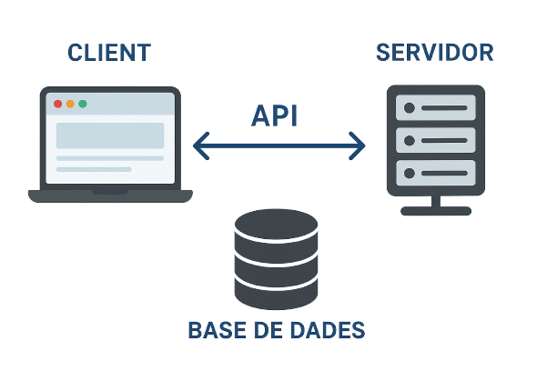
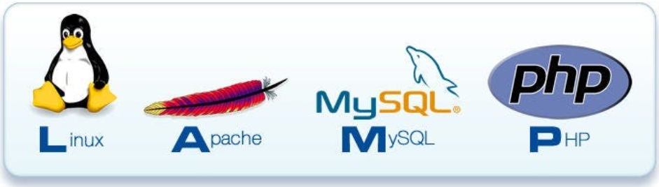

# Bloc 01. Introducció al desenvolupament d'aplicacions web

## Les Aplicacions Web

Una **aplicació web** és un programa que s'executa en un **servidor** (ordinador d'altes prestacions) i a la qual es pot accedir a través d'un **navegador web** sense necessitat d'instal·lar cap programari al dispositiu de l'usuari. A diferència d'un lloc web tradicional (pàgines web estàtiques), una aplicació web permet la **interacció** amb l'usuari, **el processament de dades** i ofereix **funcionalitats avançades**.

A l'actualitat, les **aplicacions web** combinen:
- El **frontend (client)**: la part visible de l'aplicació, amb la qual interactua l'usuari mitjançant el navegador.
- El **backend (servidor)**: la part encarregada de la lògica de l'aplicació, processa i gestiona dades i interactua amb bases de dades.
  - L'**API** s'encarrega de comunicar el frontend i el backend i permet intercanviar dades en un format estàndard.
  - Les **bases de dades** i els SGBD que s'encarreguen de garantir la persistència i organitzen la informació de l'aplicació.

## L'Arquitectura Client/Servidor



L'arquitectura **client-servidor** és la base de totes les aplicacions web modernes. El **client** (el navegador) realitza peticions majoritàriament HTTP al **servidor** (servidor web), que processa la informació i retorna una resposta. En molts casos requereix realitzar consultes a una **base de dades** o fer ús d'**APIs** per l'intercanvi d'informació estandaritzada.

## Els Llenguatges de Programació Web

Un **llenguatge de programació** es un conjunt de símbols, regles sintàctiques i semàntiques que permet escriure programes per resoldre una problemàtica o cobrir necessitats específiques.

Els llenguatges de programació es poden classificar segons el seu **model d'execució**:

**Llenguatges Compilats** (C, C#, Java): Tradueixen el codi font del programa a un format de baix nivell que el processador pot entendre i generen un fitxer executable independent del codi font (procés de compilació). Els errors es detecten durant el procés de compilació i el fitxer executable es pot distribuir sense necessitar el compilador ni el codi font.
```
Codi font → Compilador → Fitxer Executable → Execució
```

**Llenguatges Interpretats** (JavaScript, PHP, Python): El codi s'executa per l'intèrpret línia per línia i no genera un fitxer executable. Els errors es detecten durant l'execució i es necessari que l'intèrpet estigui instal·lat al sistema. Aquests llenguatges permeten realitzar proves i depurar el codi més ràpidament, però són més lents a l'executar-se que un programa compilat.
```
Codi font → Intèrpret → Execució directa
```

> **Nota:** Els navegadors inclouen un intèrpret de JavaScript que permet executar el codi al client. Els servidors web necessiten tenir instal·lats intèrprets de PHP, Python o altres llenguatges per poder executar programes del backend.


### Característiques dels llenguatges web

| Llenguatge     | Tipus       | Execució           | Característiques                                                                                |
| -------------- | ----------- | ------------------ | ----------------------------------------------------------------------------------------------- |
| **HTML**       | Marques     | Navegador          | Estructura, organitza i descriu el contingut web (defineix l'estructura i significat).          |
| **CSS**        | Estils      | Navegador          | Defineix l'estil visual del contingut web. (colors, marges, vores, tipografia, etc.)            |
| **JavaScript** | Interpretat | Navegador/Servidor | Llenguatge de programació, dinàmic, orientat a esdeveniments i interactuar amb l'usuari.        |
| **PHP**        | Interpretat | Servidor           | Llenguatge de programació web, integració fàcil amb BBDD, molt utilitzat amb CMS.               |
| **SQL**        | Consulta    | Servidor BD        | Llenguatge de definició i manipulació de dades (DDL i DML), l'estàndard per a SGBD relacionals. |

## Entorn de desenvolupament

### Editor de codi
**Visual Studio Code (VS Code)** és l'editor que recomano per al desenvolupament web:
- Gratuït i multiplataforma (Linux, Windows, macOS).
- Ecosistema extens d’extensions per a HTML, CSS, PHP, JavaScript i SQL.
- Terminal integrat amb suport per a múltiples shell (Bash, PowerShell, Zsh...).
- Integració nativa amb **Git** i altres sistemes de control de versions.
- Debugger integrat i configurable per a PHP i JavaScript.

### Servidor local
Per desenvolupar aplicacions web, necessitem desplegar **programari específic al servidor** que ens permeti reproduir un entorn real:



- **Stack LAMP**  
  Un entorn de desenvolupament format per:  
  - **Apache** → Servidor web que atén les peticions HTTP.  
  - **MySQL/MariaDB** → Sistema de gestió de bases de dades relacionals.  
  - **PHP** → Llenguatge de programació backend per generar contingut dinàmic.  
  - **phpMyAdmin** → Eina web per gestionar les bases de dades de manera gràfica (la recomano per modificacions amb entorn gràfic).  

Aquest stack és ideal per **aprendre a instal·lar, configurar i integrar cada servei**, ja que és la base de molts servidors en producció.

- **Docker amb imatges LAMP**  
  Permet crear entorns aïllats i replicables en qualsevol màquina.  
  Exemple: un contenidor amb Apache + PHP i un altre amb MySQL, ambdós gestionats amb *docker-compose*.  
  Aquest exemple simula un entorn de producció real.

## Estructura d'un projecte web

Un projecte web professional ha d'estar **ben organitzat** per facilitar el manteniment i la col·laboració.

Una **separació ben definida** entre components facilita el treball en equip i el manteniment del codi.

El següent exemple és una estructura de carpetes inventades però que us ajudarà a pensar en com distribuïr els vostres projectes:
```
projecte-web/
├── frontend/                     # Tot el que veu l’usuari
│   ├── index.html                # Punt d’entrada del frontend
│   ├── css/
│   │   └── style.css             # Fulls d’estil
│   ├── js/
│   │   └── main.js               # JavaScript principal
│   └── img/
│       ├── icons/                # Icones de la interfície
│       └── banners/              # Banners i imatges generals
│
├── backend/                      # Lògica del servidor en PHP
│   ├── config/
│   │   └── database.php          # Connexió BBDD
│   ├── controllers/              # Gestió d'accions (usuari es vol registrar, iniciar sessió, modificar el perfil, etc.)
│   │   └── UserController.php
│   ├── models/                   # Rep peticions del Controller (crear un usuari, comprovar login) interactuen amb la BD. 
│   │   └── UserModel.php
│   ├── views/                    # Mostra a l'usuari l'HTML i el CSS estàtic i dinàmic (conté el mínim PHP possible).
│   │   ├── login.php             # Formulari de login (mostra missatges d'error d'inici de sessió amb PHP).
│   │   ├── register.php          # Formulari de registre (mostra missatges d'error de registre amb PHP).
│   │   ├── plataforma.php        # Índex de la plataforma un cop ha iniciat sessió l'usuari.
│   └── api/                      # Endpoints que retornen dades JSON al frontend.
│       └── game.php
│
├── database/                     # Scripts de BBDD
│   └── db.sql
│
├── uploads/                      # Fitxers pujats pels usuaris
│
├── docs/                         # Documentació del projecte
│   └── README.md
│
└── .gitignore                     # Per evitar pujar fitxers sensibles o generats
```

## Tipus de proves en desenvolupament web

El **testing** és essencial per garantir la qualitat, seguretat i fiabilitat de l'aplicació. Les proves es poden classificar segons l'abast i l'objectiu:

### 1. Proves unitàries
Verifiquen individualment **funcions o mòduls** del codi:
- De la funció calculaPunts(nivell,temps,monedes): Comprovar que diferents valors d'entrada retornen el valor de sortida esperat.
- **PHPUnit** (PHP) com a extensió de VSCode.
- **Jest** (JavaScript) com a extensió de VSCode.

### 2. Proves d'integració  
Verificuen que diversos **components del sistema funcionen correctament junts**:
- L'acció "procés de login": El formulari envia les dades de l'usuari, el backend les procesa, consulta a la base de dades i retorna si el login és exitós o no.
- Proves amb Bases de Dades.
- Testing d'APIs amb **Postman** o extensions de VSCode com **Thunder Client** o **Rest Client**.

### 3. Proves d'acceptació
Verifiquen l'aplicació des de la **perspectiva de l'usuari** (comportament real de l'usuari):
- Es verifiquen totes les funcionalitats (formularis, navegació, API, visualització de dades, modificació del perfil, filtrat de productes, etc.)
- Testing manual amb el navegador i verificant totes les funcionalitats.
- **Cypress** framework per realitzar proves E2E (End-to-End).

### 4. Proves de seguretat
Identificar i explotar **vulnerabilitats** amb la finalitat de protegir l'aplicació:
- Formulari de login: Verificar que no es pot realitzar un login bypass (saltar-se l'inici de sessió) i accedir a la part privada de la plataforma sense un usuari vàlid.
- Escaneig de dependències per vulnerabilitats conegudes en llibreries (sobretot en frameworks).
- Proves de penetració (pentesting manual) per la detecció i explotació de vulnerabilitats web.