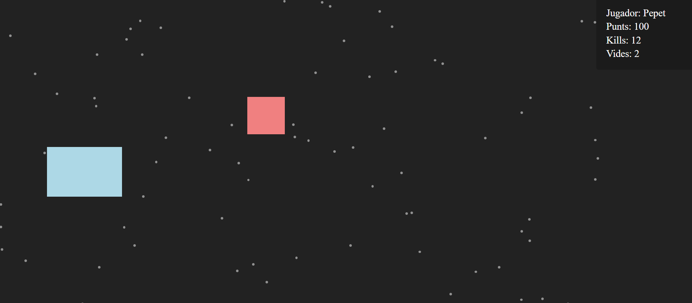

# 04. Joc interactiu amb HTML, CSS i JavaScript

En aquesta secció, crearem l'escenari i els personatges d'un petit joc interactiu utilitzant HTML, CSS i JavaScript. El nostre objectiu és combinar els conceptes bàsics de JavaScript, la manipulació del DOM, la gestió d'esdeveniments i la programació orientada a objectes amb la creació d'una interfície d'usuari senzilla però funcional.

Hi haurà un **element clarament vulnerable** en el codi, que permetria a un atacant injectar codi maliciós a la pàgina fent ús d'un input de formulari. Aquesta vulnerabilitat i d'altres s'auditaran, explotaran i corregiran en el tema 3 - auditories de seguretat web.

## Estructura del Projecte

```
/joc
|-- index.html
|-- index.css
|-- classes.js
|-- main.js
```

## ESCENARI BÀSIC: GESTIÓ DEL DOM i POO INICIAL



### index.html
```html
<!DOCTYPE html>
<html lang="ca">
  <head>
    <meta charset="UTF-8" />
    <meta name="viewport" content="width=device-width, initial-scale=1" />
    <title>Joc interactiu HTML, CSS i JavaScript</title>
    <meta name="description" content="Joc JS per treballar la manipulació del DOM, la gestió d'esdeveniments i la POO." />
    <meta name="author" content="Xavi Garcia @xavig-icv" />
    <meta name="copyright" content="Xavi Garcia @xavig-icv" />
    <link rel="stylesheet" href="./index.css" />
  </head>
  <body>
    <div id="pantalla"></div>
    <div id="infoPartida"></div>
    <script src="./classes.js"></script>
    <script src="./main.js"></script>
  </body>
</html>
```

### index.css

```css
* {
  margin: 0;
  padding: 0;
  box-sizing: border-box;
}

body {
  overflow: hidden;
}

#pantalla {
  width: 100vw;
  height: 100vh;
  background-color: #222;
  overflow: hidden;
  z-index: 0;
}

.nau {
  position: absolute;
  z-index: 1;
}

.jugador {
    background-color: lightblue;
}

.enemic {
    background-color: lightcoral;
}

.asteroide {
  position: absolute;
  background-color: rgba(255, 255, 255, 0.5);
  border-radius: 50%;
}

#infoPartida {
  position: absolute;
  top: 0;
  right: 0;
  padding: 1rem;
  font-size: 1.25rem;
  color: white;
  background-color: rgba(0, 0, 0, 0.2);
  border-radius: 5px;
  width: 200px;
  z-index: 2;
}

#infoPartida > p {
  margin: 0.25rem;
}
```

### classes.js

```javascript
// --------- Classe Base ---------
class Entitat {
  constructor(posicio = {x: 0, y:0}, ample = 50, alt = 50) {
    this.x = posicio.x;
    this.y = posicio.y;
    this.ample = ample;
    this.alt = alt;
    //Crear l'element HTML
    this.elementHTML = document.createElement("div");
    this.elementHTML.style.left = this.x + "px";
    this.elementHTML.style.top = this.y + "px";
    this.elementHTML.style.width = this.ample + "px";
    this.elementHTML.style.height = this.alt + "px";
  }

  // Modifica la posició de l'element a la pantalla
  dibuixar() {
    this.elementHTML.style.left = this.x + "px";
    this.elementHTML.style.top = this.y + "px";
  }

  moure() {
    // Implementar la lògica de moviment
  }
}
```

### main.js

```javascript
// --------- Pantalla del Joc ---------
const pantalla = document.querySelector("#pantalla");
const infoPartida = document.querySelector("#infoPartida");

// --------- Objecte Jugador ---------
const jugador = new Entitat({x: 100, y: 300}, 150, 100);
jugador.elementHTML.classList.add("nau", "jugador");
pantalla.append(jugador.elementHTML);

// --------- Objecte Enemic ---------
const enemic = new Entitat({x: 500, y: 200}, 75, 75);
enemic.elementHTML.classList.add("nau","enemic");
pantalla.append(enemic.elementHTML);

// ------- Objecte asteroide -------
const asteroides = [];
for (let i = 0; i < 100; i++) {
  let posX = Math.floor(Math.random() * 1200);
  let posY = Math.floor(Math.random() * 800);
  const asteroide = new Entitat({x: posX, y: posY}, 5, 5);
  asteroide.elementHTML.classList.add("asteroide");
  pantalla.append(asteroide.elementHTML);
  asteroides.push(asteroide);
}

// ------- Informació de la partida -------
const elementNom = document.createElement("p");
const elementPunts = document.createElement("p");
const elementDerribats = document.createElement("p");
const elementVides = document.createElement("p");
elementNom.innerHTML = `Jugador: Pepet`;
infoPartida.append(elementNom);
elementPunts.innerHTML = `Punts: 100`;
infoPartida.append(elementPunts);
elementDerribats.innerHTML = `Kills: 12`;
infoPartida.append(elementDerribats);
elementVides.innerHTML = `Vides: 2`;
infoPartida.append(elementVides);
```

## ESCENARI AVANÇAT: GESTIÓ D'ESDEVENIMENTS DE TECLAT I MOVIMENT DELS OBJECTES DEL JOC

```javascript
// (classes.js) Herència de Classes i Polimorfisme

class Jugador extends Entitat {
  constructor(nom, vides, velocitat, posicio, ample, alt) {
    super(posicio, ample, alt);
    this.nom = nom;
    this.vides = vides;
    this.velocitat = velocitat;
    this.punts = 0;
    this.derribats = 0;
    this.elementHTML.classList.add("nau", "jugador");
  }

  moure() {
    if (this.y < 0) {
      this.y = 0;
    } else if (this.y + this.alt > pantallaAlt) {
      this.y = pantallaAlt - this.alt;
    }
  }
}

class Enemic extends Entitat {
  constructor(velocitat, posicio, ample, alt) {
    super(posicio, ample, alt);
    this.velocitat = velocitat;
    this.elementHTML.classList.add("nau", "enemic");
  }

  moure() {
    this.x -= this.velocitat;
    if (this.x < -this.ample) {
      this.x = pantallaAmple + this.ample;
    }
  }
}

class Asteroide extends Entitat {
  constructor(velocitat, posicio, ample = 5, alt = 5) {
    super(posicio, ample, alt);
    this.velocitat = velocitat;
    this.elementHTML.classList.add("asteroide");
  }

  moure() {
    this.x -= this.velocitat;
    if (this.x < -this.ample) {
      this.x = pantallaAmple + this.ample;
    }
  }
}
```

```javascript
// (main.js) Noves variables de pantalla
const pantallaAmple = window.innerWidth;
const pantallaAlt = window.innerHeight;
const fotogrames = 1000 / 60;
```

```javascript
// (main.js) Variables per la gestió de la partida
const nivell = 1;
const maxPunts = 100;
const vectorAsteroides = [];
const vectorEnemics = [];
const maxAsteroides = 100;
const maxEnemics = 12;
```

```javascript
// (main.js) Actualització: Instanciació de Classes (Jugador, Enemic i Asteroides)

// ---- Objecte Jugador ----
// Constructor: nom, vides, velocitat, posicio, ample, alt
const jugador = new Jugador("Pepito", 3, 10, {x: 100, y: 300}, 150, 100);
pantalla.append(jugador.elementHTML);

// ---- Vector d'objectes Enemic ----
for (let i = 0; i < maxEnemics; i++) {
  // Fem un enemic de 50x50
  let posX = pantallaAmple + 50;
  let posY = Math.floor(Math.random() * (pantallaAlt - 50));
  let velocitat = Math.floor(Math.random() * 5) + 1;
  vectorEnemics.push(new Enemic(velocitat, {x: posX, y: posY}, 50, 50));
  pantalla.append(vectorEnemics[i].elementHTML);
}

// ---- Vector d'objectes Asteroides ----
for (let i = 0; i < maxAsteroides; i++) {
  // Fem un asteroide de 5x5
  let posX = Math.floor(Math.random() * pantallaAmple - 3);
  let posY = Math.floor(Math.random() * pantallaAlt - 3);
  let velocitat = Math.floor(Math.random() * 10) + 1;
  vectorAsteroides.push(new Asteroide(velocitat, {x: posX, y: posY}, 3, 3));
  pantalla.append(vectorAsteroides[i].elementHTML);
}
```

```javascript
// (main.js) Actualització de les dades d'informació de la partida
// ------- Informació de la partida -------
const elementNom = document.createElement("p");
const elementPunts = document.createElement("p");
const elementDerribats = document.createElement("p");
const elementVides = document.createElement("p");
elementNom.innerHTML = `Jugador: ${jugador.nom}`;
infoPartida.append(elementNom);
elementPunts.innerHTML = `Punts: ${jugador.punts}`;
infoPartida.append(elementPunts);
elementDerribats.innerHTML = `Kills: ${jugador.derribats}`;
infoPartida.append(elementDerribats);
elementVides.innerHTML = `Vides: ${jugador.vides}`;
infoPartida.append(elementVides);
```

```javascript
// (main.js) Esdeveniments de teclat
// Control de la nau del jugador quan prem una tecla
window.addEventListener("keydown", (event) => {
  switch(event.code) {
    case "ArrowUp":
      jugador.y -= jugador.velocitat;
      break;
    case "ArrowDown":
      jugador.y += jugador.velocitat;
      break;
    default:
      break;
  }
});
```

```javascript
// (main.js) Bucle d'animació del joc
setInterval(() => {
  // 1. Gestió del jugador
  jugador.dibuixar();
  jugador.moure();

  // 2. Gestió dels enemics
  vectorEnemics.forEach(enemic => {
    enemic.dibuixar();
    enemic.moure();
  });

  // 3. Gestió dels asteroides
  vectorAsteroides.forEach(asteroide => {
    asteroide.dibuixar();
    asteroide.moure();
  });
}, fotogrames);
```

## ESCENARI COMPLET: LÒGICA DEL JOC (COL·LISIONS, PUNTUACIONS I FINAL DE PARTIDA)

```javascript
// (main.js) Comprovar col·lisons entre el jugador i els enemics

function comprovarCollisions() {
  vectorEnemics.forEach(enemic => {
    if (jugador.x <= enemic.x + enemic.ample &&
        jugador.x + jugador.ample >= enemic.x &&
        jugador.y <= enemic.y + enemic.alt &&
        jugador.y + jugador.alt >= enemic.y) {
      // Col·lisió detectada
      enemic.x = pantallaAmple + enemic.ample;
      jugador.punts = jugador.punts + (nivell*10);
      jugador.derribats++;
      infoPartida.querySelector("p:nth-child(2)").innerHTML = `Punts: ${jugador.punts}`;
      infoPartida.querySelector("p:nth-child(3)").innerHTML = `Kills: ${jugador.derribats}`;
      if (jugador.punts >= maxPunts) {
        jugador.velocitat = 0;
        vectorEnemics.forEach(enemic => {
          enemic.velocitat = 0;
        });
        // Preparar el següent nivell
        alert("Nivell superat! :)");
      }
    }
  });
}
```

```javascript
// (main.js) Controlar les col·lisions al bucle d'animació
// ----- Bucle d'animació del joc -----
setInterval(() => {
  // 0. Gestió de col·lisions
  comprovarCollisions();
  
  // 1. Gestió del jugador
  infoPartida.querySelector("p:nth-child(4)").innerHTML = `Vides: ${jugador.vides}`;
  if (jugador.vides < 0) {
    jugador.velocitat = 0;
    setTimeout(() => {
      location.reload();
    }, 5000);
  }
  jugador.dibuixar();
  jugador.moure();
  ...
  ...
```

```javascript
// (main.js) Controlar les vides del jugador quan un enemic supera la pantalla
// S'ha de passar l'objecte "jugador" al constructor de l'enemic
vectorEnemics.push(new Enemic(jugador, velocitat, {x: posX, y: posY}, 50, 50));
```

```javascript
// (classes.js) Afegir al constructor de l'enemic i inicialitzar la variable "jugador" i controlar les vides
class Enemic extends Entitat {
  constructor(jugador, velocitat, posicio, ample, alt) {
    super(posicio, ample, alt);
    this.jugador = jugador;
    this.velocitat = velocitat;
    this.elementHTML.classList.add("nau", "enemic");
  }

  moure() {
    this.x -= this.velocitat;
    if (this.x < -this.ample) {
      this.jugador.vides--;
      this.x = pantallaAmple + this.ample;
    }
  }
}
```