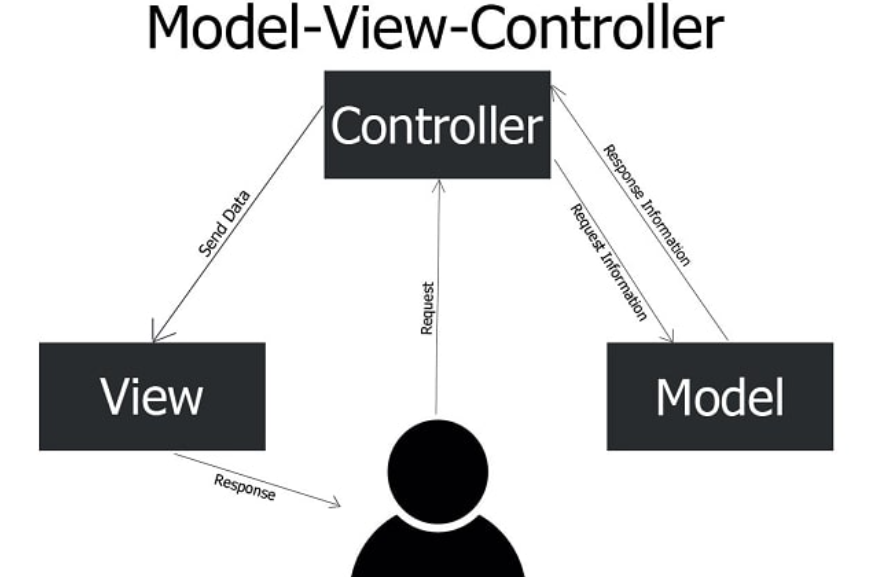

# 05. Programació Orientada a Objectes i Model Vista Controlador amb PHP

La **Programació Orientada a Objectes (POO)** és un paradigma de programació que organitza el codi al voltant d’objectes i classes, en lloc de funcions i procediments com a la programació estructurada. L’objectiu principal és aconseguir un codi modular, reutilitzable, escalable i fàcil de mantenir, sobretot en projectes web grans amb una lògica complexa.

PHP ofereix eines modernes per treballar amb conceptes clau de la POO com:
- **Classes i objectes**: Una classe és una plantilla per crear objectes, i aquests són instàncies de models del món real.
- **Encapsulament**: Protegeix l'estat dels objectes controlant la visibilitat i l'accés de les propietats i mètodes dels objectes (public, private, protected).
- **Herència**: Permet crear noves classes a partir d’altres ja existents (hereten propietats i mètodes) i permeten la reutilització del codi.
- **Polimorfisme**: Permet que diferents classes comparteixin una mateixa interfície amb diferents implementacions (mètodes amb el mateix nom però comportaments diferents).

## Per què utilitzar POO al Backend?

- Permet estructurar millor projectes grans.
- Permet reutilitzar classes i components en diferents parts de l’aplicació.
- Fa el codi més llegible i fàcil de mantenir quan treballen diferents equips en el desenvolupament.
- Facilita la implementació de patrons de disseny com el (MVC) Model-Vista-Controlador que són la base de frameworks com Laravel o Symfony.

## La Programació Orientada a Objectes (POO) amb PHP

### Declaració de Classes, Creació i Gestió d'Objectes

#### exemple_Usuari.php
```php
<?php
// exemple_Usuari.php
class Usuari {
    // Propietats (variables de la classe)
    public string $nom;
    public string $email;
    private string $rol;
    protected DateTime $data_registre;

    // Constant de classe (compartida per totes les instàncies)
    const ROL_ADMIN = 'admin';
    const ROL_USUARI = 'usuari';
    const MAX_USUARIS = 100;

    // Propietat estàtica (compartida entre tots els objectes)
    private static int $total_usuaris = 0;

    // Constructor - s'executa quan es crea un objecte
    public function __construct(string $nom, string $email, string $rol) {
       // Verificar que no arriba al màxim d'usuaris en memòria (100) abans de crear un nou usuari
        if (self::$total_usuaris >= self::MAX_USUARIS) {
            throw new Exception("No es poden crear més usuaris. Hi ha un límit de " . self::MAX_USUARIS . " usuaris.");
        }
        // Inicialitzar les variables en cas de no haver arribat al màxim d'usuaris
        $this->nom = $nom;
        $this->email = $email;
        $this->rol = $rol;
        $this->data_registre = new DateTime();
        self::$total_usuaris++;
        echo "<p>S'ha creat l'usuari " . self::$total_usuaris . " : {$this->nom}</p>";
    }
    
    // Mètode públic (accessible des de fora de la classe)
    public function obtenirDades(): array {
        if ($this->validarEmail($this->email)) { //Ús d'un mètode privat dins la classe.
            return [
                'nom' => $this->nom,
                'email' => $this->email,
                'registre' => $this->data_registre->format('Y-m-d H:i:s'),
                'rol' => $this->rol
            ];
        }
        return [];
    }
    
    // Mètode privat (només accessible dins la classe)
    private function validarEmail(string $email): bool {
        return filter_var($email, FILTER_VALIDATE_EMAIL) !== false;
    }
    
    // Mètode protegit (accessible en classes derivades o dins la classe)
    protected function obtenirRol(): string {
        return $this->rol;
    }
    
    // Mètode estàtic (no necessita instància de la classe)
    public static function crearUsuariProves(): self {
        $noms = ['Pep', 'Pepet', 'Pepito', 'Pepe'];
        $nom = $noms[array_rand($noms)];
        $email = strtolower($nom). rand(1, 1000) . '@domini.cat';

        return new self($nom, $email, self::ROL_USUARI);
    }
    
    // Destructor - s'executa quan l'objecte es destrueix
    public function __destruct() {
        echo "<p>L'usuari {$this->nom} s'ha eliminat de la memòria</p>";
    }
}

// Exemple d'ús de la classe
echo "<h1>Programació Orientada a Objectes amb PHP - Classe Usuari</h1>";

// Creació d'objectes
$usuari1 = new Usuari('Joanet Garcia', 'joan@domini.cat', Usuari::ROL_USUARI);
$usuari2 = new Usuari('Marieta VolaVola', 'maria@domini.cat', Usuari::ROL_ADMIN);

// Utilització de mètodes
echo "<h2>Dades dels usuaris:</h2>";

print_r($usuari1->obtenirDades());
print_r($usuari2->obtenirDades());

// Modificar propietats públiques
$usuari1->nom = 'Joan Garcia';

// Mostrar les constants de classe
echo "<p>Tipus d'usuari admin: " . Usuari::ROL_ADMIN . "</p>";

// Crear usuari amb el mètode estàtic (per proves o seeders)
$usuari3 = Usuari::crearUsuariProves();
print_r($usuari3->obtenirDades());

// Creació d'usuaris fins al màxim permès (100)
try {
    for ($i = 0; $i < 100; $i++) {
        $usuari = new Usuari("Usuari $i", "usuari$i@domini.cat", Usuari::ROL_USUARI);
    }
} catch (Exception $e) {
    echo "<p>Error: " . $e->getMessage() . "</p>";
}
?>
```

## El Model Vista Controlador (MVC)

El MVC és un **patró d’arquitectura de software** que separa l'aplicació en tres components: la presentació, la lògica de negoci i el control de les dades dins d’una aplicació. Aquest patró s'utilitza molt en aplicacions web on hi ha una separació entre el que visualitza l'usuari (la Vista), les dades que s'emmagatzemen i processen (el Model) i la lògica que connecta aquests dos elements (el Controlador).

- **`Model (M)`**: Gestiona la lògica de negoci i l'accés a les dades de l'aplicació. La seva funció és aplicar validacions sobre les dades i les regles de negoci i també s'encarrega de gestionar la base de dades.
    - Comprovar que un usuari no es pot registrar si el seu correu ja existeix (regla de negoci).
    - Guardar un nou usuari a la base de dades o actualitzar les dades d'un usuari existent.
    - Garantir que la contrasenya garenteixi la política de (majúscules, mínim de caràcters, símbols, etc.) (regla de negoci o norma interna de l'app).
- **`Vista (V)`**: És la interfície d'usuari (el que veu l'usuari i amb el que pot interactuar). S'encarrega de mostrar les dades del model (a través del controlador) i també permet a l'usuari enviar peticions al controlador en format de formularis o enllaços per exemple.
    - Una pàgina de login o registre amb un formulari.
    - Una pantalla amb els jocs disponibles extreta de la base de dades.
    - Un missatge d’error quan el login falla (amb la resta del disseny).
- **`Controlador (C)`**: Intermediari entre el Model i la Vista. S'encarrega de gestionar les accions o peticions de l'usuari (formularis, URLs, etc.), crida als Models necessaris per obtenir, inserir, modificar o eliminar les dades i retorna una Vista amb la informació estructurada per mostrar a l'usuari.
    - Rebre la petició d’un formulari de registre, validar l'email i demanar al Model que creï un nou usuari.
    - Gestionar la validació d’un login i enviar a la Vista un missatge d’error o la informació de perfil.
    - Rebre una petició per actualitzar la puntuació d’un usuari en un joc i demanar al Model que les modifiqui.



## El Model-Vista-Controlador (MVC) amb PHP

> ⚠️ **ADVERTÈNCIA:** Es realitzaran configuracions vulnerables de manera intencionada que seran auditades, explotades i corregides al tema 03 - auditories de seguretat web.

### Estructura de Carpetes (Projecte MVC amb PHP)

```
/plataforma_jocs/
├── index.php                 # Punt d'entrada principal
├── config/
│   └── database.php         # Configuració de base de dades
├── core/
│   ├── Router.php           # Enrutador de peticions
│   └── Session.php          # Gestió de sessions
├── models/
│   ├── UsuariModel.php      # Model d'usuaris
│   ├── JocModel.php         # Model de jocs
│   └── PartidaModel.php     # Model de partides
├── controllers/
│   ├── AuthController.php   # Controlador d'autenticació
│   ├── JocController.php    # Controlador de jocs
│   └── UsuariController.php # Controlador d'usuaris
├── views/
│   ├── layout/
│   │   ├── header.php       # Capçalera comuna
│   │   └── footer.php       # Peu de pàgina comú
│   ├── auth/
│   │   ├── login.php        # Vista de login
│   │   └── registre.php     # Vista de registre
│   ├── jocs/
│   │   ├── llista.php       # Llista de jocs
│   │   └── joc.php          # Joc individual
│   └── usuari/
│       ├── perfil.php       # Perfil d'usuari
│       └── ranking.php      # Classificació
├── private/
│   
└── public/
    ├── uploads/             # Arxius pujats pels usuaris (vulnerable!)
    ├── images/              # Imatges (fons, icones, etc.)
    ├── css/style.css        # Estils CSS
    └── js/jocs/             # Jocs JavaScript (són públics!) control a través de API o modificar ruta
        ├── 1/               # 1. Joc de naus vs ovnis HTML, CSS i JS
        └── 2/               # 2. Joc de la snake HTML, CSS i JS
```

### 0. Resum MVC per l'aplicació plataforma de videojocs

**1. Punt d'entrada (index.php)** El fitxer `index.php` s'encarrega d'inicialitzar el sistema i gestionar les peticions entrants. Actua com a punt d'entrada per a totes les peticions de l'usuari (Front Controller).

**2. Classe Router** El `Router` s'encarrega de gestionar les rutes de l'aplicació i redirigir les peticions als controladors i mètodes corresponents.

**3. Controladors** Els controladors reben les peticions del `Router`, demanen o guarden dades als models, seleccionen les vistes adequades i li passen les dades. A l'aplicació hi ha 3 controladors que gestionen l'autenticació, els jocs i els usuaris.
- `AuthController`: Gestiona l'accés a la plataforma (registre i login d'usuaris).
- `JocController`: Gestiona les operacions relacionades amb els jocs (mostrar jocs, jugar, guardar punts).
- `UsuariController`: Gestiona les operacions relacionades amb els usuaris (perfil, ranking).

**4. Models** Els models s'encarreguen de la interacció amb la base de dades i la lògica de negoci associada a les dades. A l'aplicació hi ha 3 models que representen les entitats principals.
- `UsuariModel`: Gestiona les dades i operacions relacionades amb els usuaris. (login, registre, perfil "obtenir dades d'usuari" i el ranking d'usuaris)
- `JocModel`: Gestiona les dades i operacions relacionades amb els jocs. (obtenir tots els jocs per llistar i obtenir un joc per jugar)
- `PartidaModel`: Gestiona les dades i operacions relacionades amb les partides. (guardar i obtenir partides)

**5. Vistes** Les vistes s'encarreguen de la presentació de la informació a l'usuari fent ús d'HTML, CSS i el mínim PHP possible. A l'aplicació hi ha diverses vistes que corresponen als diferents mòduls i funcionalitats.
- `layout/header.php` i `layout/footer.php`: Capçalera i peu de pàgina comuns.
- `auth/login.php` i `auth/registre.php`: Vistes per a l'autenticació i registre d'usuaris.
- `jocs/llista.php` i `jocs/joc.php`: Vistes per a la gestió dels jocs (llista de jocs i pantalla del joc).
- `usuari/perfil.php` i `usuari/ranking.php`: Vistes per a la gestió d'usuaris. **VISTES NO DESENVOLUPADES!**

**6. FLUX MVC** Petit exemple que haureu d'entendre després

- 1. L'Usuari visita la ruta /jugar?id=1.
- 2. L'index.php passa la ruta al Router.
- 3. EL Router crida JocController->jugar().
- 4. El Controlador demana al model les dades del joc.
- 5. El Controlador passa les dades a la vista (joc.php).
- 6. La vista mostra l'HTML, CSS i JS al navegador.

> Exemple del patró MVC: cada capa realitza la seva tasca i no es barregen responsabilitats.

### 1. Configuració i Nucli del Sistema

#### config/database.php
```php
<?php
// VULNERABILITAT: Credencials hardcoded i exposades
class Database {
    private static $host = 'IP_DE_LA_VM';
    private static $dbname = 'plataforma_videojocs';
    private static $username = 'plataforma_user';
    private static $password = '123456789a';
    
    public static function getConnection() {
        try {
            // VULNERABILITAT: Sense SSL i configuració insegura
            $pdo = new PDO(
                "mysql:host=" . self::$host . ";dbname=" . self::$dbname,
                self::$username,
                self::$password,
                [PDO::ATTR_ERRMODE => PDO::ERRMODE_EXCEPTION]
            );
            return $pdo;
        } catch(PDOException $e) {
            // VULNERABILITAT: Exposició d'informació sensible
            die("Error de connexió: " . $e->getMessage());
        }
    }
}
?>
```

#### core/Session.php
```php
<?php
class Session {
    public static function start() {
        if (session_status() == PHP_SESSION_NONE) {
            // VULNERABILITAT: Sessions insegures
            ini_set('session.cookie_httponly', '0'); // JavaScript pot accedir
            ini_set('session.cookie_secure', '0');   // HTTP (no HTTPS)
            session_start();
        }
    }
    
    public static function set($key, $value) {
        self::start();
        $_SESSION[$key] = $value;
    }
    
    public static function get($key) {
        self::start();
        return $_SESSION[$key] ?? null;
    }
    
    public static function isLoggedIn() {
        return self::get('usuari_id') !== null;
    }
    
    // VULNERABILITAT: Logout insegur
    public static function logout() {
        self::start();
        unset($_SESSION['usuari_id']); // No destrueix completament la sessió
    }
}
?>
```

#### core/Router.php
```php
<?php
class Router {
    private $routes = [];
    
    public function get($path, $controller, $method) {
        $this->routes['GET'][$path] = ['controller' => $controller, 'method' => $method];
    }
    
    public function post($path, $controller, $method) {
        $this->routes['POST'][$path] = ['controller' => $controller, 'method' => $method];
    }
    
    public function dispatch() {
        $method = $_SERVER['REQUEST_METHOD'];
        // VULNERABILITAT: Path Traversal
        $path = $_GET['route'] ?? '/';
        
        if (isset($this->routes[$method][$path])) {
            $route = $this->routes[$method][$path];
            $controller = new $route['controller']();
            $methodName = $route['method'];
            $controller->$methodName();
        } else {
            // VULNERABILITAT: Exposició d'informació
            die("Ruta no trobada: " . htmlspecialchars($path));
        }
    }
}
?>
```

### 2. Models (Accés a Dades)

#### models/UsuariModel.php
```php
<?php
require_once 'config/database.php';

class UsuariModel {
    private $pdo;
    
    public function __construct() {
        $this->pdo = Database::getConnection();
    }
    
    // VULNERABILITAT: SQL Injection
    public function login($email, $password) {
        $sql = "SELECT * FROM usuaris WHERE email = '$email'";
        $stmt = $this->pdo->query($sql);
        $usuari = $stmt->fetch(PDO::FETCH_ASSOC);
        
        // VULNERABILITAT: Comparació de password insegura
        if ($usuari && $usuari['password_hash'] === md5($password)) {
            return $usuari;
        }
        return false;
    }
    
    // VULNERABILITAT: SQL Injection i validació insuficient
    public function crear($nomUsuari, $email, $password, $nomComplet) {
        // Sense validació adequada
        $passwordHash = md5($password); // VULNERABILITAT: Hash feble
        
        $sql = "INSERT INTO usuaris (nom_usuari, email, password_hash, nom_complet) 
                VALUES ('$nomUsuari', '$email', '$passwordHash', '$nomComplet')";
        
        return $this->pdo->exec($sql);
    }
    
    // VULNERABILITAT: IDOR (Insecure Direct Object Reference)
    public function obtenirUsuari($id) {
        $sql = "SELECT * FROM usuaris WHERE id = $id";
        $stmt = $this->pdo->query($sql);
        return $stmt->fetch(PDO::FETCH_ASSOC);
    }
    
    // VULNERABILITAT: Exposició de dades sensibles
    public function obtenirRanking() {
        $sql = "SELECT u.nom_usuari, u.email, u.nom_complet, 
                       SUM(p.puntuacio_obtinguda) as puntuacio_total
                FROM usuaris u 
                LEFT JOIN partides p ON u.id = p.usuari_id 
                GROUP BY u.id 
                ORDER BY puntuacio_total DESC";
        
        $stmt = $this->pdo->query($sql);
        return $stmt->fetchAll(PDO::FETCH_ASSOC);
    }
}
?>
```

#### models/JocModel.php
```php
<?php
require_once 'config/database.php';

class JocModel {
    private $pdo;
    
    public function __construct() {
        $this->pdo = Database::getConnection();
    }
    
    public function obtenirJocsActius() {
        $sql = "SELECT * FROM jocs WHERE actiu = 1";
        $stmt = $this->pdo->query($sql);
        return $stmt->fetchAll(PDO::FETCH_ASSOC);
    }
    
    // VULNERABILITAT: IDOR
    public function obtenirJoc($id) {
        $sql = "SELECT * FROM jocs WHERE id = $id";
        $stmt = $this->pdo->query($sql);
        return $stmt->fetch(PDO::FETCH_ASSOC);
    }
}
?>
```

#### models/PartidaModel.php
```php
<?php
require_once 'config/database.php';

class PartidaModel {
    private $pdo;
    
    public function __construct() {
        $this->pdo = Database::getConnection();
    }
    
    // VULNERABILITAT: SQL Injection i falta de validació
    public function guardarPartida($usuariId, $jocId, $puntuacio, $durada) {
        $sql = "INSERT INTO partides (usuari_id, joc_id, nivell_jugat, puntuacio_obtinguda, durada_segons) 
                VALUES ($usuariId, $jocId, 1, $puntuacio, $durada)";
        
        return $this->pdo->exec($sql);
    }
    
    // VULNERABILITAT: IDOR - pot veure partides d'altres usuaris
    public function obtenirPartides($usuariId) {
        $sql = "SELECT p.*, j.nom_joc 
                FROM partides p 
                JOIN jocs j ON p.joc_id = j.id 
                WHERE p.usuari_id = $usuariId 
                ORDER BY p.data_partida DESC";
        
        $stmt = $this->pdo->query($sql);
        return $stmt->fetchAll(PDO::FETCH_ASSOC);
    }
}
?>
```

### 3. Controladors (Lògica de Negoci)

#### controllers/AuthController.php
```php
<?php
require_once 'models/UsuariModel.php';
require_once 'core/Session.php';

class AuthController {
    private $usuariModel;
    
    public function __construct() {
        $this->usuariModel = new UsuariModel();
    }
    
    public function mostrarLogin() {
        include 'views/auth/login.php';
    }
    
    public function login() {
        if ($_POST) {
            // VULNERABILITAT: Sense protecció CSRF
            $email = $_POST['email'] ?? '';
            $password = $_POST['password'] ?? '';
            
            $usuari = $this->usuariModel->login($email, $password);
            
            if ($usuari) {
                Session::set('usuari_id', $usuari['id']);
                Session::set('nom_usuari', $usuari['nom_usuari']);
                
                // VULNERABILITAT: Open Redirect
                $redirect = $_GET['redirect'] ?? '/';
                header("Location: $redirect");
                exit;
            } else {
                $error = "Credencials incorrectes";
                include 'views/auth/login.php';
            }
        }
    }
    
    public function mostrarRegistre() {
        include 'views/auth/registre.php';
    }
    
    public function registre() {
        if ($_POST) {
            // VULNERABILITAT: Validació insuficient
            $nomUsuari = $_POST['nom_usuari'] ?? '';
            $email = $_POST['email'] ?? '';
            $password = $_POST['password'] ?? '';
            $nomComplet = $_POST['nom_complet'] ?? '';
            
            // Crear usuari sense validacions
            $this->usuariModel->crear($nomUsuari, $email, $password, $nomComplet);
            
            header("Location: /?route=/login");
            exit;
        }
    }
    
    public function logout() {
        Session::logout();
        header("Location: /");
        exit;
    }
}
?>
```

#### controllers/JocController.php
```php
<?php
require_once 'models/JocModel.php';
require_once 'models/PartidaModel.php';
require_once 'core/Session.php';

class JocController {
    private $jocModel;
    private $partidaModel;
    
    public function __construct() {
        $this->jocModel = new JocModel();
        $this->partidaModel = new PartidaModel();
    }
    
    public function llistaJocs() {
        $jocs = $this->jocModel->obtenirJocsActius();
        include 'views/jocs/llista.php';
    }
    
    public function jugar() {
        // VULNERABILITAT: IDOR - no verifica el jugador
        $jocId = $_GET['id'] ?? 0;
        $joc = $this->jocModel->obtenirJoc($jocId);
        
        if (!$joc) {
            die("Joc no trobat");
        }
        
        include 'views/jocs/joc.php';
    }
    
    public function guardarPuntuacio() {
        if ($_POST && Session::isLoggedIn()) {
            // VULNERABILITAT: Sense validació de dades
            $usuariId = Session::get('usuari_id');
            $jocId = $_POST['joc_id'];
            $puntuacio = $_POST['puntuacio'];
            $durada = $_POST['durada'];
            
            $this->partidaModel->guardarPartida($usuariId, $jocId, $puntuacio, $durada);
            
            echo json_encode(['success' => true]);
        } else {
            echo json_encode(['success' => false]);
        }
    }
}
?>
```

### 4. Vistes (Presentació)

#### views/layout/header.php
```php
<!DOCTYPE html>
<html lang="ca">
<head>
    <meta charset="UTF-8">
    <meta name="viewport" content="width=device-width, initial-scale=1.0">
    <title>Plataforma de Videojocs</title>
    <link rel="stylesheet" href="public/css/style.css">
</head>
<body>
    <header>
        <nav>
            <div class="logo">
                <h2>Gamers.cat</h2>
            </div>
            <div class="menu">
                <a href="/?route=/">Inici</a>
                <a href="/?route=/jocs">Jocs</a>
                <?php if (Session::isLoggedIn()): ?>
                    <!-- VULNERABILITAT: XSS -->
                    <a href="/?route=/perfil">Hola, <?= Session::get('nom_usuari') ?></a>
                    <a href="/?route=/ranking">Ranking</a>
                    <a href="/?route=/logout">Sortir</a>
                <?php else: ?>
                    <a href="/?route=/login">Accedir</a>
                    <a href="/?route=/registre">Registrar-se</a>
                <?php endif; ?>
            </div>
        </nav>
    </header>
    <main>
```

#### views/layout/footer.php
```php
    </main>
    <footer>
        <p>&copy; 2025 Gamers.cat. Tots els drets reservats :)</p>
    </footer>
</body>
</html>
```

#### views/auth/login.php
```php
<?php include 'views/layout/header.php'; ?>

<div class="auth-container">
    <h2>Iniciar Sessió</h2>
    
    <?php if (isset($error)): ?>
        <!-- VULNERABILITAT: XSS -->
        <div class="error"><?= $error ?></div>
    <?php endif; ?>
    
    <!-- VULNERABILITAT: Sense protecció CSRF -->
    <form method="POST">
        <div class="form-group">
            <label for="email">Email:</label>
            <input type="email" id="email" name="email" required>
        </div>
        
        <div class="form-group">
            <label for="password">Contrasenya:</label>
            <input type="password" id="password" name="password" required>
        </div>
        
        <button type="submit">Entrar</button>
    </form>
    
    <p>No tens compte? <a href="/?route=/registre">Registra't aquí</a></p>
</div>

<?php include 'views/layout/footer.php'; ?>
```

#### views/jocs/llista.php
```php
<?php include 'views/layout/header.php'; ?>

<div class="jocs-container">
    <h2>Jocs Disponibles</h2>
    
    <div class="jocs-grid">
        <?php foreach ($jocs as $joc): ?>
            <div class="joc-card">
                <!-- VULNERABILITAT: XSS -->
                <h3><?= $joc['nom_joc'] ?></h3>
                <p><?= $joc['descripcio'] ?></p>
                <p>Puntuació màxima: <?= $joc['puntuacio_maxima'] ?></p>
                
                <?php if (Session::isLoggedIn()): ?>
                    <!-- VULNERABILITAT: IDOR a la URL -->
                    <a href="/?route=/jugar&id=<?= $joc['id'] ?>" class="btn-jugar">Jugar</a>
                <?php else: ?>
                    <p><a href="/?route=/login">Inicia sessió per jugar</a></p>
                <?php endif; ?>
            </div>
        <?php endforeach; ?>
    </div>
</div>

<?php include 'views/layout/footer.php'; ?>
```

#### views/jocs/joc.php

```php
<?php
$jocId = $joc['id'];
$indexFile = __DIR__ . "/../../public/js/jocs/$jocId/index.php";

if (!file_exists($indexFile)) {
    die("Joc no trobat");
}

// Afegim una base perquè tots els recursos relatius del joc es carreguin bé
echo '<base href="/js/jocs/' . $jocId . '/">'; // Al estar a public hi ha risc d'executar scripts externs

// Incloem directament l'index del joc
include $indexFile; // VULNERABILITAT: Inclusió de fitxers sense validació (LFI)
?>
```

#### index.php (Punt d'entrada - Front controller)
```php
<?php
// Incloure els fitxers per gestionar les rutes i controlar les sessions d'usuari
require_once 'core/Router.php';
require_once 'core/Session.php';
require_once 'controllers/AuthController.php';
require_once 'controllers/JocController.php';
require_once 'controllers/UsuariController.php';

// VULNERABILITAT: Headers de seguretat absents

$router = new Router(); // Emmagatzema les rutes i redirigeix peticions GET i POST al controlador corresponent

// DEFINICIÓ DE RUTES (Cada ruta disposa de la URL, el Controlador i el Mètode que s'executa)
// Rutes d'autenticació
$router->get('/login', 'AuthController', 'mostrarLogin');
$router->post('/login', 'AuthController', 'login');
$router->get('/registre', 'AuthController', 'mostrarRegistre');
$router->post('/registre', 'AuthController', 'registre');
$router->get('/logout', 'AuthController', 'logout');

// Rutes de jocs
$router->get('/', 'JocController', 'llistaJocs');
$router->get('/jocs', 'JocController', 'llistaJocs');
$router->get('/jugar', 'JocController', 'jugar');
$router->post('/guardar-puntuacio', 'JocController', 'guardarPuntuacio');

// Rutes d'usuari
$router->get('/perfil', 'UsuariController', 'perfil');
$router->get('/ranking', 'UsuariController', 'ranking');

// REP PETICIONS DE L'USUARI: Detecta el mètode HTTP i la ruta i redirigeix al controlador corresponent, sinó mostra un error.
$router->dispatch();
?>
```