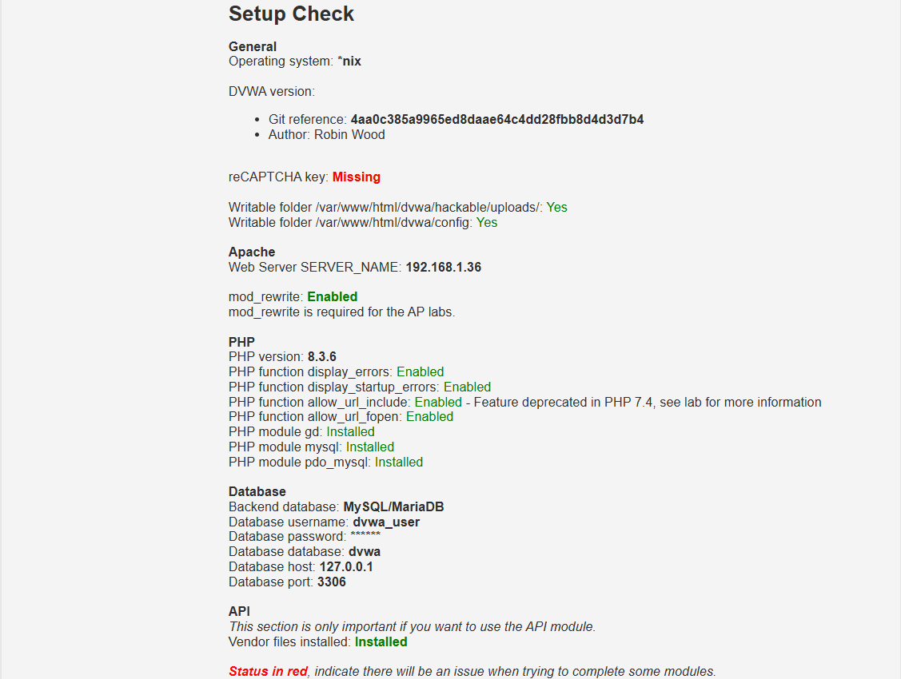

# 03. Instal·lació de DVWA a Debian/Ubuntu

Damn Vulnerable Web Applicatgion (DVWA) és una aplicació web desenvolupada en PHP i MySQL, intencionadament vulnerable i dissenyada a conèixer i explotar les vulnerabilitrats en entorns web. L'aplicació es basa en reptes amb diferents nivells de seguretat (Low, Medium, High i Impossible) que permeten als desenvolupadors i pentesters:

- Practicar tècniques d'intrusió web en un entorn controlat.
- Explorar i comprendre vulnerabilitats comuns com injeccions SQL, XSS, CSRF, i altres.
- Revisar el codi font per entendre com es produeixen les vulnerabilitats i com corregir-les.

**Versió recomanada**: DVWA 2.x (comprovar que és l'última disponible al repositori).

**Requisits de sistema**: LAMP Stack (Linux + Apache + MySQL + PHP).

**Nivells de seguretat disponibles**: Low, Medium, High i Impossible.

**Repositori oficial**: https://github.com/digininja/DVWA

## Prerequisits (Considerant LAMP ja desplegat)

```bash
# Verificar Apache
sudo systemctl status apache2

# Verificar MySQL/MariaDB
sudo systemctl status mysql

# Verificar PHP
php -v

# Verificar mòduls de PHP necessaris
php -m | grep -E 'mysqli|gd|mbstring|xml'
```

### **Mòduls PHP requerits per DVWA:**

- `php-mysqli` - Connexió a MySQL
- `php-gd` - Manipulació d'imatges
- `php-mbstring` - Suport multibyte
- `php-xml` - Parsing XML

**Si falta algun mòdul, instal·lar:**

```bash
sudo apt update
sudo apt install php php-mysqli php-gd php-mbstring php-xml -y
sudo systemctl restart apache2
```

## Instal·lació de DVWA

### **Pas 1: Descarregar DVWA del repositori oficial**

```bash
# Navegar al directori web
cd /var/www/html/

# Clonar el repositori de DVWA
sudo git clone https://github.com/digininja/DVWA.git dvwa

# Canviar propietari a l'usuari d'Apache
sudo chown -R www-data:www-data /var/www/html/dvwa/

# Proporcionar els permisos adequats
sudo chmod -R 755 /var/www/html/dvwa/
```

### **Pas 2: Configurar la base de dades**

#### **2.0 Instal·lar MariaDB si tenieu MySQL**

```bash
# Exportar totes les BDs (backup)
sudo mysqldump -u root -p --all-databases > /tmp/mysql_backup_$(date +%Y%m%d).sql

# Verificar que s'ha creat correctament
ls -l /tmp/mysql_backup_*.sql
```

```bash
# Aturar el servei
sudo systemctl stop mysql

# Desinstal·lar MySQL
sudo apt remove --purge mysql-server mysql-client mysql-common mysql-server-core-* mysql-client-core-*

# Netejar els paquets obsolets
sudo apt autoremove
sudo apt autoclean
```

```bash
# Instal·lar MariaDB
sudo apt update
sudo apt install mariadb-server mariadb-client

# Verificar que està el servei actiu
sudo systemctl status mariadb

#Iniciar després de reiniciar el servidor
sudo systemctl enable mariadb
```

```bash
# Importar totes les BDs
sudo mysql -u root -p < /tmp/mysql_backup_*.sql
```

#### **2.1 Crear base de dades MariaDB/MySQL**

```bash
# Accedir a MariaDB/MySQL com a root
sudo mysql -u root -p
```

**Dins de MySQL:**

```sql
-- Crear base de dades
CREATE DATABASE dvwa;

-- Crear usuari per DVWA
CREATE USER 'dvwa_user'@'localhost' IDENTIFIED BY 'password123!';

-- Donar permisos
GRANT ALL PRIVILEGES ON dvwa.* TO 'dvwa_user'@'localhost';

-- Aplicar canvis
FLUSH PRIVILEGES;

-- Sortir
EXIT;
```

#### **2.2 Configurar el fitxer de connexió**

```bash
# Copiar el fitxer de configuració d'exemple
cd /var/www/html/dvwa/config/
sudo cp config.inc.php.dist config.inc.php

# Editar la configuració
sudo nano config.inc.php
```

**Modificar les següents línies:**

```php
# Database management system to use
$_DVWA[ 'db_server' ]   = '127.0.0.1';
$_DVWA[ 'db_database' ] = 'dvwa';
$_DVWA[ 'db_user' ]     = 'dvwa_user';
$_DVWA[ 'db_password' ] = 'password123!';
$_DVWA[ 'db_port' ]     = '3306';

# ReCAPTCHA settings (opcional, es pot deixar buit fin obtenir les claus de recaptcha de Google)
$_DVWA[ 'recaptcha_public_key' ]  = '';
$_DVWA[ 'recaptcha_private_key' ] = '';
```

**Guardar i tancar** (`Ctrl+X`, `Y`, `Enter`)

---

### **Pas 3: Configurar permisos especials**

DVWA necessita permisos d'escriptura en algunes carpetes:

```bash
# Donar permisos d'escriptura a la carpeta hackable/uploads
sudo chmod 777 /var/www/html/dvwa/hackable/uploads/

# Donar permisos d'escriptura a external/phpids/0.6/lib/IDS/tmp/phpids_log.txt
sudo chmod 666 /var/www/html/dvwa/external/phpids/0.6/lib/IDS/tmp/phpids_log.txt

# Verificar també que el fitxer config.inc.php és llegible
sudo chmod 644 /var/www/html/dvwa/config/config.inc.php
```

### **Pas 4: Configurar PHP per DVWA**

Algunes configuracions de PHP s'han de modificaar per permetre que DVWA funcioni correctament i sigui més vulnerable:

```bash
#Habilitar el mòdul rewrite per reescriure rutes pel format de les APIs
sudo a2enmod rewrite

sudo systemctl restart apache2
```

```bash
#Instal·lar el composer per habilitar les dependències de PHP pels reptes d'APIs
sudo apt install composer -y

cd /var/www/html/dvwa/vulnerabilities/api

sudo composer install

sudo chown -R www-data:www-data vendor/

sudo systemctl restart apache2
```

```bash
# Editar php.ini (la localització pot variar si tens php-fpm)
sudo nano /etc/php/8.X/apache2/php.ini
```

**Modificar o verificar aquestes línies:**

```ini
# Permetre funcions perilloses (NOMÉS per DVWA!)
allow_url_fopen = On
allow_url_include = On

# Augmentar límits si cal
upload_max_filesize = 20M
post_max_size = 20M
memory_limit = 256M
```

**Guardar i reiniciar Apache:**

```bash
sudo systemctl restart apache2
```

### **Pas 5: Inicialitzar la base de dades**

Ara podem accedir a DVWA via navegador per completar la configuració:

#### **5.1 Accedir a DVWA**

Obre el navegador i accedeix a:

```
http://IP_DE_LA_VM/dvwa/
```

#### **5.2 Comprovar configuració**

Abans de fer el setup, veuràs una pàgina amb l'estat de la configuració.

**Verificar que tot estigui en verd (OK):**

- ✅ PHP version
- ✅ PHP modules (mysqli, gd, etc.)
- ✅ PHP function allow_url_include
- ✅ reCAPTCHA key (⚠️ pot estar en vermell, no és obligatori per desplegar l'aplicació)
- ✅ File permissions

**Si alguna cosa està en vermell (excepte reCAPTCHA), s'ha de solucionar abans de continuar.**



#### **5.3 Crear/Reset base de dades**

A la part inferior de la pàgina, clic al botó:

```
Create / Reset Database
```

Això crearà totes les taules necessàries i inserirà dades de prova.

**Sortida esperada:**

```
Database has been created.
```

## Primer accés a DVWA

Després de crear la base de dades, seràs redirigit al login.

### **Credencials per defecte:**

| Usuari    | Password   | Rol           |
| --------- | ---------- | ------------- |
| `admin`   | `password` | Administrador |
| `gordonb` | `abc123`   | Usuari normal |
| `1337`    | `charley`  | Usuari normal |
| `pablo`   | `letmein`  | Usuari normal |
| `smithy`  | `password` | Usuari normal |

## Configurar nivells de seguretat

Després de fer login, veuràs el menú lateral esquerre.

### **DVWA Security**

Clic a `DVWA Security` al menú lateral.

Aquí pots modificar el nivell de dificultat:

#### **Low (Baix)**

- **No hi ha cap protecció** implementada
- Ideal per **començar** i entendre les vulnerabilitats
- Tots els exploits funcionen directament

#### **Medium (Mitjà)**

- **Algunes proteccions** bàsiques implementades
- Filtres simples que es poden saltar (**fer bypass**)
- Requereix de tècniques addicionals per evitar el bloqueig

#### **High (Alt)**

- **Proteccions avançades** implementades
- Filtres més complexos dificils de saltar.
- Requereix **tècniques sofisticades** de bypass

#### **Impossible**

- **"Aplicació completament assegurada"** (segons les bones pràctiques)
- No és explotable amb tècniques conegudes
- Serveix com a **referència** de codi segur pel backend
