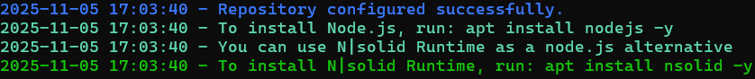

# 04. Instal·lació i desplegament d'OWASP Juice Shop

OWASP Juice Shop és una aplicació web moderna intencionadament vulnerable, ideal per a formar-se i realitzar auditories de seguretat en entorns que utilitzen tecnologies actuals com (Node.js, SPA, API REST, etc). Fa servir una metodologia de gamificació amb reptes més de 100 reptes que proporcionen puntuacions i insignies.

- **Versió recomanada**: Última disponible (v16+)
- **Stack tecnològic**: Node.js + Express + Angular + SQLite
- **Challenges**: 100+ vulnerabilitats gamificades
- **Repository oficial**: [https://github.com/juice-shop/juice-shop](https://github.com/juice-shop/juice-shop)
- **Demo online**: [https://juice-shop.herokuapp.com](https://juice-shop.herokuapp.com)

## **Instal·lació amb: npm (Node.js)**

### **Prerequisits**

```bash
# Instal·lar Node.js i npm
sudo apt update
sudo apt upgrade

# Afegeix el repositori oficial de NodeSource per Node 22
curl -fsSL https://deb.nodesource.com/setup_22.x | sudo -E bash -



# Instal·la Node.js 22
sudo apt install -y nodejs

# Verificar versions (Node.js 20+ obligatoria)
node --version
npm --version
```

### **Descarregar el codi font del repositori oficial**

```bash
# Instal·lar des del repositori
cd /var/www/html
git clone https://github.com/juice-shop/juice-shop.git
cd juice-shop

sudo chown -R $USER:$USER /var/www/html/juice-shop

#Triga un temps (sigues pacient :)
npm install

#Fem que l'usuari propietari sigui www-data
sudo chown -R www-data:www-data /var/www/html/juice-shop

#Executem Node.js amb www-data (no com a root o el vostre usuari)
sudo -u www-data npm start
```

## Primer accés

### **Accedir a l'aplicació**

Obre el navegador i accedeix a:

```
http://IP_DE_LA_VM:3000/
```

Veuràs una botiga online d'electrònica i productes naturals (Juice Shop).

### **Interfície principal**

#### **Pàgina d'inici**

- Catàleg de productes
- Barra de cerca
- Cistella de compra
- Login/Register

#### **Menú lateral (burger menu)**

- **Home**: Pàgina principal
- **Account**: Perfil d'usuari (cal login)
- **Privacy & Security**: Polítiques
- **Customer Feedback**: Formulari de contacte
- **Complain**: Formulari de queixes
- **Photo Wall**: Galeria d'imatges
- **Score Board**: **Challenges i puntuació**
- **About Us**: Informació

## Sistema de Challenges (Score Board)

### **Accedir al Score Board**

El Score Board és **ocult per defecte**. Descobrir-lo és el primer challenge!

**Pista**: Inspecciona el codi JavaScript del frontend (main.js) o prova URLs comunes.

**Solució (spoiler)**:

```
http://IP_DE_LA_VM:3000/#/score-board
```

### **Comprendre el Score Board**

#### **Categories de challenges**

| Dificultat              | Color   | Estrelles | Punts |
| ----------------------- | ------- | --------- | ----- |
| ⭐ Trivial              | Verd    | 1         | 100   |
| ⭐⭐ Easy               | Groc    | 2         | 250   |
| ⭐⭐⭐ Medium           | Taronja | 3         | 450   |
| ⭐⭐⭐⭐ Hard           | Vermell | 4         | 700   |
| ⭐⭐⭐⭐⭐ Expert       | Negre   | 5         | 1000  |
| ⭐⭐⭐⭐⭐⭐ Impossible | Morat   | 6         | 1337  |

#### **Tags OWASP Top 10**

Cada challenge està etiquetat segons el tipus de vulnerabilitat d'OWASP:

- 🔴 **Broken Access Control**
- 🟠 **Cryptographic Failures**
- 🟡 **Injection**
- 🟢 **Insecure Design**
- 🔵 **Security Misconfiguration**
- 🟣 **Vulnerable Components**
- ⚫ **Authentication Failures**
- Etc.

#### **Pistes (Hints)**

Cada repte disposa pistes amb diferents nivells de detall. Intenta resoldre'ls sense pistes primer!

### **Registrar nou usuari**

Pots registrar els teus propis usuaris clicant a "Account" → "Login" → "Not yet a customer?".

## Vulnerabilitats principals a practicar

### **Injection**

- **SQL Injection**: Login bypass, data extraction
- **NoSQL Injection**: MongoDB query manipulation
- **Command Injection**: Remote Code Execution
- **Code Injection**: Arbitrary code execution

### **Broken Authentication**

- **Password strength**: Weak passwords
- **JWT attacks**: Token manipulation
- **OAuth flaws**: Autorització incorrecta

### **XSS (Cross-Site Scripting)**

- **Reflected XSS**: Via search, tracking
- **Stored XSS**: Comentaris, feedback
- **DOM XSS**: Client-side vulnerabilities

### **Broken Access Control**

- **IDOR**: Accés a recursos aliens
- **Privilege escalation**: User → Admin
- **Path traversal**: Directory listing

### **Security Misconfiguration**

- **Error handling**: Stack traces
- **Admin interfaces**: Exposed endpoints
- **Debug mode**: Information disclosure

### **XXE (XML External Entities)**

- **XXE attacks**: File disclosure
- **Billion laughs**: DoS

### **Insecure Deserialization**

- **Object injection**: RCE
- **Prototype pollution**: JavaScript

### **API Security**

- **Broken API authentication**: Token issues
- **Excessive data exposure**: Information leakage
- **Rate limiting**: Brute force

## Eines recomanades per Juice Shop

### **Proxy d'intercepció**

- **Burp Suite**: Interceptar requests API
- **OWASP ZAP**: Alternativa open source

### **Browser Developer Tools**

- **Network tab**: Analitzar requests/responses
- **Console**: Errors JavaScript
- **Application tab**: Local storage, cookies, JWT tokens

### **Extensions de navegador**

- **Cookie Editor**: Manipular cookies
- **JWT Debugger**: Decodificar tokens JWT
- **Wappalyzer**: Identificar tecnologies

### **Command line tools**

- **curl**: Testing API endpoints
- **jq**: Parse JSON responses
- **jwt-cli**: Manipular JWT tokens

## Challenges recomanats per començar

### **⭐ Trivial (per familiaritzar-se)**

1. **Score Board** - Trobar el tauler de puntuacions
2. **Privacy Policy** - Llegir la política de privacitat
3. **Confidential Document** - Accedir a documents confidencials

### **⭐⭐ Easy (primers exploits)**

4. **Admin Section** - Accedir al panell d'administració
5. **View Basket** - Veure la cistella d'un altre usuari
6. **Five-Star Feedback** - Donar 5 estrelles sense login
7. **Zero Stars** - Donar 0 estrelles (no permès per UI)

### **⭐⭐⭐ Medium (vulnerabilitats reals)**

8. **Login Admin** - Login com a admin amb SQL injection
9. **XSS Tier 1** - XSS en search
10. **API-only XSS** - XSS només accessible via API

## Comparativa DVWA vs Juice Shop

| Característica      | DVWA              | Juice Shop         |
| ------------------- | ----------------- | ------------------ |
| **Tecnologia**      | PHP + MySQL       | Node.js + Angular  |
| **Complexitat**     | Bàsic             | Intermedi-Avançat  |
| **Realisme**        | Menys realista    | Molt realista      |
| **UI**              | Simple, funcional | Moderna, SPA       |
| **API**             | Limitada          | REST API completa  |
| **Gamificació**     | No                | Sí (punts, badges) |
| **OWASP Top 10**    | Parcial           | Completa           |
| **Documentació**    | Bàsica            | Extensiva          |
| **Actualitzacions** | Menys freqüents   | Molt activa        |
| **Millor per**      | Principiants      | Intermig+          |

## Recursos addicionals

### **Documentació oficial**

- **Repository GitHub**: [https://github.com/juice-shop/juice-shop](https://github.com/juice-shop/juice-shop)
- **Documentació completa**: [https://pwning.owasp-juice.shop](https://pwning.owasp-juice.shop)
- **Gitbook**: Guia completa amb solucions

### **Tutorials i writeups**

- **OWASP Official Book**: "Pwning OWASP Juice Shop"
- **YouTube**: Buscar "Juice Shop walkthrough"
- **Blog posts**: Múltiples writeups disponibles

### **Comunitat**

- **Gitter Chat**: [https://gitter.im/bkimminich/juice-shop](https://gitter.im/bkimminich/juice-shop)
- **Twitter**: [@owasp_juiceshop](https://twitter.com/owasp_juiceshop)
- **Stack Overflow**: Tag [owasp-juice-shop]
