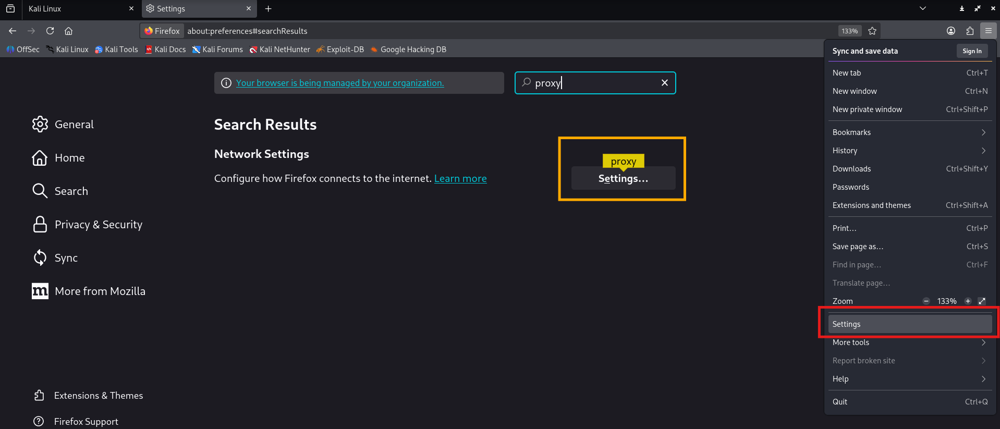
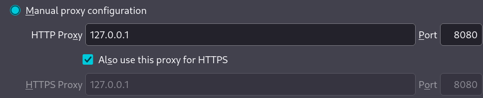
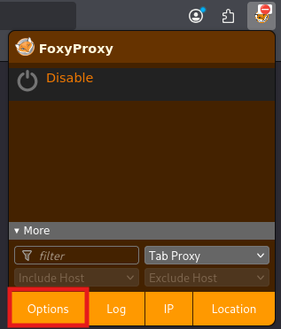
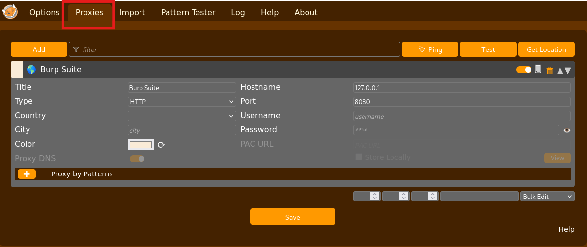
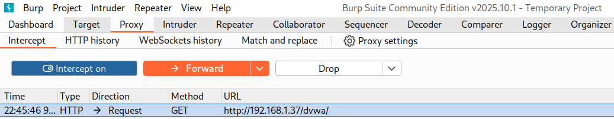
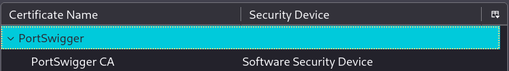

# 06. Instal·lació de Burp Suite a Kali Linux

Burp Suite és l'eina de pentesting (auditories de seguretat) web més utilitzada professionalment. Actua com a proxy entre el navegador i les aplicacions web, permetent interceptar, modificar i analitzar tot el trànsit HTTP/HTTPS.

- **Desenvolupador**: PortSwigger
- **Versions**: Community (gratuïta) i Professional (de pagament)
- **Llenguatge**: Java
- **Ús i Mòduls**: Proxy, Scanner, Repeater, Intruder, Decoder, Comparer, etc.
- **Web oficial**: [https://portswigger.net/burp](https://portswigger.net/burp)
- **Academia**: [https://portswigger.net/web-security](https://portswigger.net/web-security)

## Burp Community vs Professional

| Característica | Community         | Professional          |
| -------------- | ----------------- | --------------------- |
| **Preu**       | Gratuït           | 475$ (preus per 2026) |
| **Proxy**      | ✅ Sí             | ✅ Sí                 |
| **Repeater**   | ✅ Sí             | ✅ Sí                 |
| **Decoder**    | ✅ Sí             | ✅ Sí                 |
| **Comparer**   | ✅ Sí             | ✅ Sí                 |
| **Intruder**   | ⚠️ Limitat (lent) | ✅ Complet (ràpid)    |
| **Scanner**    | ❌ No             | ✅ Sí                 |
| **Extensions** | ⚠️ Limitades      | ✅ Completes          |
| **Crawling**   | ⚠️ Bàsic          | ✅ Avançat            |
| **Sessions**   | ✅ Sí             | ✅ Sí                 |

**Per realitzar les auditories web utilitzarem Burp Community**

## Configuració a Kali Linux

### **Verificar si ja està instal·lat**

Kali Linux disposa instal·lada la versió Community de Burp Suite:

```bash
# Verificar si està instal·lat
which burpsuite

# Versió instal·lada
burpsuite --version
```

### **Instal·lar Burp Suite (repositori oficial de Debian)**

```bash
# Actualitzar els repositoris i actualitzar les versions del programari
sudo apt update
sudo apt upgrade
```

```bash
# Verificar que burpsuite es troba al repositori oficial
sudo apt search burpsuite
```

```bash
# Instal·lar burpsuite
sudo apt install burpsuite
```

## Primera execució

### **Pas 1: Iniciar Burp Suite**

```bash
burpsuite
```

### **Pas 2: Acceptar termes i condicions**

1. Llegir els "Terms and Conditions"
2. Clic al botó **"I Accept"**

### **Pas 3: Escollir la configuració**

Burp preguntarà quin tipus de projecte vols:

#### **Opcions del projecte**

**Temporary project in memory** (A l'executar per primer cop només deixa escollir aquest)

- No es guarda l'estat
- Més ràpid d'iniciar
- Ideal per sessions curtes

**New project on disk** (Només s'accepta a la versió Burp Suite Professional)

- Es guarda tot l'estat (history, sitemap, etc.)
- Útil per auditories llargues
- Requereix especificar una ubicació al disc

**Open existing project**

- Reobrir un projecte guardat

**Seleccionar la que deixa**: `Temporary project` → `Next`

### **Pas 4: Escollir la configuració**

**Use Burp defaults** (Opció recomanada i ja seleccionada)

- Configuració estàndard i optimitzada
- Perfecta per començar

**Custom configuration**

- És per usuaris avançats que volen personalitzar el seu entorn de pentesting

**Seleccionar**: `Use Burp defaults` → `Start Burp`

## Configurar Firefox com a proxy

Perquè Burp intercepti el trànsit web, hem de configurar Firefox per utilitzar Burp com a proxy.

### **Pas 1: Configuració manual del proxy a Firefox**

#### **Mètode A: Configuració integrada a Firefox**

1. **Obrir Firefox**

2. **Menú → Settings** (o la URL escriure `about:preferences`)

3. **Al buscador escriure "proxy"**

4. **Clic a "Settings..."**



5. **Seleccionar "Manual proxy configuration"**

6. **Configurar**:

   ```
   HTTP Proxy: 127.0.0.1
   Port: 8080

   ☑ Also use this proxy for HTTPS

   No proxy for: (deixar buit o afegir excepcions)
   ```



7. **Clic a "OK"**

#### **Mètode B: Utilitzar extensió FoxyProxy (Ho recomano per comoditat)**

Desactiveu primer el proxy configurat manualment:

0. **Seleccionar a Settings → "No Proxy"**

**Instal·lar FoxyProxy** permet canviar ràpidament entre el mode proxy i mode normal.

1. **Anar a Firefox Add-ons** (o a la URL escriure `about:addons`)

   ```
   Al buscador escriure "foxyproxy"
   ```

2. **Seleccionar FoxyProxy Standard**

3. **Clic a "Add to Firefox"**

4. **Clic a la icona de FoxyProxy** (a la barra d'eines)

5. **Options**



6. **Add** (afegir nou proxy)

7. **Configurar**:

   ```
   Title: Burp Suite
   Proxy Type: HTTP
   Proxy IP: 127.0.0.1
   Port: 8080
   ```

8. **Save**



9. **Activar**: Clic a la icona FoxyProxy → Seleccionar "Burp Suite"

### **Pas 2: Verificar el proxy**

1. **Assegurar que Burp Suite està executant-se**

2. **A la pantalla de Burp**:

   - Anar a **Proxy → Intercept**
   - Activar el botó **"d'Intercept is on"**

3. **A Firefox**:

   - Navegar al pàgina del DVWA del vostre servidor: `http://IP_DE_LA_VM/dvwa/`

4. **A Burp**:

   - Hauria d'aparèixer el request interceptat
   - Veure **"GET /dvwa/ HTTP/1.1"**



5. **Clic a "Forward" diverses vegades** per deixar passar els requests

6. **Desactiva la intercepció amb el botó "Intercept is off"**

7. **Ves a la pestanya de "HTTP history" per veure totes les URL visitades**

## Instal·lar el certificat CA de Burp (Trànsit HTTPS)

Per interceptar el trànsit **HTTPS**, necessitem instal·lar el certificat CA de Burp Suite al navegador.

### **Pas 1: Generar el certificat**

1. **Assegurar que el proxy està configurat i actiu**

2. **Amb Firefox**, anar a:

   ```
   http://burpsuite/cert
   ```

   o

   ```
   http://127.0.0.1:8080/cert
   ```

3. **Automàticament es descarrega el fitxer**: `cacert.der`

### **Pas 2: Importar el certificat a Firefox**

1. **Firefox → Menú → Settings**

2. **Al buscador cercar la paraula** (certificates)

3. **Clic a "View Certificates..."**

4. **Pestanya "Authorities"**

5. **Clic a "Import..."**

6. **Seleccionar** `cacert.der` (descarregat abans)

7. **Marcar les opcions**:

   ```
   ☑ Trust this CA to identify websites
   ☑ Trust this CA to identify email users (opcional)
   ```

8. **Clic a "OK"**



### **Pas 3: Verificar HTTPS**

1. **Navegar a un site HTTPS**: `https://kali.org`

2. **A Burp:**

- Pesetanya Proxy → HTTP History haurieu de veure la petició

## Interfície de Burp Suite

### **Components principals**

Burp Suite disposa de diverses pestanyes, cadascuna amb funcions específiques:

#### **1. El Dashboard**

- Tasques en execució (i per crear de noves)
- Resum de l'activitat (un sitemap de l'objectiu)
- Resum i logs de la tasca en execució

#### **2. Target**

- **Site map**: Estructura de fitxers i carpetres de totes les webs que estan al "scope" (abast).
- **Scope**: Permet definir quines URL estan dins de l'abast de l'auditoria de seguretat web.

#### **3. Proxy**

- **Intercept**: Interceptar i modificar peticions i respostes (requests/responses).
- **HTTP history**: Historial de tot el trànsit web realitzat
- **WebSockets history**: trànsit WebSocket (no el farem servir)
- **Proxy Settings**: Configuració avançada del proxy

#### **4. Intruder**

- Automatitzar atacs personalitzats
- Brute force, fuzzing, etc.
- Molt lent a Community Edition (s'hauria de fer servir Turbo Intruder)
- Millor fer servir eines com Hydra, Gobuster, Ffuff

#### **5. Repeater**

- Modificar i reenviar requests manualment (per repetir peticions)
- Ideal per testing manual (proves amb payloads específics)

#### **6. Sequencer**

- Analitzar la qualitat de tokens de sessió (cookies, tokens CSRF, etc.)
- Analitza si un token es fàcilment predible.

#### **7. Decoder**

- Codificar/decodificar dades (URL-encode, Base64, HTML entities, hex, rot13, etc.)
- Permet reconèixer el tipus de codificació per poder realitzar correctament una injecció de codi.

#### **8. Comparer**

- Permet comparar dos peticions o respostes per veure diferències (headers, codi HTTP, contingut, longitud de la resposta, etc.)
- A vegades només cal veure que canvia el codi HTTP de resposta o la longitud d'una petició per identificar una vulnerabilitat.

#### **9. Extensions**

- Pestanya de "BApp Store" per instal·lar extensions
  - Autorize - comprovacions d'autorització horitzontal/vertical. (útil per IDOR)
  - Turbo Intruder - atac massiu/velocitat en mode multi-thread (útil per atac de diccionari)
  - SQLi Py - integra sqlmap dins de burp suite
  - Auth Analyzer - navega i fes accions com un admin i Auth Analyzer replicarà les teves accions com un usuari sense privilegis

## Configuració recomanada per pentesting

### **Definir Target Scope**

Definir l'abast evita interceptar trànsit irrellevant:

1. **Burp → Target → Scope**

2. **Clic a "Add"**

3. **Protocol**: `http` i `https`

4. **Host or IP range**:

   - Per DVWA i Juice Shop: (IP de la vostra VM)
   - Per bWAPP VM: (IP de la VM)

5. **Port**: Deixar buit (tots els ports) o especificar (`80`, `3000`, etc.)

6. **File**: Deixar buit o especificar paths

7. **Clic a "OK"**

8. **Activar "Show only in-scope items"** (a Proxy → HTTP history)

### **Configurar Intercept**

Per defecte, Burp intercepta TOTS els requests, que pot ser molest:

#### **Opcions d'Intercept**

**Proxy → Options → Intercept Client Requests**

**Regles recomanades**:

1. **Eliminar la regla "And URL Is in target scope"** (si hi és)

2. **Afegir regla personalitzada**:

   ```
   Intercept if:
   - URL → Is in target scope

   O bé:

   Do not intercept if:
   - File extension → matches → ^(jpg|png|gif|css|js|ico|woff|woff2)$
   ```

Això evita interceptar imatges, CSS, JS, etc.

### **Logging i storage**

**Proxy → Options → Intercept Server Responses**

Per defecte, no intercepta respostes. Es pot activar si cal analitzar respostes.

## Funcions bàsiques essencials

### **1. Interceptar requests (Proxy → Intercept)**

**Activar/Desactivar intercepció**:

- **Intercept is on**: Intercepta i pausa cada request
- **Intercept is off**: Deixa passar tot sense interceptar (però guarda a l'historial a History)

**Modificar un request**:

1. Interceptar un request
2. Editar manualment el text (paràmetres, headers, etc.)
3. Clic a **"Forward"** per enviar

**Accions disponibles**:

- **Forward**: Enviar el request
- **Drop**: Descartar el request
- **Action**: Més opcions (Send to Repeater, Intruder, etc.) La farem servir molt

### **2. Historial de trànsit (Proxy → HTTP history)**

Tots els requests passen per aquí, interceptats o no.

**Funcions**:

- Veure tots els requests i responses
- Filtrar per host, status code, MIME type, etc.
- **Si interessa quelcom → Botó dret del ratolí → Send to Repeater/Intruder/etc.**

**Filtres útils**:

- **Filter**: Configurar filtres avançats
- **Show only in-scope items**: Només mostrar el target definit

### **3. Repeater (enviar requests manualment)**

És l'eina més utilitzada per fer testing manual

**Com utilitzar-la**:

1. **Trobar un request interessant** a HTTP history
2. **Botó dret del ratolí → Send to Repeater**
3. **Anar a la pestanya del Repeater**
4. **Modificar el request** com consideris
5. **Clic a "Send"**
6. **Veure la resposta** a la finestra dreta

**Casos d'ús**:

- Provar SQL injection manualment
- Modificar paràmetres per IDOR
- Modificar cookies o tokens
- Fer Fuzzing manual

### **4. Intruder (atacs automatitzats)**

**Molt lent a Community Edition** (limitat a 1 request/segon)

**Com utilitzar-lo**:

**Send to Intruder** (petició enviada al intruder)

1. **Seleccionar tipus d'atac**:

- **Sniper**: 1 payload position, 1 llista de "paraules" (un únic input per itreració per fer fuzzing)
- **Battering ram**: Mateix payload a totes les positions (la mateixa paraula a tots els inputs per cada iteració)
- **Pitchfork**: Múltiples llistes, sincronitzades (cada input se li pot assignar una llista de paraules idependent)
- **Cluster bomb**: Totes les combinacions possibles (de diverses llistes en diferents inputs)

2. **Positions**: Marcar on vol injectar payloads (amb `§§`), es poden seleccionar tantes com es vulgui.
3. **Payloads**: Definir la llista de payloads (passwords, usernames, ids, etc.)
4. **Start attack**

**Exemple (Brute force)**:

```http
POST /login HTTP/1.1
Host: target.com

username=§admin§&password=§password123§
```

Enviar petició a l'intruder, afegir wordlist de passwords amb "Sniper" i iniciar l'atac.

### **5. Decoder (codificar/decodificar)**

**Funcions**:

- **URL encode/decode**
- **Base64 encode/decode**
- **HTML encode/decode**
- **Hex, ASCII, etc.**

**Com utilitzar-la**:

1. **Decoder tab**
2. **Enganxar text**
3. **Decode as...** o **Encode as...**
4. **Escollir format** (URL, Base64, etc.)

### **6. Comparer (comparar requests/responses)**

**Com utilitzar-la**:

1. **Seleccionar 2 requests** a HTTP history
2. **Boto dret del ratolí → Send to Comparer**
3. **Comparer tab → Words/Bytes**
4. **Veure diferències** ressaltades

Útil per:

- Comparar respostes de diferents usuaris
- Identificar canvis entre requests

## Extensions útils (BApp Store)

### **Logger++**

- **Funcionalitat**: Logging avançat amb filtres
- **Ús**: Trobar patterns en respostes
- **Gratuït**: Sí

### **Autorize**

- **Funcionalitat**: Testing automàtic d'autorització
- **Ús**: Detectar IDOR i bypass d'autorització
- **Gratuït**: Sí

### **Param Miner**

- **Funcionalitat**: Descobriment de paràmetres ocults
- **Ús**: Trobar paràmetres no documentats
- **Gratuït**: Sí

### **Turbo Intruder**

- **Funcionalitat**: Intruder ràpid sense limitacions
- **Ús**: Brute force ràpid (alternativa a Intruder Community)
- **Gratuït**: Sí

## Primer test amb DVWA

### **Exercici pràctic: Interceptar login de DVWA**

1. **Iniciar Burp Suite**

2. **Configurar Firefox amb proxy** (FoxyProxy activat)

3. **Definir Target Scope**: `IP_DE_LA_VM`

4. **Activar Intercept** (Proxy → Intercept → Intercept is on)

5. **Navegar a DVWA**: `http://IP_DE_LA_VM/dvwa/`

6. **Fer login**:

   - Username: `admin`
   - Password: `password`
   - Clic a "Login"

7. **A Burp, veure el request interceptat**:

   ```http
   POST /dvwa/login.php HTTP/1.1
   Host: localhost
   ...

   username=admin&password=password&Login=Login
   ```

8. **Modificar el password** (per exemple: `password123`)

9. **Clic a "Forward"**

10. **Veure que el login falla** (password incorrecte)

**Has interceptat i modificat el teu primer request!**

## Workflow típic amb Burp Suite

### **1. Exploració (Spidering)**

**Objectiu**: Mapatge complet de l'aplicació

**Passos**:

1. Definir Target Scope
2. Navegar manualment per totes les pàgines
3. Fer login, registre, totes les accions possibles (fer clic a tots els botons de la web)
4. Burp construeix el Site map automàticament
5. Revisar **Target → Site map**

### **2. Anàlisi de requests**

**Objectiu**: Identificar punts d'entrada interessants

**Passos**:

1. **Proxy → HTTP history**
2. Filtrar per POST requests (sovint més interessants)
3. Buscar formularis, APIs, autenticació
4. Send to Repeater els requests interessants

### **3. Testing manual**

**Objectiu**: Provar vulnerabilitats específiques

**Passos**:

1. **Repeater tab**
2. Modificar paràmetres, injectar payloads
3. Analitzar respostes
4. Iterar fins a trobar una vulnerabilitat

### **4. Explotació automatitzada**

**Objectiu**: Automatitzar atacs (brute force, fuzzing)

**Passos**:

1. **Send to Intruder**
2. Configurar positions i payloads
3. **Start attack**
4. Analitzar resultats (status codes, length, etc.)

### **5. Documentació**

**Objectiu**: Guardar evidències

**Passos**:

1. **Boto dret del ratolí → Copy as curl command** (per reproduir sense Burp: PoC)
2. **Boto dret del ratolí → Copy to file** Exportar requests/responses (Copy to File)
3. Screenshots del Burp amb informació rellevant
4. Guardar els payloads utilitzats i apuntar els resultats

## Recursos addicionals

### **Documentació oficial**

- **PortSwigger Support**: [https://portswigger.net/support](https://portswigger.net/support)
- **Burp Suite Documentation**: [https://portswigger.net/burp/documentation](https://portswigger.net/burp/documentation)
- **Web Security Academy**: [https://portswigger.net/web-security](https://portswigger.net/web-security)

### **Tutorials**

- **YouTube**: "Burp Suite Tutorial for Beginners"
- **PortSwigger Blog**: Tutorials oficials
- **HackerSploit**: Canal YouTube amb tutorials Burp

### **Cheat sheets**

- **Burp Suite Cheat Sheet**: [portswigger.net/web-security/reference/burp-suite-cheat-sheet](https://portswigger.net/web-security/reference/burp-suite-cheat-sheet)
