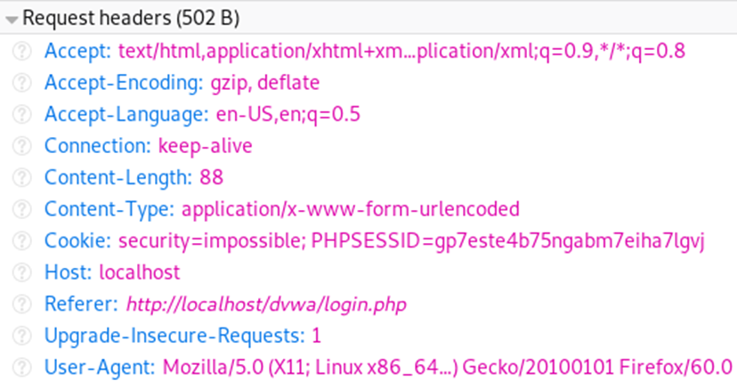
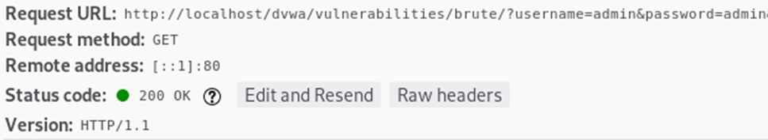
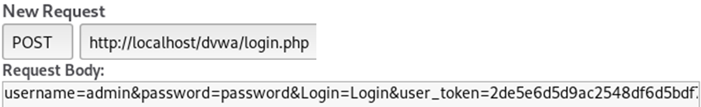

# Bloc 02. Introducció a la vulnerabilitat injection

La injecció de codi és una vulnerabilitat que es produeix quan un atacant **manipula els paràmetres d'entrada** d'una aplicació per introduir-hi codi o dades malicioses que l'aplicació interpreta com si fossin legítims i els executa fent canviar el comportament de l'aplicació.

## Vectors d'entrada HTTP

A una petició HTTP, els paràmetres d'entrada poden aparèixer en tres llocs principals:

- Les Capçaleres (headers) - per exemple Cookie, User-Agent, Referer.

- La URL (mètode GET) - paràmetres visibles a la URL.

- Cos de la petició (mètode POST, PUT, PATCH, etc.) - dades enviades al cos (formularis, JSON, multipart).

Aquests tres punts d'entrada són sensibles perquè es pot injectar codi si l'aplicació no valida ni sanititza correctament les dades d'entrada. Els headers que normalment es manipulen més durant un atac són Cookie i User-Agent.

## Tipus d'injecció més comunes

- SQL Injection - injectar fragments de text que modifiquen l'estructura d'una consulta SQL.

- XSS (Cross-Site Scripting) - injectar codi JavaScript o HTML en pàgines web perquè s'executi al navegador dels usuaris.

- HTML Injection / DOM-based XSS - injectar contingut HTML o manipular el DOM per alterar el comportament d'una pàgina web.

- Command Injection - injecció que permet executar ordres del sistema operatiu amb paràmetres manipulats.

- Template Injection (SSTI) - injectar expressions dins de plantilles que s'avaluen o executen al servidor.

- NoSQL Injection - manipular consultes o operadors en bases de dades NoSQL com MongoDB.

- LDAP Injection - injectar dades que alteren filtres o consultes en serveis LDAP.

- XXE (XML External Entity) - incloure entitats externes en documents XML per accedir a fitxers locals o fer peticions remotes.

- HTTP Header Injection / CRLF - injectar caràcters de salt de línia per manipular capçaleres HTTP.

# Què busquem?

- Robatori de dades sensibles: obtenir cookies, tokens, contrasenyes o informació de la base de dades.

- Segrestar comptes d'usuari i sessions per poder suplantar-los.

- Execució de codi remot: ja sigui al servidor (RCE) o al navegador dels usuaris (XSS).

- Alteració del servei: modificar dades, corrompre la informació o provocar una denegació del servei (DoS).
