# 01. Brute Force Attacks

Els atacs de **Força Bruta (Brute Force)** consisteixen en provar de manera automatitzada múltiples combinacions d'usuari i contrasenya fins aconseguir unes credencials vàlides per accedir a l'aplicació. Aquest tipus d'atac aprofita la manca de controls de seguretat en el procés d'autenticació: no limitar el número d'intents per iniciar sessió, no establir captchas, bloquejos temporals, etc.

**Tipus d'atacs**:

- **Credential Stuffing**: Fer ús de credencials filtrats en diferents "data breaches" per provar-les automàticament contra la aplicació.
- **Password Spraying**: Sobre un llistat d'usuaris conegut, provar un número petit de contrasenyes molt utilitzades per evitar bloquejos.
- **Dictionary Attack**: Fer ús de wordlists predefinides amb contrasenyes molt freqüents.

## Objectius d'un atac de Força Bruta

- ✅ Accés a comptes d'usuaris sense autorització - Iniciar sessió suplantant la identitat de les víctimes (control de les seves dades i accions).
- ✅ Escalada de privilegis - Comprometre comptes d'administradors o amb més privilegis que un usuari normal.
- ✅ Moviment lateral - Un cop dins l'aplicació, utilitzar informació del compte compromès per accedir a altres funcionalitats, usuaris o sistemes.
- ✅ Comprometre la integritat del servei - Realitzar accions malicioses (canviar configuracions o modificar dades).
- ✅ Accés a informació sensible - Llegir dades personals, informació interna de l'aplicació o d'altres serveis emmagatzemades al mateix compte.

**Com funciona un atac de força bruta?**:

```http
GET /dvwa/vulnerabilities/brute/?username=admin&password=1234 HTTP/1.1

username=admin&password=password123
username=admin&password=admin123
username=admin&password=12345678
...
...
```

**Com sabem si es pot explotar la vulnerabilitat?**:

- No hi ha un límit d'intents per iniciar sessió (login)
- No hi ha un CAPTCHA o altres limitadors després de múltiples logins fallits
- No hi ha bloqueig temporal del compte després de múltiples logins fallits
- No hi ha cap avís per correu o altres a l'usuari legítim

## Realitzar un atac de Força Bruta

El següent exemple consisteix en realitzar un `Atac de Diccionari` sobre el formulari d'inici de sessió de DVWA.

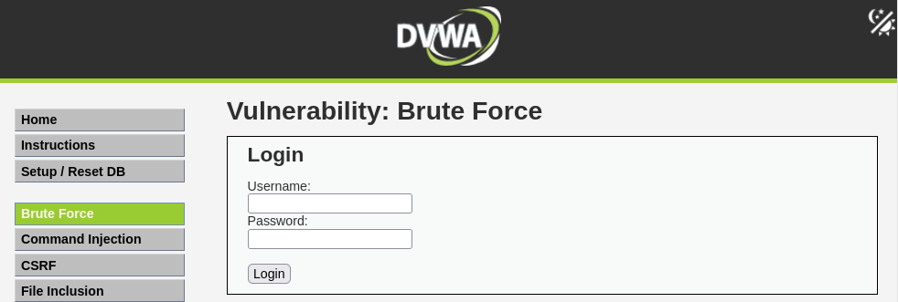

**Veure com funciona**:

```
Input: admin / password
Output: Welcome to the password protected area admin
```

```
Input: admin / 1234
Output: Username and/or password incorrect.
```

### Atac de Diccionari amb Burp Suite

1. **Activar Intercept**: Proxy → Intercept → Intercept is on

2. **Fer login** a DVWA amb credencials incorrectes

3. **A Burp, veure el request interceptat**:

```http
GET /dvwa/vulnerabilities/brute/?username=admin&password=1234&Login=Login HTTP/1.1
Host: IP_DE_LA_VM
Cookie: PHPSESSID=...; security=low
```

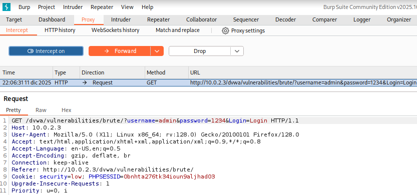

4. Selecciona el request, **fes clic al botó dret del ratolí --> Send to Intruder**

- També podries fer-ho amb la combinació de tecles `CTRL + I`

5. **Anar a la pestanya Intruder**

- Seleccionar tipus d'atac `Sniper Attack`
- Selecciona el valor de l'input de la contrasenya `1234`
- A l'apartat positions fer clic al botó `Add §`

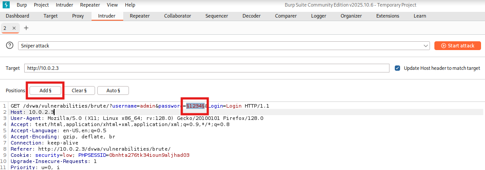

6. **De payload farem servir les 50 primeres contrasenyes del Rockyou.txt**

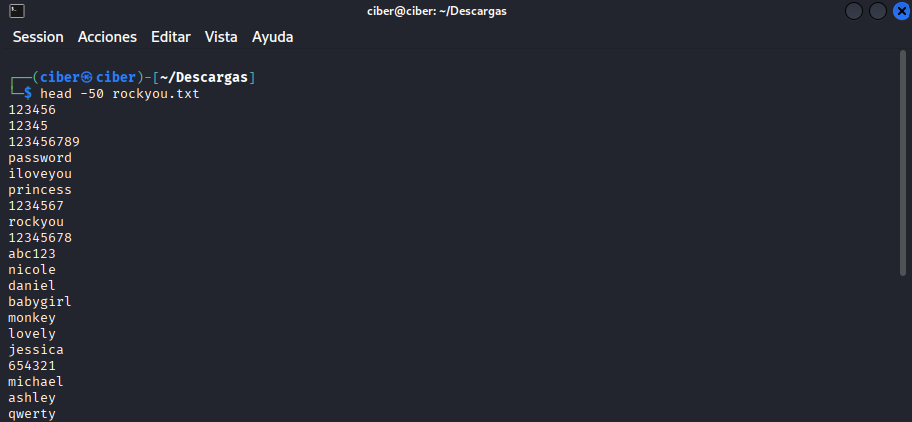

7. **Enganxem les 50 contrasenyes a l'apartat de Payloads**

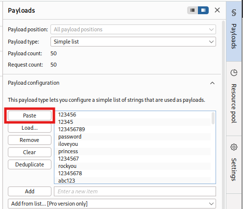

8. **Clic a `Start Attack`**

- Una longitud diferent pot significar èxit en l'atac de força bruta.

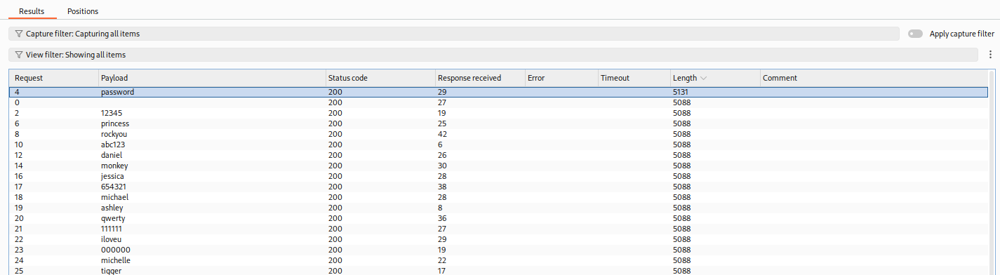

9. **Verificar l'èxit amb el renderitzat de la resposta a Burp**

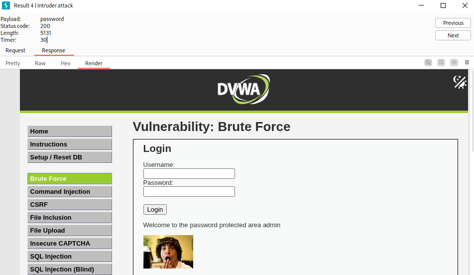

10. **Extra: Si el length no és significatiu i coneixem que hi ha darrera del login**

- Podem indicar als Settings de l'Intruder que hi ha una paraula clau o frase que si apareix vol dir que hem tingut èxit.

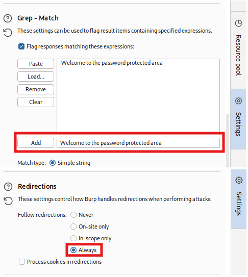

- Demostració de l'atac amb el Grep-Match actiu.

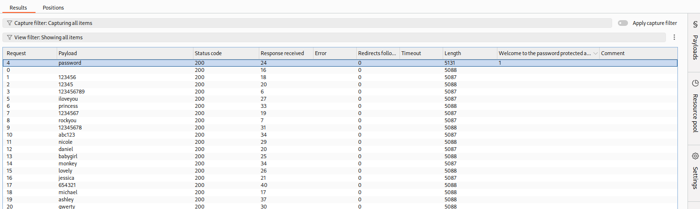

### Atac de Diccionari amb Hydra (més ràpid)

Burp Community Edition és molt lent ja que realitza 1 request per segon. Si fem servir wordlists grans, millor fer servir Burp Pro o Hydra.

1. **Analitzar la petició per fer ús correcte d'Hydra**

Necessitem conèixer (mirant el codi font o la petició a Burp):

- La URL de la petició (on s'envia el formulari)
- Els noms dels camps d'usuari i contrasenya
- El mètode d'enviament GET o POST
- La frase d'error que mostra l'aplicació si l'usuari és incorrecte
- Com estem dintre de l'aplicació necessitem la Cookie de Sessió

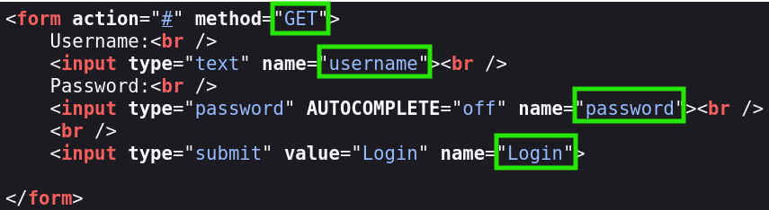

- Domini o IP: `IP_DE_LA_VM`
- URL: `/dvwa/vulnerabilities/brute/`
- Mètode: `GET`
- Paràmetres: `username`, `password`, `Login`
- Cookie de sessió: `PHPSESSID:...;security=low`
- Text amb l'error: `Username and/or password incorrect`

2. **Construir l'atac amb Hydra i executar-lo**

En el cas de disposar d'un fitxer amb llistat d'usuaris podem utilitzar el paràmetre `-L usuaris.txt`

```bash
hydra -l admin -P rockyou.txt IP_DE_LA_VM http-get-form "/dvwa/vulnerabilities/brute/:username=^USER^&password=^PASS^&Login=Login:H=Cookie:PHPSESSID=...;security=low:F=incorrect"
```

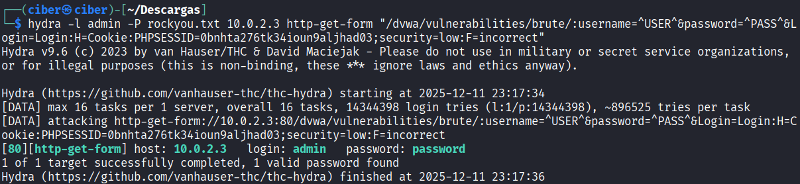

**Nota:** Podeu realitzar peticions en paral·lel (múltiples threads) amb l'opció, per exemple, `-t 12` que permetria de manera simultània fer 12 requests.

### Login Bypass Attack (Fuzzing SQLi amb Burp)

1. **Enviar la petició a l'Intruder**

2. **Seleccionar el camp de l'usuari amb Snipper Attack**

- En el cas de voler fer servir 2 camps per fer Fuzzing (usuari i password) es pot fer servir el mode `Battering ram attack`

3. **Fer ús de llistats de seclists o payload all the things**

```bash
#El fitxer de payloads que he utilitzat:
/usr/share/seclists/Fuzzing/Databases/SQLi/sqli.auth.bypass.txt
```

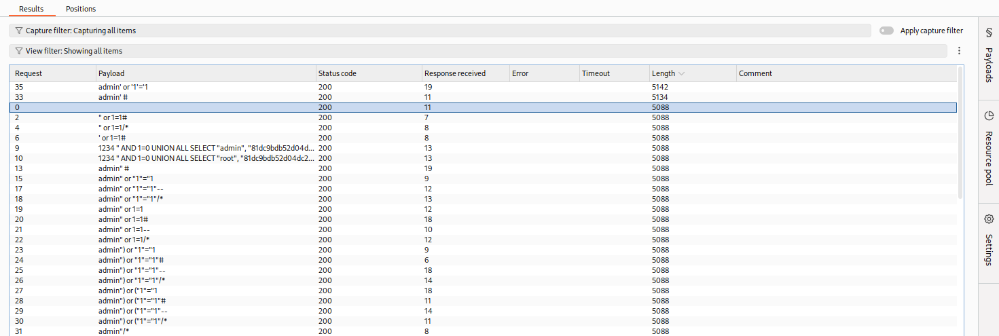

4. **Verificar que el payload ha permès saltar-se el login**

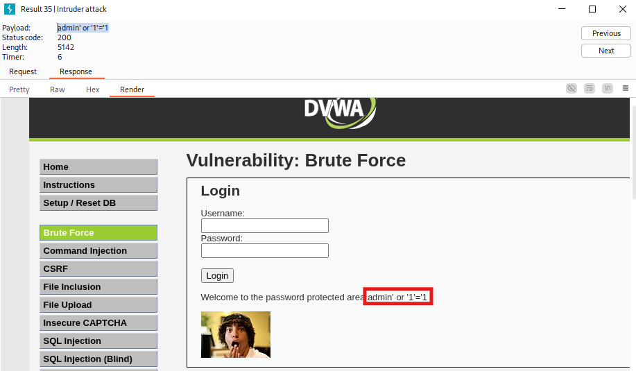
