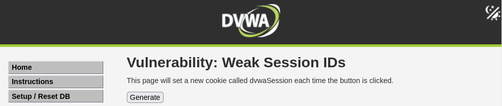
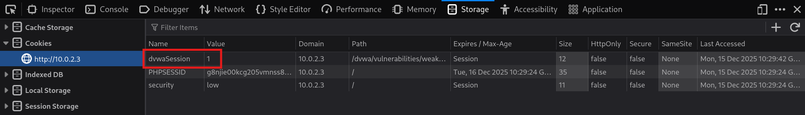
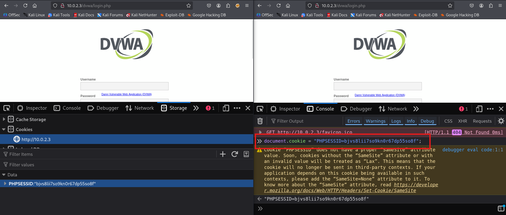
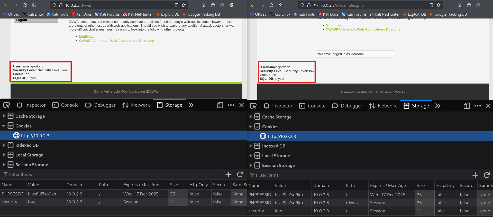

# 02. Session Management Vulnerabilities

Les vulnerabilitats de **gestió de sessions** permeten als atacants comprometre les sessions d'usuaris legítims per accedir a les seves funcionalitats i dades sense necessitat de conèixer les seves credencials.

Una sessió web és el mecanisme que permet mantenir l'estat d'un usuari autenticat entre múltiples peticions HTTP.

**Components clau d'una sessió**:

- **Session ID**: Identificador únic que associa les peticions d'un usuari amb la seva sessió al servidor
- **Cookie de sessió**: Normalment emmagatzemada com a cookie HTTP (PHPSESSID, JSESSIONID, etc.)
- **Session timeout**: Temps màxim d'inactivitat abans que la sessió expiri
- **Session storage**: On s'emmagatzema la informació de sessió al servidor

## Tipus de vulnerabilitats de gestió de sessions

- **Weak Session IDs**: IDs de sessió predibles o amb poca entropia que es poden endevinar fàcilment
- **Session Fixation**: Forçar a una víctima a establir un ID de sessió coneguit per l'atacant abans de que s'autentiqui
- **Session Timeout inadequat**: Sessions que no expiren o que ho fan massa tard
- **Logout insegur**: El logout no invalida correctament la sessió al servidor
- **Session Hijacking**: Robatori de cookies de sessió (ja ho hem fet amb XSS al tema anterior)

## Objectius d'un atac a sessions

- ✅ Suplantació d'identitat sense credencials
- ✅ Accés no autoritzat a funcionalitats de l'aplicació
- ✅ Obtenir i modificar de dades de l'usuari víctima
- ✅ Escalada de privilegis si es compromet una sessió d'administrador
- ✅ Persistència en l'aplicació sense necessitat de re-autenticació

# IDs de Sessió Dèbils (Weak Session IDs)

Els **Weak Session IDs** són identificadors de sessió que tenen poca entropia o segueixen patrons seqüencials. Això permet a un atacant endevinar o generar IDs de sessió vàlids d'altres usuaris.

**Característiques d'un ID de Sessió dèbil**:

- IDs seqüencials o incrementals (1, 2, 3, ...)
- IDs basats en timestamps que es poden predir fàcilment
- IDs amb poca longitud o amb una combinació de caràcters possibles molt baixa
- IDs generats amb algorismes dèbils o sense entropia suficient
- IDs que segueixen patrons identificables

**Característiques d'un ID de Sessió robust**:

- Longitud mínima de 128 bits
- Generats amb algorismes criptogràficament segurs
- Alta entropia i aleatorietat
- No es poden predir o endevinar
- No disposen de patrons identificables

## Atac a Weak Session IDs amb DVWA

1. **Accedir a DVWA → Weak Session IDs**

2. **Configurar el nivell de seguretat a Low**
   - DVWA Security → Security Level: Low



### Anàlisi dels Session IDs generats

1. **Fer clic al botó "Generate" una vegada**



2. **Fer un anàlisi dels valors generats**:

- Fer clic al botó "Generate" diverses vegades

```
dvwaSession=1
dvwaSession=2
dvwaSession=3
dvwaSession=4
dvwaSession=5
...
```

**Problema identificat**: Els IDs són **completament seqüencials i es poden predir fàcilment**. Un atacant pot:

- Endevinar el següent ID que es generarà
- Provar IDs de sessions actives d'altres usuaris
- Enumerar totes les sessions possibles

# Fixar la Sessió (Session Fixation)

El **Session Fixation** és un tipus d'atac on l'atacant força a la víctima a utilitzar un ID de sessió conegut per ell. Quan la víctima s'autentica amb aquest ID, l'atacant pot utilitzar el mateix ID per accedir a la sessió autenticada de la víctima sense necessitat de saber la seva contrasenya.

**Fases de l'atac**:

1. **Obtenció d'un Session ID vàlid**: L'atacant obté un ID de sessió vàlid de l'aplicació
2. **Fixació de la sessió**: L'atacant fa que la víctima utilitzi aquest ID (via link de Phishing, XSS, etc.)
3. **Autenticació de la víctima**: La víctima fa login amb el Session ID fixat
4. **Explotació**: L'atacant utilitza el mateix Session ID per accedir a la sessió de la víctima que ja està autenticada

## Com funciona Session Fixation?

**Escenari vulnerable** (DVWA Low):

```
1. Atacant visita: http://IP_DE_LA_VM/dvwa/login.php
   → Obtenir: PHPSESSID=abc123

2. Atacant envia a la víctima: http://IP_DE_LA_VM/dvwa/login.php?PHPSESSID=abc123
   (o injecta la cookie via XSS)

3. Víctima fa clic i fa login amb usuari/password correctes
   → Sessió abc123 ara està autenticada

4. Atacant utilitza PHPSESSID=abc123
   → Accedeix com la víctima sense conèixer la contrasenya
```

**Aplicacions vulnerables**:

- ✅ No regeneren el Session ID després del login
- ✅ Accepten Session IDs proporcionats per URL o POST
- ✅ No invaliden sessions antigues després de l'autenticació

## Escenari: Session Fixation manual

1. **Obrir un navegador i accedir a DVWA sense fer login**

2. **Obtenir la cookie de sessió actual**:

   - Obrir DevTools (F12)
   - Application/Storage → Cookies
   - Copiar el valor de `PHPSESSID`

3. **Obrir un altre navegador o mode incògnit** (simulant la víctima)


4. **Fixar la sessió a la víctima**:

A la Consola de DevTools:

```javascript
document.cookie = 'PHPSESSID=atacant123456789';
```



5. **La "víctima" fa login amb credencials vàlides** (admin/password) o (gordonb/abc123)

6. **Tornar al primer navegador** (atacant) i **recarregar la pàgina**
   - L'atacant ara està autenticat com admin sense haver introduït credencials


