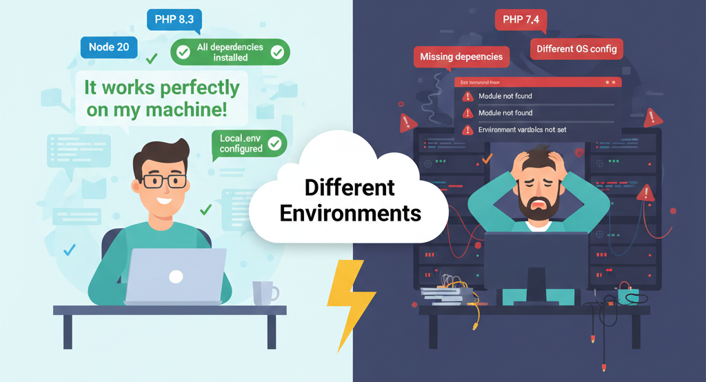
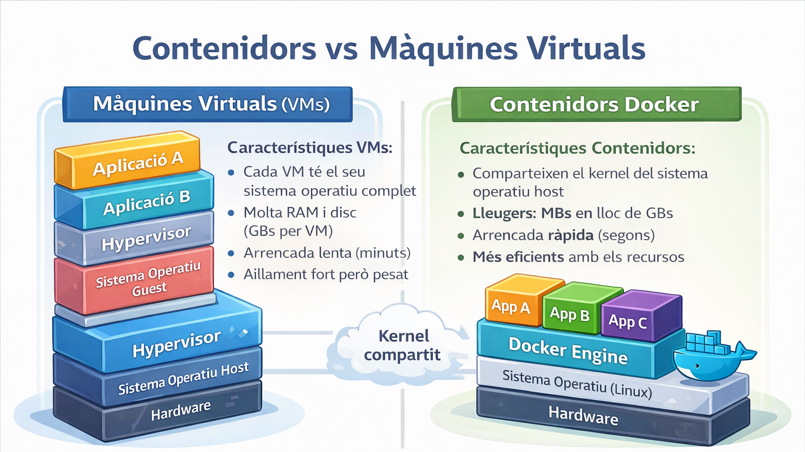
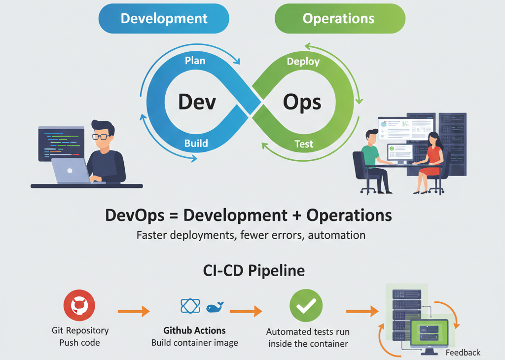
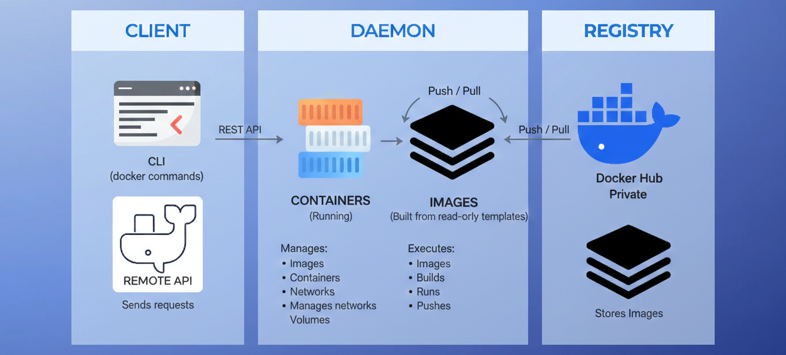

# 01. Introducció a Docker i la Containerització

## 1. El problema: "It works on my machine"

Els desenvolupadors d'aplicacions i els administradors de sistemes moltes vegades es troben en la següent situació:

- **Desenvolupador**: "El meu codi funciona perfectament al meu portàtil"
- **DevOps/Admin Sistemes**: "Doncs al servidor no funciona"
- **Desenvolupador**: "Doncs al meu ordinador va bé"

El problema real es que cada sistema utilitza diferents versions i configuracions:

**Diferents versions de llibreries**

- PHP 8.3 vs PHP 7.4, Node 20 vs Node 16, MySQL 8 vs MariaDB 10, etc.

**Configuracions diferents del sistema operatiu**

- Diferències en permisos d'arxius, Sistema d'arxius case-sensitive vs case-insensitive, Timezone UTC vs Europe/Madrid, etc.

**Configuracions diferents en els serveis**

- MySQL escoltant al port 3306 vs 3307, PHP amb memory_limit 128M vs 512M, CORS habilitat vs bloquejat, etc.

**Dependències que falten en producció**

- Extensió pdo_mysql no instal·lada, libpng absent per processar imatges, curl no disponible per crides API, etc.

**Variables d'entorn diferents**

- APP_ENV=local vs APP_ENV=production, Credencials BD diferents, JWT_SECRET inexistent, Claus d'API diferents, etc.



**Docker: la solució**: "Empaqueta" l'aplicació amb totes les seves dependències en un **contenidor** que funciona de la mateixa manera a tots els sistemes.

## 2. Què és Docker?

**Docker** és una tecnologia que permet **empaquetar, distribuir i executar aplicacions** dins de **contenidors** lleugers i portables. Ens permet crear entorns de treball aïllats que es poden executar a qualsevol sistema (l'ordinador del desenvolupador, el servidor de l'empresa, al núvol, etc.).

Un **contenidor** és com una capsa tancada que conté:

- La teva aplicació - codi font: HTML, CSS, JS, PHP, Python, Node.js
- Totes les llibreries necessàries - paquets que importa el teu codi: PHPMailer, Express, Twig, Requests, Axios
- La configuració del sistema - OS base (Debian, Alpine), permisos d'arxius, timezone, locale
- Les dependències - extensions i paquets del sistema que el teu codi necessita: pdo_mysql, gd, curl, mbstring, openssl, build-essential

**Analogia**: És com enviar un producte per correu dins d'una capsa amb totes les eines que necessita per fer-lo funcionar (tornavís, cargols, carregador, piles, etc.), en lloc d'enviar només el producte i esperar que el destinatari tingui les eines i material necessaris per muntar-lo i fer-lo funcionar.

## 3. Avantatges de Docker

- ✅ Portabilitat: La mateixa aplicació funciona a qualsevol sistema (empaqueta aplicacions i dependències)
- ✅ Rapidesa: Crear i desplegar contenidors amb l'aplicació funcional en pocs segons
- ✅ Aïllament: Cada contenidor és independent (projectes diferents executats alhora)
- ✅ Eficiència: Executar diversos contenidors en un únic servidor (és possible centenars de contenidors)
- ✅ Gestió: Eines per controlar, monitoritzar i escalar contenidors (gràficament i per comandes)

**Per a desenvolupadors:** Mateix entorn en desenvolupament, proves i producció

**Per a empreses i DevOps:**

- Desplegaments més ràpids i fiables de les aplicacions
- Escalabilitat: Afegir més contenidors segons la càrrega
- Portabilitat: Mateix codi on-premise que a AWS, Azure o Google Cloud
- Estalvi de recursos en comparació a màquines virtuals
- Automatització de desplegaments (CI/CD)
- Rollback ràpid si alguna cosa falla

## 4. Contenidors vs Màquines Virtuals

Els contenidors i les màquines virtuals es fan servir per encapsular o aïllar aplicacions, però utilitzen tècniques diferents per fer-ho possible. Les VMs també ofereixen un nivell més aïllament i els contenidors ofereixen més eficiència i portabilitat.

**Característiques VMs:**

- Virtualitzen una màquina física completa
- Requereixen d'un hipervisor
  - Tipus 1 (bare-metal): VMware ESXi, Proxmox VE, KVM, Microsoft HYPER-V.
  - Tipus 2 (allotjat/aplicació): VirtualBox, VMWare Workstation, etc.
- Cada VM disposa del seu sistema operatiu complet
- Necessiten molta RAM i espai de disc (GBs per cada VM)
- Arrencada lenta (minuts)

**Característiques Contenidors:**

- Comparteixen el kernel del sistema operatiu amfitrió
- Requereixen d'un motor de contenidors (com Docker)
- Són lleugers: Ocupen MBs en lloc de GBs
- Arrencada ràpida (segons)
- Utilitzat en el desenvolupament d'aplicacions (senzill empaquetat i portabilitat)



**Comparativa en format taula:**

| Característica        | Màquina Virtual          | Contenidor Docker                 |
| --------------------- | ------------------------ | --------------------------------- |
| **Kernel**            | Propi per cada VM        | Comparteix el de l'amfitrió       |
| **Aïllament**         | Fort (SO complet)        | Alt (processos) comparteix kernel |
| **Disc**              | GB (1-25 GB)             | MB (10-500 MB)                    |
| **RAM**               | Alt consum (SO complet)  | Baix Consum (processos)           |
| **Temps d'arrencada** | Minuts                   | Segons                            |
| **Rendiment**         | Possible sobrecàrrega    | Execució pràcticament nativa      |
| **Portabilitat**      | Mitjana (compatibilitat) | Alta                              |
| **Escalabilitat**     | Lenta (més temps)        | Ràpida (poc temps)                |

## 5. Docker en l'entorn laboral: DevOps i CI/CD

### Què és DevOps?

**DevOps** = Development (Desenvolupament) + Operations (Operacions)

És una metodologia que integra els equips de desenvolupament i sistemes per:

- Col·laborar des de l'inici del projecte per crear i gestionar aplicacions de manera més eficient
- Automatitzar els processos per construir, provar i desplegar les aplicacions
- Detectar errors abans de posar l'aplicació en producció

### Què és CI/CD?

**CI/CD** = Continuous Integration / Continuous Deployment

- **CI (Integració Contínua)**: Els desenvolupadors integren freqüentment els canvis que realitzen en el codi d'un projecte compartit (un repositori compartit). Cada cop que es realitza una integració s'executen proves automàtiques per detectar errors ràpidament.
- **CD (Desplegament Continu)**: Els canvis validats es despleguen automàticament a entorns de pre-producció i producció.



**Exemple de pipeline CI/CD amb Docker:**

Un **pipeline CI/CD** és un conjunt de passos automatitzats que permeten construir, provar i desplegar una aplicació cada vegada que hi ha canvis al codi i s'han afegit al repositori remot/compartit.

```
1. El Desenvolupador fa push del codi al repositori remot (GitHub)
2. GitHub Actions detecta el canvi i executa automàticament el workflow.
3. Es construeix la imatge Docker de l'aplicació.
4. S'executen proves automàtiques dins del contenidor
5. Si les proves són correctes, la imatge es publica i es desplega a producció.
Tot això es realitza en pocs minuts i sense intervenció de l'usuari
```

**Per què Docker és tan popular a DevOps:**

Docker és una eina clau en entorns Devps perquè proporciona **portabilitat**, **consistència** i **aïllament** en les aplicacions, facilitant el desplegament automatitzat i la integració amb el núvol.

- Docker permet empaquetar l'aplicació amb les seves dependències (tot el necessari per funcionar).
- Garanteix el funcionament en tots els entorns (desenvolupament, testing i producció).
- Facilita la integració amb eines de CI/CD (GitHub Actions, Jenkins, GitLab CI/CD).
- Estàndard de la indústria: **saber Docker és imprescindible per treballar en posicions DevOps**

## 6. Arquitectura Docker

Docker té diversos components que treballen conjuntament:



### Components principals:

**1. Docker Client (docker)**

- La interfície de línia de comandes que utilitzen els usuaris per comunicar-se amb Docker
- Envia comandes al Docker Daemon (`docker run`, `docker build`, `docker ps`, etc)

**2. Docker Daemon (dockerd)**

- El "cervell" de Docker. Procés principal que gestiona (imatges, contenidors, xarxes i volums)
- Escolta les peticions del Docker Client

**3. Imatges (Images)**

- Plantilles, de només lectura, per crear contenidors
- Contenen l'aplicació, totes les seves dependències i configuració.
- Es construeixen des d'un **Dockerfile** (`nginx:latest`, `mysql:8.0`, `php:8.2-apache`)

**4. Contenidors (Containers)**

- **Instàncies en execució** d'una imatge
- Són efímers: es poden crear i destruir ràpidament
- Aïllats uns dels altres (contenidor executant WordPress, un altre Node JS, etc.)

**5. Registre (Registry)**

- Repositori on es guarden i comparteixen imatges de Docker.
- **Docker Hub**: Registre públic oficial. També es poden configurar registres privats
- **GitHub Container Registry (GHCR)**: Registre de GitHub

**6. Xarxes Docker (Networks)**

- Conjunt de xarxes virtuals que permeten la comunicació entre contenidors i amb l'exterior.
- Proporciona aïllament de xarxa entre diferents aplicacions
- Tipus: bridge (per defecte), host, none

**7. Volums (Volumes)**

- Emmagatzematge persistent per contenidors (punts de muntatge fora del contenidor)
- Les dades sobreviuen quan el contenidor es destrueix (Base de dades MySQL necessita un volum)

### Flux de treball Docker:

```
1. Descarregar imatge: docker pull nginx
   Docker Hub → Docker Daemon → Imatge local

2. Crear contenidor: docker run nginx
   Imatge → Docker Daemon → Contenidor en execució

3. Gestionar contenidro: docker ps, docker stop, docker rm
   Docker Client → Docker Daemon → Accions sobre els contenidors
```
