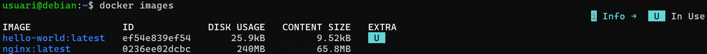
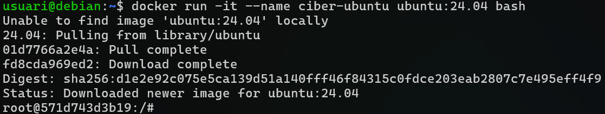
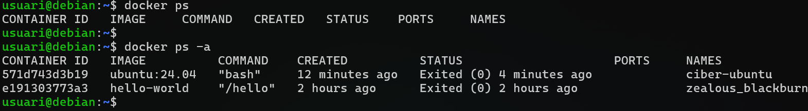
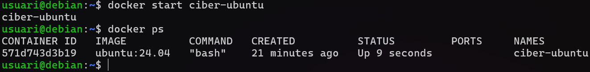
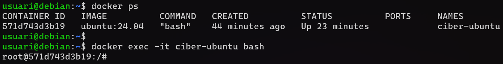

# 02. Gestió de Contenidors

## El teu primer contenidor: Hello World

```bash
# Executar el contenidor hello-world
docker run hello-world
```

**Què passa quan executes aquesta comanda?**

1. Docker busca la imatge `hello-world` localment
2. No la troba, així que la descarrega de Docker Hub
3. Crea un contenidor a partir de la imatge
4. Executa el programa dins del contenidor
5. El programa mostra un missatge pel terminal i surt
6. El contenidor s'atura automàticament

## 1. El Docker Hub

**Docker Hub** (hub.docker.com) és el registre públic més gran d'imatges Docker:

- Milers d'imatges oficials (nginx, mysql, php, ubuntu, alpine, node, python, etc.)
- Imatges de la comunitat
- Gratuït per imatges públiques

### Buscar imatges a Docker Hub

```bash
# Buscar imatges de nginx
docker search nginx

# Veure informació d'una imatge
docker pull nginx:latest
docker images
```



### Format d'una imatge Docker

Format: `repositori:tag`

Exemples:

- `nginx:latest` → Última versió d'nginx
- `nginx:1.29.5` → Versió específica 1.29.5
- `mariadb:lts-ubi` → MariaDB LTS (estable i amb patch de seguretat)
- `php:8.3.30-apache` → PHP 8.3.30 amb Apache

**Recomanació**: En producció, sempre especifica la versió (no utilitzis `:latest`).

## 2. Treballant amb contenidors

### `docker run` - Crear nous contenidors

`docker run` és la comanda que permet crear un contenidor a partir d'una imatge. Us recomano posar un nom al contenidor per facilitar-vos posterioment la seva gestió.

```bash
docker run -it --name ciber-ubuntu ubuntu:24.04 bash
#-it: Mode interactiu amb terminal (necessari perquè no s'aturi el contenidor)
#--name ciber-ubuntu: Doneu-li un nom descriptiu
#ubuntu:24.04: Imatge oficial d'Ubuntu
#bash: comanda a executar (obrir una shell bash)
exit
```

**Recordatori**: El contenidor és **efímer**. Si tornes a executar `docker run -it ubuntu:24.04 bash`, es crearà un NOU contenidor.



### `docker ps` - Mostrar els contenidors en execució i disponibles

`docker ps -a` mostra un llistat dels contenidors existents. Es mostren els que estan en execució i els detinguts. Podem veure informació com l'ID del contenidor, l'estat, els ports que utilitza, etc.

```bash
# Contenidors en execució
docker ps
# Contenidors disponibles (en execució i detinguts)
docker ps -a
```



### `docker start` - Iniciar contenidors creats (i mantenir-los actius)

`docker start` permet iniciar un contenidor existent i que està detingut. Has d'indicar el nom del contenidor.

```bash
# Iniciar un contenidor
docker start ciber-ubuntu
```

En el cas anterior s'inicia el contenidor que hem creat prèviament. Això és possible gràcies a que la imatge d'Ubuntu que ens hem descarregat incloia l'execució de la comanda `/bin/bash` quan s'inicia el contenidor amb `docker start`.



### `docker exec` - Executar comandes a un contenidor en execució

Si volem accedir al terminal del contenidor podem fer ús de la comanda `docker exec -it ciber-ubuntu bash`. Si el contenidor s'està executant obtindrem la bash.



### Comandes útils

```bash
# Aturar un contenidor
docker stop ciber-ubuntu

# Inicia el contenidor i accedeix a la shell en mode interactiu
docker start -ai ciber-ubuntu

# Elimina un contenidor detingut (hello-world)
docker rm nom-contenidor/id-contenidor

# Logs d'un contenidor
docker logs ciber-ubuntu

# Visualitzar els logs en temps real
docker logs -f ciber-ubuntu

# Veure imatges descarregades
docker images

# Eliminar una imatge (abans el contenidor)
docker rm nom-contenidor-hello-world
docker rmi hello-world:latest

# Accedir a un contenidor en execució
docker exec -it ciber-ubuntu bash

# Executar una comanda puntual
docker exec ciber-ubuntu ls
```

## 3. Exercicis amb contenidors individuals

### Exercici 1 (Contenidor bàsic Nginx)

1. Descarrega la imatge oficial d'nginx.
2. Executa un contenidor en seogn pla amb el nom `ciber-nginx` exposant el port 80 del host al 80 del contenidor.
3. Accedeix a la pàgina de prova des del navegador del host (http://localhost)
4. Accedeix al terminal del contenidor `ciber-nginx`
5. Crea un fitxer index.html amb contingut "Hola Ciber Docker!" a /usr/share/nginx/html/index.html.
6. Comprova que el canvi es veu des del navegador.

### Exercici 2 (Contenidor Apache-PHP)

1. Descarrega php:8.3-apache.
2. Executa un contenidor en segon pla amb el nom `ciber-apache-php` exposant el port 9000 del host al 80 del contenidor.
3. Crea un fitxer index.php que imprimeixi phpinfo().
4. Comprova des del navegador http://localhost:9000.
5. Obre un terminal interactiu del contenior `ciber-apache-php`.

### Exercici 3 (Contenidor MariaDB)

Has d'utilitzar un fitxer de variables d'entorn `.env` per posar les contrasenyes i que no siguin visibles a l'historial quan executis docker.

1. Descarrega mariadb:11.4
2. Executa el contenidor MariaDB amb `--env-file`, el nom `ciber-mariadb` i exposant el port 3306 del host al 3306 del contenidor. També heu de complir amb les següents condicions:

- Password de root: `ciber`.
- Nom de la base de dades: `plataforma_videojocs`.
- Nom de l'usuari: `plataforma_user`.
- Password de l'usuari: `123456789a`.

3. Comprova que el contenidor està corrent.
4. Accedeix a la consola de mariadb del contenidor `ciber-mariadb`.
