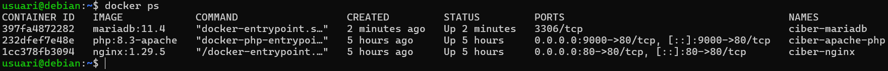
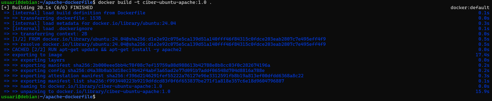
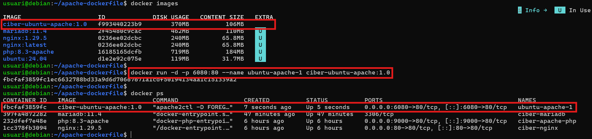
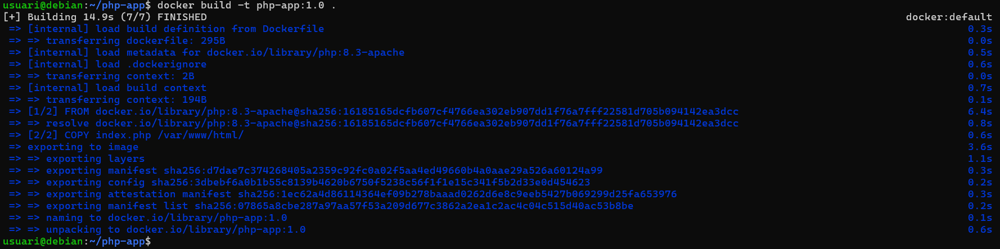
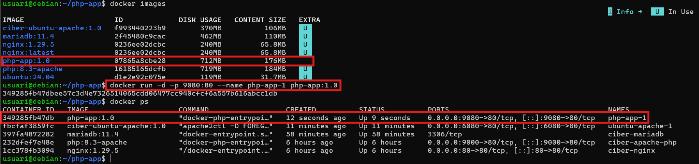
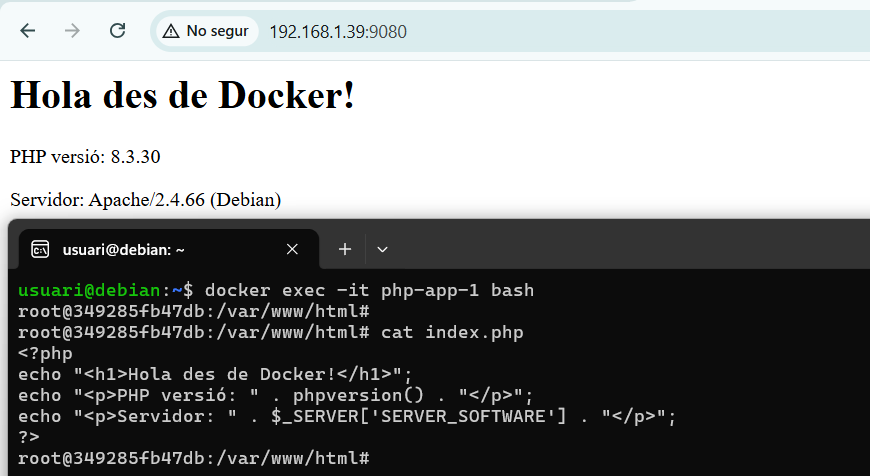
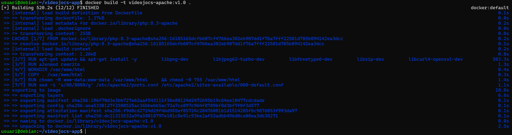
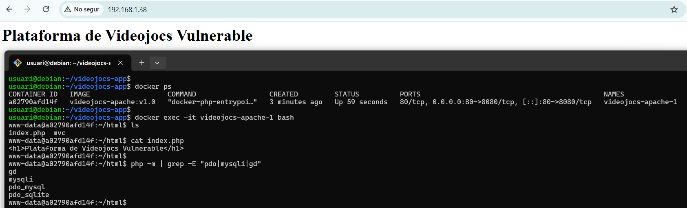

# 04. Gestió d'Imatges Docker

## 1. Què és un Dockerfile i per què el necessitem?

Els exercicis que hem fet utilitzen imatges públiques de Docker Hub:

```bash
# Exposem els ports perquè de moment no hem creat una xarxa interna de contenidors
docker run -it --name ciber-ubuntu ubuntu:24.04 bash
docker run -d --name  ciber-nginx -p 80:80 nginx:1.29.5
docker run -d --name ciber-apache-php -p 9000:80 php:8.3-apache
docker run -d --env-file .env --name ciber-mariadb mariadb:11.4
# fitxer .env
# MARIADB_ROOT_PASSWORD=ciber
# MARIADB_DATABASE=plataforma_videojocs
# MARIADB_USER=plataforma_user
# MARIADB_PASSWORD=123456789a
```



Però per les nostres aplicacions segurament necessitem:

- PHP amb extensions específiques (mysqli, pdo_mysql, gd)
- La nostra aplicació web dins de la imatge (el codi font)
- Configuració personalitzada d'Apache i/o Nginx
- Eines addicionals (curl, git, composer, wget, python)
- Executar l'script per crear la base de dades i importar les dades inicials

**La Solució: Crear les nostres pròpies imatges amb un Dockerfile**

## 2. Ara si, què és un Dockerfile?

Un Dockerfile és un fitxer que disposa d'instruccions per construir una imatge Docker de forma automatitzada. El nom del fitxer ha de ser exactament `Dockerfile` amb la primera lletra majúscula

**Exemple bàsic (contingut Dockerfile):**

```bash
nano Dockerfile
```

```dockerfile
FROM ubuntu:24.04
RUN apt-get update && apt-get install -y apache2
EXPOSE 80
CMD ["apache2ctl", "-D", "FOREGROUND"]
```

**Construcció de la imatge:**

```bash
# Construïr la imatge
docker build -t ciber-ubuntu-apache:1.0 .
```



Resultat: Una imatge `ciber-ubuntu-apache:1.0` amb Ubuntu + apache2 instal·lat.

```bash
# Veure la imatge que hem construït
docker images
# Crear un contenidor a partir de la nostra imatge
docker run -d -p 6080:80 --name ubuntu-apache-1 ciber-ubuntu-apache:1.0
# Verificar que està executant-se
docker ps
```



Verifica que apache està en funcionament accedint a: `http://IP_DE_LA_VM:6080`

## 3. Un fitxer Dockerfile

Un Dockerfile està composat d'INSTRUCCIONS. Cada instrucció representa una acció específica que Docker ha de realitzar.

### Instruccions principals:

| Instrucció     | Descripció                                                              | Exemple                               |
| -------------- | ----------------------------------------------------------------------- | ------------------------------------- |
| **FROM**       | Imatge base (punt de partida)                                           | `FROM php:8.3-apache`                 |
| **RUN**        | Executar comandes durant la construcció                                 | `RUN apt-get update`                  |
| **COPY**       | Copiar fitxers del host a la imatge                                     | `COPY ./src /var/www/html`            |
| **ADD**        | Permet baixar fitxers remots i descomprimir (+COPY)                     | `ADD app.tar.gz /app`                 |
| **WORKDIR**    | Establir directori de treball (el crea si no existeix)                  | `WORKDIR /var/www/html`               |
| **ENV**        | Definir variables d'entorn persistents a la imatge                      | `ENV DB_HOST=localhost`               |
| **EXPOSE**     | Indicar quin port utilitza l'app (no mapeja el port)                    | `EXPOSE 80`                           |
| **CMD**        | Comanda o passa paràmetres a l'iniciar el contenidor                    | `CMD ["apache2-foreground"]`          |
| **ENTRYPOINT** | Comanda principal (normalment crida a un script d'inici)                | `ENTRYPOINT ["nginx"]`                |
| **USER**       | Canviar l'usuari (per seguretat)                                        | `USER www-data`                       |
| **VOLUME**     | Defineix punts de muntatge per dades persistents                        | `VOLUME ["/var/lib/mysql"]`           |
| **LABEL**      | Afegir metadades per documentació i identificació (autor, versió, etc.) | `LABEL maintainer="ciber@domini.cat"` |
| **ARG**        | Definir variables de build que poden canviar la construcció             | `ARG APP_VERSION=1.0`                 |

### Procés per crear un Dockerfile pas a pas:

`Pas 1`: Escollir una imatge base adequada com a punt de partida. **(FROM)**
`Pas 2`: Executar comandes durant la construcció de la imatge. **(RUN)**
`Pas 3`: Copiar fitxers locals de l'aplicació al contenidor o descarregar fitxers remots. **(COPY i ADD)**
`Pas 4`: Definir el directori de treball (working directory). **(WORKDIR)**
`Pas 5`: Indicar els ports necessaris per a la comunicació amb l'app. **(EXPOSE)**
`Pas 6`: Definir variables d'entorn dins la imatge (per no modificar fitxers de codi). **(ENV)**
`Pas 7`: Canviar l'usuari que gestionarà el servei (seguretat). **(USER)**
`Pas 8`: Especificar els arguments per defecte que s'executaran i el procés principal. **(CMD i ENTRYPOINT)**

## 4. `docker-build` - El meu primer Dockerfile

`docker build` permet construir imatges Docker a partir d'un Dockerfile i una carpeta local o repositori remot que disposa dels fitxers necessaris per desplegar l'aplicació.

### Pas 1: Crear la carpeta i els fitxers de la app

Carpeta local que disposa dels fitxers que es copiaran a la imatge. Aquesta carpeta normalment inclou el fitxer Dockerfile i els arxius necessaris per a la construcció de la imatge.

```bash
mkdir php-app
cd php-app
nano index.php
# Crear un index amb contingut php
<?php
echo "<h1>Hola des de Docker!</h1>";
echo "<p>PHP versió: " . phpversion() . "</p>";
echo "<p>Servidor: " . $_SERVER['SERVER_SOFTWARE'] . "</p>";
?>
```

### Pas 2: Crear el `Dockerfile`

Dins de la mateixa carpeta de l'aplicació web:

```bash
nano Dockerfile
```

```dockerfile
# Imatge base: PHP amb Apache
FROM php:8.3-apache
# Copiar el nostre codi a la carpeta arrel de l'Apache
COPY index.php /var/www/html/
# Exposar el port 80
EXPOSE 80
# Comanda per defecte (tot i que ja es troba a la imatge base)
CMD ["apache2-foreground"]
```

### Pas 3: Construir la imatge amb `docker build`

- Docker llegeix el Dockerfile per determinar com construir la imatge.

```bash
# -t --> tag (nom de la imatge : versió)
# .  --> context (carpeta actual)
docker build -t php-app:1.0 .
```



### Pas 4: Executar el contenidor amb `docker run`

```bash
# Veure la imatge construïda
docker images
# Executar el contenidor php-app
docker run -d -p 9080:80 --name php-app-1 php-app:1.0
```



### Pas 5: Verificar el funcionament

Obre el navegador: `http://localhost:9080`

Obra una terminal: `docker exec -it php-app-1 bash`



## Exercici - Dockerfile pels diferents contenidors de l'aplicació PHP del vostre projecte

Ara heu de crear un Dockerfile complet per l'aplicació del projecte (contenidor backend: apache-php).

### Estructura del projecte:

```
projecte-videojocs/
├── frontend/
│   ├── index.html
│   ├── css/
│   └── js/
├── backend/
│   ├── index.php
│   ├── config/
│   │   └── database.php
│   └── api/
├── Dockerfile          Nou!
└── .dockerignore       Nou!
```

### Dockerfile complet (contenidor apache-php):

```dockerfile
# Imatge base: PHP 8.3 amb Apache
FROM php:8.3-apache

# Instal·lar extensions PHP recomanades per projectes web amb PHP
RUN apt-get update && apt-get install -y \
        libpng-dev \
        libjpeg62-turbo-dev \
        libfreetype6-dev \
        libzip-dev \
        libcurl4-openssl-dev \
        libonig-dev \
        zip \
        unzip \
    && docker-php-ext-configure gd --with-freetype --with-jpeg \
    && docker-php-ext-install -j$(nproc) \
        pdo_mysql \
        mysqli \
        mbstring \
        gd \
        zip \
    && apt-get clean \
    && rm -rf /var/lib/apt/lists/*

# Habilitar mod_rewrite d'Apache (per URLs amigables)
RUN a2enmod rewrite

# Establir directori de treball
WORKDIR /var/www/html

# Copiar el codi de l'aplicació
COPY . /var/www/html

# Donar propietat i permisos a www-data
RUN chown -R www-data:www-data /var/www/html \
    && chmod -R 755 /var/www/html

# Modificar el port d'escolta 80 per 8080 (a la xarxa interna)
RUN sed -i 's/80/8080/g' /etc/apache2/ports.conf /etc/apache2/sites-available/000-default.conf

# Exposar el pot 8080 (només a la xarxa interna)
EXPOSE 8080

# Canviar l'usuari del servei a www-data
USER www-data

# Comanda per defecte (Apache en primer pla)
CMD ["apache2-foreground"]
```

## 6. .dockerignore - Ignorar fitxers

Similar a `.gitignore`, el fitxer `.dockerignore` indica quins fitxers NO copiar a la imatge.

### Crear el fitxer `.dockerignore`:

```
# Control de versions
.git
.gitignore

# Fitxers de configuració local
.env

# Fitxers temporals
*.log
*.tmp

# Documentació
README.md
docs/

# Docker
Dockerfile
.dockerignore
docker-compose.yml

# IDE
.vscode/
```

**Per què és important?**

- ✅ Imatges més petites
- ✅ No s'han de copiar secrets (.env)
- ✅ Build més ràpid
- ✅ No s'han d'incloure fitxers innecessaris

## 7. Construcció i gestió d'imatges

### Construir la imatge:

```bash
# Des de la carpeta del projecte
docker build -t videojocs-apache:v1.0 .
```



```bash
# Veure totes les imatges
docker images

# Filtrar per nom
docker images videojocs-apache
```

### Provar la imatge

```bash
# Executar el contenidor
docker run -d -p 80:8080 --name videojocs-apache videojocs-apache:v1.0

# Verificar que funciona
curl http://localhost

# O obrir el navegador
firefox http://localhost

# Entrar al contenidor
docker exec -it videojocs-apache bash

# Dins del contenidor
php -m | grep -E "pdo|mysqli|gd"
# Hauries de veure: pdo_mysql, mysqli, gd

exit
```



### Netejar (eliminar el contenidor)

```bash
docker stop videojocs-apache
docker rm videojocs-apache
```

## 8. Preparació per Reverse Proxy (Nginx + Apache/PHP)

Properament crearem una arquitectura en xarxa Docker amb 3 contenidors:

- **Nginx**: Reverse proxy (entrada única)
- **Apache/PHP**: Backend amb l'aplicació
- **MariaDB**: Base de dades

### Per què aquesta arquitectura?

**Avantatges:**

- ✅ **Nginx**: Excel·lent per servir fitxers estàtics (HTML, CSS, JS, imatges)
- ✅ **Nginx**: Gestió eficient de SSL/TLS
- ✅ **Apache/PHP**: Especialitzat en processar PHP
- ✅ **Separació de responsabilitats**: Cada servei fa el que millor fa
- ✅ **Escalabilitat**: Pots tenir múltiples contenidors Apache darrere d'un Nginx
