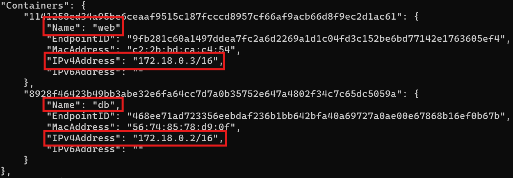
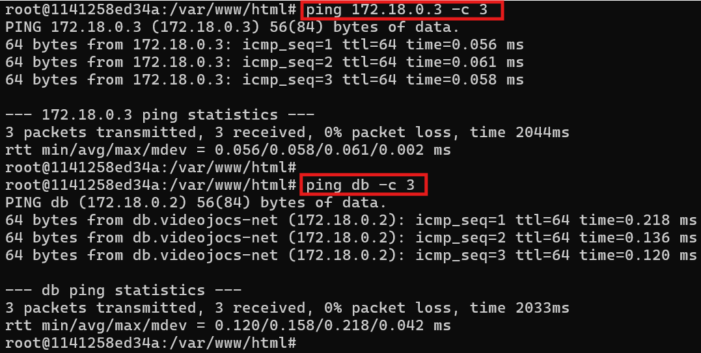

# 05. Gestió de Xarxes Docker

## 1. Per què necessitem xarxes Docker?

```bash
# Contenidor 1: Base de dades
docker run -d --env-file .env --name db mariadb:11.4

# Contenidor 2: Aplicació web
docker run -d --name web php:8.3-apache

# Problema: L'aplicació NO pot interactuar amb la BD (la ip ha canviat)
```

**Per què?** Cada contenidor té la seva pròpia interfície de xarxa. Per defecte, els contenidors estan connectats a la xarxa bridge de Docker. Poden comunicar-se entre ells per IP, però no hi ha resolució de noms automàtica i `les IP poden canviar`.

### La solució: Xarxes Docker

Les **xarxes Docker** permeten que els contenidors es comuniquin entre ells de forma **controlada** i **segura** ja que proporciona un `DNS` intern.

```bash
# Crear una xarxa
docker network create videojocs-net

# Afegir Contenidor 1: Base de dades (a la xarxa)
docker network connect videojocs-net db

# Afegir Contenidor 2: Aplicació web (a la mateixa xarxa)
docker network connect videojocs-net web

# Podem crear un contenidor i afegir-lo a la xarxa amb docker run
# docker run -d --name web --network videojocs-net php:8.3-apache

# Ara web pot comunicar-se sempre amb la base de dades pel nom "db"
```

```bash
# Podem veure els contenidor que estan dintre de la xarxa amb
# docker network inspect nom-xarxa
docker network inspect videojocs-net
```



## 2. Conceptes bàsics de xarxes Docker

### Què és una xarxa Docker?

Una **xarxa Docker** és un **entorn de xarxa virtual** on els contenidors poden comunicar-se entre ells.

### DNS intern de Docker

Quan connectes contenidors a una xarxa, Docker proporciona **resolució de noms automàtica**:

```bash
# Contenidor "db" a la xarxa videojocs-net
# Contenidor "web" a la xarxa videojocs-net
# Contenidor "web" podrà trobar "db" pel seu nom

docker exec -it web bash

apt update
apt install iputils-ping

# Fem ping amb IP i amb NOM
ping 172.20.0.3 -c 3

ping db -c 3
```

**Important**: El **nom del contenidor** es converteix en el **nom DNS** dins de la xarxa.



### Exercici de Xarxa (Comunicació WEB i DB)

1. Instal·la el paquet de php-mysql amb php-docker
2. Realitza la connexió a la base de dades amb PHP (index-db.php)
3. Accedeix des del tue host i verifica que la connexió és exitosa

### Exercici 2 de Xarxa (Dockerfile WEB i DB)

1. Crea un Dockerfile per automatizar a partir de php:8.3-apache:

- La instal·lació de php-mysql amb docker-php
- La còpia del fitxer index.php i index-db.php

2. Fes la construcció de la imatge

3. Crea un nou contenidor incloent-lo a la xarxa videojocs-app i mapejant un port al host. Per exemple: 9980

4. Verifica que la connexió a la BD és fa amb èxit: http://IP_VM:9980/index-db.php

## 3. Tipus de xarxes Docker

Docker proporciona diferents tipus de xarxes per diferents casos d'ús:

### 3.1. Bridge (per defecte)

La xarxa **bridge** és la xarxa per defecte quan no especifiques cap xarxa.

```bash
# Sense especificar xarxa es posen els contenidors a la "xarxa bridge"
docker run -d --name web nginx
```

**Característiques:**

- Xarxa privada interna (normalment 172.17.0.0/16)
- Els contenidors poden comunicar-se per IP
- ❌ NO poden comunicar-se per nom (sense DNS automàtic a bridge per defecte)
- Adequada per contenidors individuals
- Port mapping necessari per accés des del host: `-p`

**Quan la fariem servir?**

- Proves ràpides amb un sol contenidor
- Proves ràpides amb diversos contenidors amb comunicació temporal per IP
- NO recomanada per aplicacions multi-contenidor

### 3.2. Xarxes Bridge personalitzades (la que farem servir)

Xarxes bridge (internes) que les podeu crear i disposen de **DNS automàtic**.

```bash
docker network create xarxa-ciber
docker run -d --name web --network xarxa-ciber nginx
```

**Característiques:**

- ✅ DNS automàtic (resolució de noms)
- ✅ Aïllament entre diferents aplicacions
- ✅ Control sobre quin contenidor està a quina xarxa
- ✅ Millor pràctica per aplicacions multi-contenidor

**Quan la fariem servir?**

- **Sempre** que creem aplicacions amb múltiples contenidors
- Quan necessitem aïllament entre projectes

### 3.3. Host

El contenidor **comparteix la xarxa del host** directament.

```bash
docker run -d --network host nginx
# Nginx escolta directament al port 80 del host
# Comparteixen l'espai de xarxa de l'amfitrió
```

**Característiques:**

- No hi ha NAT (Network Address Translation)
- Millor rendiment de xarxa
- El contenidor veu totes les interfícies del host
- Menys aïllament (menys segur)

**Quan la fariem servir?**

- Aplicacions que necessiten el màxim rendiment de la xarxa
- El servei del contenidor ha de ser accessible com un servei del host
- El servei del contenidor necessita veure les IPs del host
- Es fa servir en servidors de videojocs, testing de xarxa, multimedia, etc.

### 3.4. None

El contenidor **no disposa de cap interficie de xarxa**.

```bash
docker run -d --network none nginx
# El contenidor està completament aïllat de la xarxa
```

**Característiques:**

- Només disposa de la interfície loopback (127.0.0.1)
- Proporciona el màxim aïllament
- No pot comunicar-se amb altres contenidors ni amb l'exterior

**Quan la fariem servir?**

- Contenidors que NO necessiten xarxa
- Processament de dades sense accés extern
- Màxima seguretat (sandbox)
- Volem provar un servei vulnerable, executen programari intern sense necessitat de comunicació o Internet (processament de dades, etc.),

## 4. Gestió de xarxes Docker

### Llistar xarxes

```bash
# Veure totes les xarxes
docker network ls
```

Docker crea automàticament 3 xarxes per defecte: **bridge**, **host** i **none**.

### Crear una xarxa

```bash
# Crear xarxa amb nom
docker network create app-network

# Crear xarxa amb subxarxa específica
docker network create --subnet=192.168.1.0/24 custom-network
```

### Inspeccionar una xarxa

```bash
# Veure detalls d'una xarxa
docker network inspect app-network
```

### Connectar/Desconnectar contenidors a una xarxa

```bash
# Connectar contenidor existent a una xarxa
docker network connect app-network web

# Desconnectar contenidor d'una xarxa
docker network disconnect app-network web
```

### Eliminar xarxes

```bash
# Eliminar una xarxa específica
docker network rm app-network

# Eliminar totes les xarxes no utilitzades
docker network prune
```

## 5. Exercicis pràctics

### 5.1 Desplegament de l'aplicació DVWA i un Kali

1. Crea una xarxa "dvwa-net"
2. Crea un Dockerfile per MariaDB (root/dvwa) --> mariadb:11.4
3. Construeix la imatge de base de dades
4. Crea el contenidor "dvwa-db" i afegeix-lo a la xarxa "dvwa-net"
5. Crea un Dockerfile per Apache --> php8.3-apache

- 5.1. Instal·la les dependències necessàries
- 5.2. Copia la carpeta de DVWA a l'arrel del servidor web.
- 5.3. Exposa el port 80 (el mapejaras al 8080)

6. Construeix la imatge del servidor web
7. Crea el contenidor "dvwa-web" i afegeix-lo a la xarxa "dvwa-net"
8. Crea un Dockerfile pel Kali --> kalilinux/kali-rolling

- 8.1 Instal·la les dependències necessàries (curl, namp ,sqlmap, gobuster, etc.)

9. Construeix la imatge de la màquina atacant
10. Crea el contenidor "dvwa-kali" i afegeix-lo a la xarxa "dvwa-net"

Fes proves des del Kali per verificar el funcionament del laboratori.

## 6. Arquitectura multi-contenidor (multi-capa) amb aïllament

Per aplicacions reals, és recomanable **segmentar** la xarxa en múltiples capes per seguretat.

### Arquitectura objectiu:

```
Internet
   ↓
[Nginx] (ports 80/443)  ← Xarxa: frontend-network + backend-network
   ↓
[Apache/PHP]            ← Xarxa: backend-network + database-network
   ↓
[MySQL]                 ← Xarxa: database-network (AÏLLADA)
```

**Avantatges:**

- ✅ **Nginx** pot comunicar-se amb Apache/PHP
- ✅ **Apache/PHP** pot comunicar-se amb MySQL
- ❌ **Nginx NO pot accedir directament a MySQL** (més segur)

## 7. Exercici Multi-contenidor

Implementació amb Dockerfiles

1. Crea dues xarxes (frontend i backend)
2. Crea el contenidor de base de dades a la xarxa backend
3. Crea el contenidor d'apache-php

- Connecta'l a la xarxa backend
- Connecta'l a la xarxa frontend

4. Crea el contenidor nginx (port 80) a la xarxa frontend
5. Verificar aïllament (ping nginx a la db)

## 8. Comandes essencials de xarxes

```bash
# Gestió de xarxes
docker network create <nom>              # Crear xarxa
docker network ls                        # Llistar xarxes
docker network inspect <nom>             # Inspeccionar xarxa
docker network rm <nom>                  # Eliminar xarxa
docker network prune                     # Eliminar xarxes sense ús

# Connectar/Desconnectar contenidors
docker network connect <xarxa> <contenidor>
docker network disconnect <xarxa> <contenidor>

# Debugging
docker exec <contenidor> ping <altre>    # Test connectivitat
docker inspect <contenidor>              # Veure IP i xarxes
docker port <contenidor>                 # Veure ports publicats
```

## 9. Troubleshooting comú

### Error: "network not found"

```bash
# Verificar que la xarxa existeix
docker network ls

# Crear la xarxa si no existeix
docker network create app-network
```

### Error: "could not resolve host"

```bash
# Verificar que els contenidors estan a la mateixa xarxa
docker network inspect app-network

# Connectar el contenidor a la xarxa
docker network connect app-network contenidor
```

### Error: "address already in use"

```bash
# Port ja ocupat al host
# Usar un altre port:
docker run -d -p 8081:80 nginx  # En lloc de 8080

# O aturar el servei que ocupa el port
sudo lsof -i :8080
sudo kill <PID>
```

### Contenidors no es poden comunicar

```bash
# 1. Verificar que estan a la mateixa xarxa
docker network inspect app-network

# 2. Verificar connectivitat per IP
docker exec contenidor1 ping <IP_contenidor2>

# 3. Verificar DNS
docker exec contenidor1 ping contenidor2

# 4. Verificar firewall del host
sudo iptables -L
```
