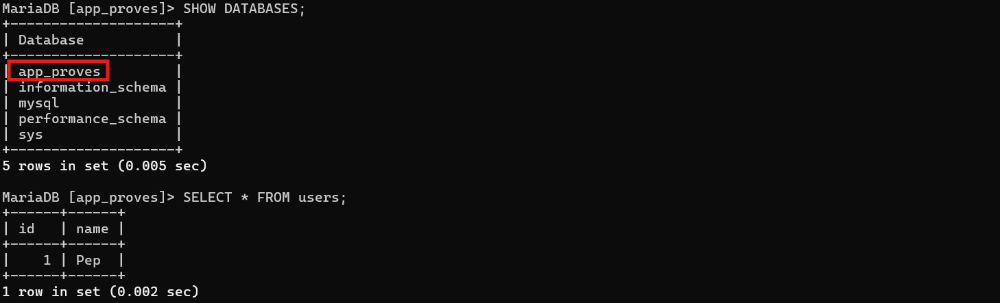
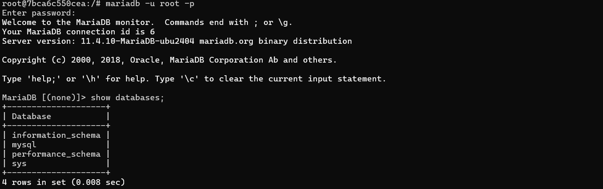
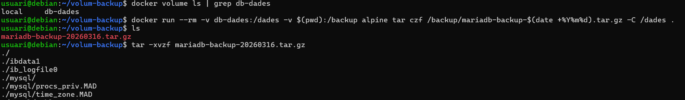
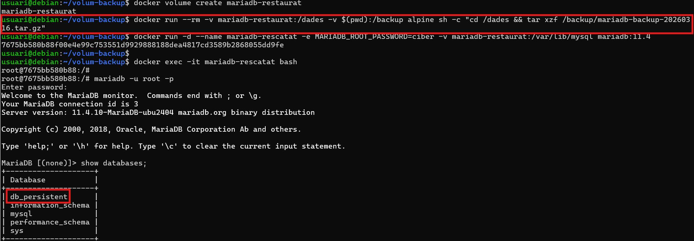
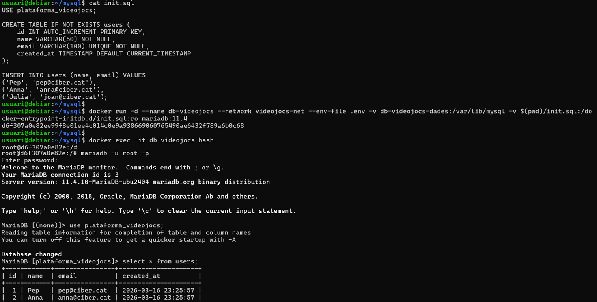

# 06. Gestió de Volumns i Persistència de Dades

## 1. El problema: Contenidors efímers

### Què passa amb les dades quan elimines un contenidor?

Les dades dins del contenidor desapareixen quan elimines el contenidor.

**Per què ens passaria pel cap eliminar un contenidor?**

- Actualitzar la imatge (hi ha disponible una nova versió de la imatge)
- Canviar la configuració inicial (ports, variables d'entorn, etc.)
- El contenidor s'ha corromput (és millor elimnar-lo i crear un altre)
- S'ha de fer un canvi a la xarxa, un canvi d'àlies, etc.

```bash
# Crear contenidor MariaDB
docker run -d --name db-proves -e MARIADB_ROOT_PASSWORD=ciber mariadb:11.4

# Entrar i crear una base de dades
docker exec -it db-proves bash

# Dins del contenidor (a la bash)
mariadb -u root -p

# Al client de mariadb
CREATE DATABASE app_proves;
USE app_proves;
CREATE TABLE users (id INT, name VARCHAR(50));
INSERT INTO users VALUES (1, 'Pep');
SELECT * FROM users;
SHOW DATABASES;
exit
```

Confirmem que la base de dades, la taula d'usuaris i l'usuari introduït existeix.



```bash
# Sortim del contenidor
exit

# Eliminar el contenidor
docker stop db-proves
docker rm db-proves

# Crear un nou contenidor amb el mateix nom
docker run -d --name db-proves -e MARIADB_ROOT_PASSWORD=ciber mariadb:11.4

docker exec -it db-proves bash
# Dins del contenidor (a la bash)
mariadb -u root -p

# Al client de mariadb comprovar...
SHOW DATABASES;
# La base de dades 'db_proves' no existeix
```

Confirmem que la base de dades, la taula d'usuaris i l'usuari introduït NO EXISTEIXEN amb el nou contenidor creat.



### La solució: Volums de Docker

Els **volums** són l'eina per mantenir la informació amb independència del contenidor **(persistència de les dades)**.

Un volum és un directori del Host gestionat per Docker (que existeix fora del sistema de fitxers del contenidor). Per tant, les dades es mantenen encara que el contenidor s'elimini.

Això resol un dels problemes principals dels contenidors (que són efímers).

**Com funcionen els volumns?**

Quan es crea un nou volum, Docker el guarda al sistema de fitxers del Host. Un contenidor pot tenir un o diversos volums associats.

Aquest nou volum es pot "muntar" o adherir a un contenidor. La gestió d'aquest del volum la farà Docker internament, emmagaztemant informació, per exemple d'una base de dades.

Si s'elimina el contenidor, és pot crear un de nou i "muntar" el volum que mantindrà tota la informació de la base de dades.

**`docker volumne create` ens permet crear un nou volum**

**Al fer el docker run podem associat un volum amb l'opció `-v` o `--volume`**

```bash
# Crear volum
docker volume create db-dades

# Contenidor MariaDB amb un volum associat
docker run -d --name db-persistent -e MARIADB_ROOT_PASSWORD=ciber -v db-dades:/var/lib/mysql mariadb:11.4

# Crear dades...
docker exec -it db-persistent bash
mariadb -u root -p
CREATE DATABASE db_persistent;
USE db_persistent;
CREATE TABLE users (id INT, name VARCHAR(50));
INSERT INTO users VALUES (1, 'Pep');
exit
exit

# Eliminar el contenidor
docker stop db-persistent
docker rm db-persistent

# Crear NOU contenidor amb el MATEIX volum
docker run -d --name db-persistent -e MARIADB_ROOT_PASSWORD=ciber -v db-dades:/var/lib/mysql mariadb:11.4

# Comprovar que es mantenen les dades dades...
docker exec -it db-persistent bash
mariadb -u root -p
SHOW DATABASES;
USE db_persistent;
SELECT * FROM users;
# Les dades segueixen aquí :)
```

Confirmem que la base de dades amb la seva informació és manté quan s'elimina el contenidor i es crea un de nou.

És important assignar el mateix volum "db-dades" al nou contenidor.


## 2. Tipus d'emmagatzematge Docker

Docker ofereix **3 tipus** d'emmagatzematge:

- Named Volumes (volums amb nom, gestionats per Docker)
- Anonymous Volumes (volums creats sense nom i Docker els hi assigna un)
- Bind mounts (muntatges directes de directoris del host)

### Named Volumes (el recomanat per producció)

Volums amb nom assignat gestionats per Docker, s'emmagatzemen en una ubicació específica del host. Són portables entre contenidors, es poden fer backups i restaurar fàcilment.

```bash
# Crear volum
docker volume create volum-alpine

# Associat el volum
docker run -d -v volum-alpine:/data alpine
```

**Característiques:**

- ✅ Gestió automàtica per Docker
- ✅ Fàcil backup i restore
- ✅ Funciona igual a Linux, Windows i macOS
- ✅ Millor rendiment
- ✅ Es poden compartir entre contenidors
- ✅ **Recomanat per bases de dades entre altres**

**Ubicació al host:**

- Linux: `/var/lib/docker/volumes/`
- macOS/Windows: Dins de la VM de Docker Desktop

### Bind Mounts (recomanat per desenvolupament)

Munta un directori del host directament al contenidor.

```bash
# Muntar directori actual
docker run -d -v /home/ciber/projecte-videojocs:/var/www/html php:8.3-apache
```

**Característiques:**

- ✅ Edites fitxers al host, els canvis són visibles immediatament al contenidor
- ✅ Ideal per desenvolupament (fas canvis i al recarregar s'han produït)
- ✅ Control total sobre la ubicació del volum
- És necessita una ruta absoluta o $(pwd)
- Possibles Problemes de permisos
- No es recomana per producció

## 3. Gestió de volums Docker

```bash
# Veure tots els volums
docker volume ls
```

```bash
# Crear un volum amb nom
docker volume create volum-dades

# Crear un volum automàticament si no existeix al fer docker run
docker run -v volum-auto:/dades alpine
```

```bash
# Veure la informació d'un volum
docker volume inspect db-dades
```

```bash
# Eliminar un volum específic (ha d'estar sense ús)
docker volume rm my-data

# Eliminar tots els volums no utilitzats (important!)
docker volume prune

# Eliminar amb confirmació
docker volume prune -f
```

**Vigileu, `docker volume prune` elimina permanentment les dades**

### Compartir volums entre contenidors

**Exemple 1:** Un exemple seria un sistema que emmagatzema logs d'un serveidor. Si disposem de diverses eines d'anàlisi i visualització de logs, i corren en diferents contenidors, podem disposar d'un volum compartit perquè puguin consultar els logs els 2 o 3 contenidors amb les eines d'anàlisi de logs.

**Exemple 2:** Contenidors que necessiten accedir a fitxers de configuració compartits, com certificats SSL, claus, templates, etc.. Per exemple, un contenidor "certbot" que genera certificats i diversos contenidors web que necessiten utilitzar aquests certificats poden muntar un volum compartit on els fitxers de configuració i certificats estiguin disponibles a tots ells.

Quan necessiteu que diversos contenidors facin processos de lectura/escriptura de la mateixa informació, un volum compartit és la solució.

## 4. Bind Mounts: Desenvolupament amb hot reload

### Exemple: Desenvolupament PHP

Estructura del projecte:

```
php-app/
├── index.php
├── config.php
└── api/
    └── users.php
```

**Fitxer `index.php`:**

```php
<?php
echo "<h1>Hola des de PHP!</h1>";
echo "<p>Hora: " . date('H:i:s') . "</p>";
?>
```

**Executar amb bind mount:**

```bash
# Des de la carpeta del projecte
cd php-app

# Muntar codi actual al contenidor (la del teu projecte)
# $(pwd) o una ruta absoluta /home/ciber/projecte-videojocs
docker run -d --name php-dev -p 8080:80 -v $(pwd):/var/www/html php:8.3-apache

# Obrir navegador: http://localhost:8080
```

**Editar codi al host:**

```bash
# Edita index.php amb el teu editor preferit
echo '<?php echo "<h1>Codi actualitzat!</h1>"; ?>' >> index.php

# Recarrega el navegador i veuràs els canvis immediatament.
```

**No cal reconstruir la imatge ni reiniciar el contenidor!**

## 5. Backup i Restore de volums

### Backup d'un volum amb `tar`

```bash
# Crear backup del volum db-dades
docker run --rm -v db-dades:/dades -v $(pwd):/backup alpine tar czf /backup/mariadb-backup-$(date +%Y%m%d).tar.gz -C /dades .

# Resultat: mariadb-backup-20260316.tar.gz
```

- `--rm`: Elimina el contenidor automàticament (ideal per tasques temporals)
- `-v db-dades:/dades`: Munta el volum dins del contenidor a /dades
- `-v $(pwd):/backup`: Munta carpeta actual per guardar el backup al host
- `tar czf`: Crea arxiu comprimit



### Restore d'un backup

```bash
# 1. Crear volum nou (o utilitzar un existent)
docker volume create mariadb-restaurat

# 2. Restaurar des del backup
docker run --rm -v mariadb-restaurat:/dades -v $(pwd):/backup alpine sh -c "cd /dades && tar xzf /backup/mariadb-backup-20260316.tar.gz"

# 3. Provar el volum restaurat
docker run -d --name mariadb-rescatat -e MARIADB_ROOT_PASSWORD=ciber -v mariadb-restaurat:/var/lib/mysql mariadb:11.4

```



### Migrar un volum a un altre host

```bash
# Host A: Crear backup
docker run --rm -v my-volume:/data -v $(pwd):/backup alpine tar czf /backup/volume.tar.gz -C /data .

# Copiar volume.tar.gz a Host B (amb scp, rsync, etc.)
scp volume.tar.gz user@hostB:/home/user/

# Host B: Restaurar
docker volume create my-volume
docker run --rm -v my-volume:/data -v $(pwd):/backup alpine sh -c "cd /data && tar xzf /backup/volume.tar.gz"
```

## 6. Exercici pràctic complet

Exercici pràctic: Aplicació web multicontenidor amb aïllament de 2 xarxes.

Desplegar la vostra plataforma de videojocs vulnerable utilitzant Docker amb una arquitectura multicontenidor que separi clarament les capes de l'aplicació:

- Reverse proxy exposat a Internet
- Servidor d'aplicació
- Base de dades aïllada

Els objectius principals són entendre:

- Comunicació entre contenidors amb xarxes Docker
- Persistència de dades amb volums
- Separació de responsabilitats entre serveis
- Arquitectura similar a entorns reals de producció

### Arquitectura:

```
Internet
   ↓
[Nginx] (ports 80/443)  ← Xarxa: frontend-network
   ↓
[Apache/PHP]            ← Xarxa: frontend-network + database-network
                        ← Volum: bind mount per desenvolupament
   ↓
[MySQL]                 ← Xarxa: database-network (AÏLLADA)
                        ← Volum: named volume per la persistència
```

### Pas 1: Disposar del projecte

```
app/
├── frontend/
│   └── index.php
├── backend/
│   ├── plataforma.php
└── database/
    └── init.sql
```

Heu de tenir el fitxer d'inicialització de la base de dades.

### Pas 2: Crear xarxes i volums

```bash
# Xarxa
docker network create videojocs-xarxa-frontend
docker network create videojocs-xarxa-backend

# Volum per la base de dades
docker volume create db-videojocs-dades
```

### Pas 3: Base de dades amb volum persistent

El "bind volume" que creeu amb `$(pwd)/database/init.sql` ha de coincidir amb la vostra ruta i el nom de fitxer .sql

```bash
# fitxer .env
# MARIADB_ROOT_PASSWORD=ciber
# MARIADB_DATABASE=plataforma_videojocs
# MARIADB_USER=plataforma_user
# MARIADB_PASSWORD=123456789a
docker run -d --name db-videojocs --network videojocs-xarxa-backend --env-file .env -v db-videojocs-dades:/var/lib/mysql -v $(pwd)/database/init.sql:/docker-entrypoint-initdb.d/init.sql:ro mariadb:11.4
```



### Pas 4: Backend amb bind mount darrera de Nginx (8080)

```bash
# Dockerfile per desplegar php8.3-apache com a imatge base.

# Docker Build

# Executar docker run amb bind mount i xarxa backend i frontend
```

### Pas 5: Nginx com a reverse proxy (80 --> 8080)

```bash
# Dockerfile per desplegar nginx:1.29.5 com a imatge base

# Executar Nginx exposant port 80 a la xarxa frontend
```

### Pas 6: Provar l'aplicació

```bash
# Obrir navegador
firefox http://IP_DE_LA_VM
```

### Pas 7: Hot reload - Editar codi en temps real

```bash
# Editar l'index i modificar (el títol de la plataforma per exemple)
```

## Comandes per la gestió de volums

```bash
# Gestió de volums
docker volume create <nom>                # Crear volum
docker volume ls                          # Llistar volums
docker volume inspect <nom>               # Inspeccionar volum
docker volume rm <nom>                    # Eliminar volum
docker volume prune                       # Eliminar volums no utilitzats

# Utilitzar volums (es creen si no existeixen)
docker run -v <volum>:<path> <imatge>            # Named volume
docker run -v $(pwd)/<dir>:<path> <imatge>       # Bind mount
docker run -v <path>:<path>:ro <imatge>          # Només lectura

# Backup/Restore
docker run --rm -v <volum>:/data -v $(pwd):/backup alpine tar czf /backup/backup.tar.gz -C /data .
docker run --rm -v <volum>:/data -v $(pwd):/backup alpine sh -c "cd /data && tar xzf /backup/backup.tar.gz"

# Permisos
docker run -u $(id -u):$(id -g) ...              # Executar com usuari actual
docker exec <cont> chown -R user:group <path>    # Canviar ownership
```

## Troubleshooting comú

### Error: "volume is in use"

```bash
# Volum en ús per un contenidor
docker volume rm my-volume
# Error: volume is in use

# Trobar quin contenidor l'utilitza
docker ps -a --filter volume=my-volume

# Aturar i eliminar el contenidor
docker stop <container>
docker rm <container>

# Ara pots eliminar el volum
docker volume rm my-volume
```

### Error: Permisos denegats en bind mount

```bash
# Error: Permission denied

# Solució: Executar amb l'usuari del host
docker run -u $(id -u):$(id -g) -v $(pwd):/data alpine touch /data/file.txt
```

### Les dades no persisteixen

```bash
# Verificar que el volum està muntat correctament
docker inspect <container>

# Buscar "Mounts":
"Mounts": [
    {
        "Type": "volume",
        "Name": "db-data",
        "Source": "/var/lib/docker/volumes/db-data/_data",
        "Destination": "/var/lib/mysql"
    }
]

# Si no hi ha Mounts, el volum no està configurat!
```

### Volum ple (disc ple)

```bash
# Veure mida dels volums
docker system df -v

# Veure contingut del volum
docker run --rm -v my-volume:/data alpine du -sh /data

# Netejar volums no utilitzats
docker volume prune
```

### Backup falla (out of space)

```bash
# Comprimir amb màxima compressió
docker run --rm \
  -v db-data:/data \
  -v $(pwd):/backup \
  alpine tar czf /backup/backup.tar.gz -C /data .

# O utilitzar altres algoritmes
docker run --rm \
  -v db-data:/data \
  -v $(pwd):/backup \
  alpine tar cJf /backup/backup.tar.xz -C /data .  # xz: més compressió
```
