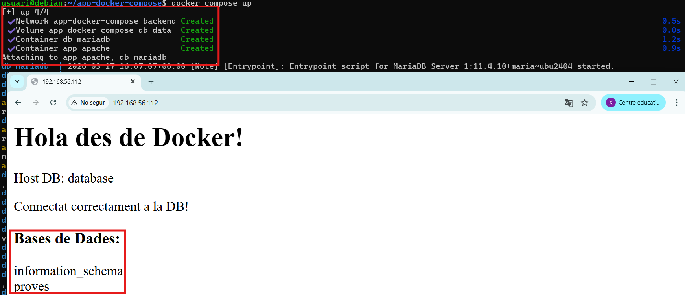
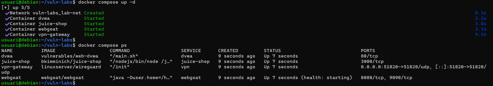
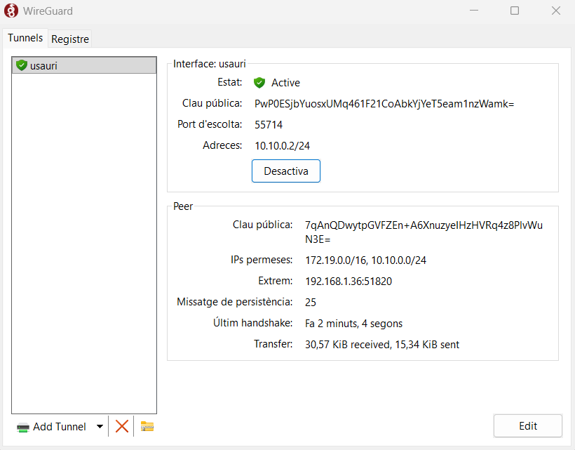
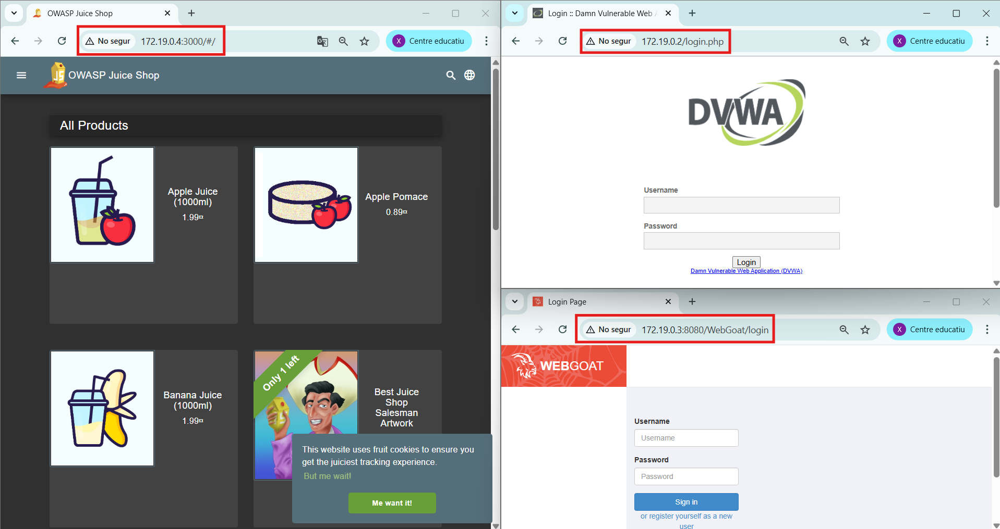

# 05. Docker Compose i Orquestració

## El problema: Un procés manual

Tot i disposar d'un Dockerfile per la construcció de les imatges, per desplegar completament les aplicacions necessitem executar diferents comandes manuals de Docker i en un ordre específic. Això pot comportar a errors de la persona que ho executa, és dificil de compartir amb l'equip de treball i el procés de desplegament no es pot reproduir fàcilment (és feixuc).

Tot i que funciona, és un procés repetitiu i difícil de mantenir en el temps.

```bash
# Comandes executades al terminal per:

# Crear xarxes (frontend i backend)

# Crear volum de bases de dades

# Base de dades (docker run a la xarxa backend i muntar el named volum)

# Backend (Dockerfile - xarxa backend i muntar bind volum carpeta projecte)
# docker network connect (frontend i backend)

# Fontend (Dockerfile - xarxa frontend, mapejar port 80, fitxers config, etc.)
```

## 2. La solució: Docker Compose

Docker Compose és l'EINA que permet construïr i executar aplicacions composades per múltiples contenidors mitjançant un únic fitxer de configuració en format `YAML`.

En aquest fitxer es defineix tot el procés de construcció, configuració i execució d'una aplicació basada en contenidors. Docker Compose permet gestionar de forma centralitzada tots els elements de la infraestructura, com ara:

- Crear contenidors
- Construcció d'imatges (build)
- Xarxes
- Volums
- Ports
- Variables d'entorn
- Dependències entre serveis
- Altres opcions de configuració, etc.

## 3. Estructura d'un `docker-compose.yml`

### Versió mínima:

```yaml
# Els Comentaris comencen amb #
# Claus i valors (un espai després dels dos punts)
# Llistes d'elements comencen amb -
# Objectes imbricats (indentació amb 2 espais)
services:
  web:
    image: nginx:alpine
    ports:
      - '80:80'
```

### Estructura completa:

```yaml
# Definició de serveis (contenidors)
services:
  servei1:
    image: ...
    # o
    build: ...

  servei2:
    image: ...

# Definició de xarxes
networks:
  xarxa1:
  xarxa2:

# Definició de volums
volumes:
  volum1:
  volum2:
```

## 4. Exemple desplegament de serveis amb Docker Compose

Un **servei** és un contenidor que executa una aplicació. En el següent exemple es mostra com desplegar un sistema de 2 contenidors (app i database) amb Docker Compose a partir de la següent estructura:

### Estructura del projecte

```
projecte/
├── docker-compose.yml
├── app/
│   ├── Dockerfile
│   └── index.php
└── .env
```

### Fitxer de configuració `docker-compose.yml`:

```yaml
services:
  app:
    build:
      context: ./app
      args:
        - PHP_VERSION=${PHP_VERSION}

    container_name: app-apache

    ports:
      - '${APP_PORT}:80'

    volumes:
      - ./app:/var/www/html

    environment:
      - DB_HOST=database
      - DB_PORT=${DB_PORT}
      - MARIADB_DATABASE=${MARIADB_DATABASE}
      - MARIADB_USER=${MARIADB_USER}
      - MARIADB_PASSWORD=${MARIADB_PASSWORD}

    depends_on:
      - database

    networks:
      - backend

    restart: unless-stopped

  database:
    image: mariadb:${MARIADB_VERSION}

    container_name: db-mariadb

    environment:
      MARIADB_ROOT_PASSWORD: ${MARIADB_ROOT_PASSWORD}
      MARIADB_DATABASE: ${MARIADB_DATABASE}
      MARIADB_USER: ${MARIADB_USER}
      MARIADB_PASSWORD: ${MARIADB_PASSWORD}

    volumes:
      - db-data:/var/lib/mysql

    networks:
      - backend

    restart: unless-stopped

volumes:
  db-data:

networks:
  backend:
```

### Dockerfile del projecte

```dockerfile
# Dockerfile (app/Dockerfile)
ARG PHP_VERSION
FROM php:${PHP_VERSION}-apache

# Instal·lar extensió MySQL
RUN docker-php-ext-install mysqli
```

### index.php (Exemple del projecte)

```php
<?php
// index.php (app/index.php)
echo "<h1>Hola des de Docker!</h1>";
$host = getenv('DB_HOST');
$user = getenv('MARIADB_USER');
$pass = getenv('MARIADB_PASSWORD');
$db   = getenv('MARIADB_DATABASE');
$conn = new mysqli($host, $user, $pass, $db);
if ($conn->connect_error) {
    die("Connexió fallida: " . $conn->connect_error);
}
echo "<p>Host DB: ".$host."</p>";
echo "Connectat correctament a la DB!";
?>
```

### Fitxer de Variables d'entorn (.env)

```bash
# Variables d'entron (.env)
# PHP
PHP_VERSION=8.3
# MariaDB
MARIADB_VERSION=11.4
MARIADB_ROOT_PASSWORD=root
MARIADB_DATABASE=test
MARIADB_USER=user
MARIADB_PASSWORD=secret
# Ports
APP_PORT=80
DB_PORT=3306
```

### La comanda màgica: `docker compose up`

```bash
#Posada en producció
docker compose up

# Es construirà la imatge de app (amb el teu Dockerfile)
# Es descarregarà la imatge de MariaDB
# Es crearà la xarxa backend
# Es crearà el volum db-data
# S'arrencaran els contenidors: db-mariadb i app-apache
```



## Eliminar contenidors i volums persistents

```bash
# Atura i elimina contenidors i xarxes
docker compose down

# També elimina volum
docker compose down -v
```

## 6. Exemple LAB Ciber: Contenidor (VPN Wireguard) + 3 Labs Vulnerables

El següent exemple vol simular una infraestructura com la de Hack The Box o TryHackMe. L'arquitectura de 3 laboratoris vulnerables un Servidor VPN amb Wireguard exposant el port 51820 per connectar-nos per VPN des del nostre host a la xarxa interna de laboratoris vulnerables.

### Estructura del projecte:

```
vuln-labs/
├── docker-compose.yml
├── vpn/
│   ├── Dockerfile
│   ├── entrypoint.sh
│   └── wg0.conf
└── labs/
    ├── lab1/
    ├── lab2/
    └── lab3/
```

### Docker compose `docker-compose.yml`

```yaml
services:
  vpn:
    image: linuxserver/wireguard
    container_name: vpn-gateway

    cap_add:
      - NET_ADMIN

    devices:
      - /dev/net/tun:/dev/net/tun

    sysctls:
      - net.ipv4.ip_forward=1

    ports:
      - '51820:51820/udp'

    volumes:
      - ./vpn:/config

    environment:
      - PUID=1000
      - PGID=1000
      - TZ=Europe/Madrid

    networks:
      - lab-net

  dvwa:
    image: vulnerables/web-dvwa
    container_name: dvwa
    networks:
      - lab-net

  juice-shop:
    image: bkimminich/juice-shop
    container_name: juice-shop
    networks:
      - lab-net

  webgoat:
    image: webgoat/webgoat
    container_name: webgoat
    networks:
      - lab-net

networks:
  lab-net:
    driver: bridge
```

### Configuració Wireguard (vpn/wg0.conf)

Abans s'han de generar les clau pública i privada del servidor:

```bash
wg genkey | tee server_private.key | wg pubkey > server_public.key
```

Per la prova també podem generar la clau pública i privada de l'usuari:

```bash
wg genkey | tee user1_private.key | wg pubkey > user1_public.key
```

Aquest és el fitxer de configuració del SERVER

```conf
[Interface]
Address = 10.10.0.1/24
ListenPort = 51820
PrivateKey = SGrcVp5ELI48mfWmjPobKIftKv+aHQo4SMvgE0WvaVs=

PostUp = iptables -t nat -A POSTROUTING -o eth0 -j MASQUERADE
PostUp = iptables -A FORWARD -i wg0 -j ACCEPT
PostUp = iptables -A FORWARD -o wg0 -j ACCEPT

PostDown = iptables -t nat -D POSTROUTING -o eth0 -j MASQUERADE
PostDown = iptables -D FORWARD -i wg0 -j ACCEPT
PostDown = iptables -D FORWARD -o wg0 -j ACCEPT

[Peer]
PublicKey = PwP0ESjbYuosxUMq461F21CoAbkYjYeT5eam1nzWamk=
AllowedIPs = 10.10.0.2/32
```

Aquest és el fitxer de configuració de l'USUARI que s'ha d'importar al client de Wireguard

```conf
[Interface]
PrivateKey = ALUMNE1_PRIVATE_KEY
Address = 10.10.0.2/24, 172.19.0.0/16

[Peer]
PublicKey = SERVER_PUBLIC_KEY
Endpoint = <IP_DEL_SERVIDOR>:51820
AllowedIPs = 10.10.0.0/24, 172.19.0.0/16
PersistentKeepalive = 25
```

### Desplegament del LAB

```bash
docker compose up -d
# Si tenim labs personalitzats (s'han de construir algunes imatges)
docker compose up -d --build
```



### Usuari es connecta la VPN

```bash
wg-quick up usuari.conf
```

Accés amb l'aplicació de VPN.



Verificar l'accés als 3 serveis vulnerables mitjançant la teva màquia host.

La VPN hauria de fer NAT des de la xarxa 10.10.0.0/24 a la xarxa 172.19.0.0/16.



## 7. Exercici: Aplicació completa - Nginx + PHP-Apache + MySQL

Ara crearem l'arquitectura completa amb reverse proxy que hem estat practicant.

Desplega l'aplicació completa (plataforma de videojocs vulnerable) amb un arquitectura de tres capes utilitzant Docker Compose: un frontend estàtic servit per Nginx, un backend PHP amb Apache, i una base de dades MariaDB.

```
Internet
   ↓
[Nginx] (ports 80/443)  ← Xarxa: frontend-network
   ↓
[Apache/PHP]            ← Xarxa: frontend-network + database-network
                        ← Volum: bind mount per desenvolupament
   ↓
[MySQL]                 ← Xarxa: database-network (AÏLLADA)
                        ← Volum: named volume per la persistència
```

## 8. Comandes de Docker Compose

### Gestió del cicle de vida:

```bash
# Arrencar serveis (crear i iniciar)
docker compose up

# Arrencar en segon pla (-d = detached)
docker compose up -d

# Arrencar serveis específics
docker compose up -d nginx api

# Aturar serveis (no els elimina)
docker compose stop

# Iniciar serveis aturats
docker compose start

# Reiniciar serveis
docker compose restart

# Aturar i eliminar contenidors (manté volums i xarxes)
docker compose down

# Aturar i eliminar contenidors, xarxes I VOLUMS (ESBORRA DADES!)
docker compose down -v

# Aturar, eliminar i també imatges
docker compose down --rmi all
```

### Logs i debugging:

```bash
# Veure logs de tots els serveis
docker compose logs

# Seguir logs en temps real
docker compose logs -f

# Logs d'un servei específic
docker compose logs -f api

# Últimes 100 línies
docker compose logs --tail=100

# Logs amb timestamps
docker compose logs -t
```

### Estat i informació:

```bash
# Llistar serveis en execució
docker compose ps

# Llistar tots (inclosos aturats)
docker compose ps -a

# Veure configuració efectiva (després de variables d'entorn)
docker compose config

# Validar sintaxi del docker-compose.yml
docker compose config --quiet
```

### Executar comandes:

```bash
# Executar comanda en un servei
docker compose exec api bash

# Executar comanda sense TTY
docker compose exec -T db mysqldump -u root -p${DB_ROOT_PASSWORD} ${DB_NAME}

# Executar comanda puntual (crea contenidor temporal)
docker compose run --rm api php --version
```

### Build i imatges:

```bash
# Construir imatges (no arrenca contenidors)
docker compose build

# Construir sense cache
docker compose build --no-cache

# Construir servei específic
docker compose build api

# Build i up alhora
docker compose up -d --build

# Pull de totes les imatges
docker compose pull
```

### Escalat (múltiples contenidors del mateix servei):

```bash
# Executar 3 contenidors del servei api
docker compose up -d --scale api=3

# Nota: Cal eliminar container_name i ports per escalar!
```

## 9. Funcions avançades

### 9.1. depends_on amb healthchecks

```yaml
services:
  db:
    image: mariadb:11
    healthcheck:
      test: ['CMD', 'healthcheck.sh', '--connect']
      interval: 10s
      timeout: 5s
      retries: 3
      start_period: 30s

  api:
    depends_on:
      db:
        condition: service_healthy # Espera que db estigui healthy
```

**Tipus de condicions:**

- `service_started`: Servei ha començat (per defecte)
- `service_healthy`: Servei està healthy
- `service_completed_successfully`: Servei ha acabat amb èxit

### 9.2. Restart policies

```yaml
services:
  web:
    restart: always # Sempre reiniciar
    # restart: unless-stopped  # Reiniciar excepte si s'atura manualment
    # restart: on-failure      # Només si falla
    # restart: no              # Mai reiniciar (per defecte)
```

### 9.3. Profiles (entorns diferents)

```yaml
services:
  db:
    # Sempre s'executa

  api:
    # Sempre s'executa

  debug-tools:
    image: nicolaka/netshoot
    profiles:
      - debug # Només amb --profile debug
```

**Ús:**

```bash
# Executar només serveis per defecte
docker compose up -d

# Executar amb profile debug
docker compose --profile debug up -d
```

### 9.4. Extends (reutilitzar configuració)

`docker-compose.base.yml`:

```yaml
services:
  base-service:
    image: alpine
    networks:
      - app-net
    restart: unless-stopped
```

`docker-compose.yml`:

```yaml
services:
  web:
    extends:
      file: docker-compose.base.yml
      service: base-service
    image: nginx:alpine
```

### 9.5. Variables d'entorn amb default values

```yaml
services:
  web:
    image: nginx:${NGINX_VERSION:-1.25-alpine}
    ports:
      - '${HTTP_PORT:-80}:80'
```

Si `NGINX_VERSION` no està definida, utilitza `1.25-alpine`.
